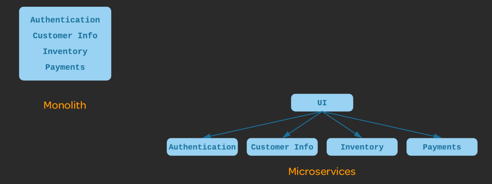

# Microservices

## Que sont les microservices ?

- Microservices : une architecture de microservice divise une application en une collection de petits services faiblement couplés.

- Traditionnellement, les applications utilisaient une architecture monolithique. Dans une architecture monolithique, toutes les fonctionnalités et tous les services font partie d'une seule grande application

- Les microservices sont petits : chaque microservice n'implémente qu'une petite partie de la fonctionnalité globale d'une application.

- Les microservices sont faiblement couplés : différents microservices interagissent les uns avec les autres à l'aide d'API stables et bien définies. Cela signifie qu'ils sont indépendants les uns des autres.

## À quoi ressemblent les microservices ?

- Il existe de nombreuses façons de structurer et d'organiser une architecture de microservices

- Par exemple, une application d'animalerie peut avoir :

--- Un service d'inventaire des animaux de compagnie  
--- Un service de coordonnées clients  
--- Un service d'authentification  
--- Un service de demande d'adoption d'animaux de compagnie  
--- Un service de traitement des paiements  

- Chacun d'eux a sa propre base de code et un processus d'exécution distinct (ou des processus). Ils peuvent tous être construits, déployés et mis à l'échelle séparément.

## Pourquoi utiliser les Microservices ?

- Modularité – Les microservices encouragent la modularité. Dans les applications monolithiques, les éléments individuels deviennent étroitement couplés et la complexité augmente. Finalement, il est très difficile de changer quoi que ce soit sans casser quelque chose

- Flexibilité technologique - Nous n'avons pas besoin d'utiliser les mêmes langages et technologies pour chaque partie de l'application. Nous pouvons utiliser le meilleur outil pour chaque travail

- Évolutivité optimisée - Nous pouvons mettre à l'échelle des parties individuelles de l'application en fonction de l'utilisation et de la charge des ressources. Avec un monolithe, nous devons mettre à l'échelle l'ensemble de l'application, même si un seul aspect du service doit réellement être mis à l'échelle

- Les microservices ne sont pas toujours le meilleur choix. Pour les applications plus petites et plus simples, un monolithe peut être plus facile à gérer.