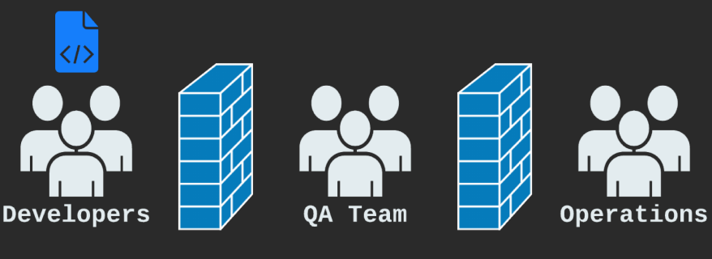
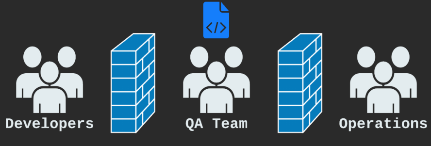

# Les objectifs de DevOps
La culture DevOps concerne la collaboration entre Dev et Ops. 
Sous la séparation traditionnelle entre Dev et Ops, Dev et Ops ont des objectifs différents et opposés :  
- dev : vitesse de livraison des applications
- ops : stabilité des applications

Avec DevOps, Dev et Ops travaillent ensemble et partagent les mêmes objectifs : vitesse de livraison des applications et stabilité des applications.   

Les Objectifs de la Culture DevOps :
- Délai de commercialisation rapide (TTM : time to market)
- Peu d'échecs de production
- Récupération immédiate des pannes

## Une histoire de DevOps par rapport à la méthode traditionnelle

- Les développeurs écrivent du code
- Le code est envoyé au contrôle qualité
- Le code rebondit entre le développeur et le QA lorsque le QA découvre des problèmes et que les développeurs les résolvent.
- Enfin, il est prêt pour la production

- QA/Dev envoie le code aux Opérations
- Oh non! Il ya un problème. Ops le renvoie par-dessus le mur à Dev
- Le domaine de chaque groupe est une "boîte noire" pour les autres groupes
- « Nos systèmes fonctionnent ; c'est ton code !"
- « Mais le code fonctionne sur ma machine ! »

Méthode traditionnelle - Qu'est-ce qui s'est mal passé ?

- Dev et Ops sont des boîtes noires l'un par rapport à l'autre, ce qui conduit à pointer du doigt :
--- Parce que Ops est une boîte noire, les développeurs ne leur font pas vraiment confiance  
--- Et Ops ne fait pas vraiment confiance aux développeurs  
- Dev et Ops ont des priorités différentes, ce qui les oppose :
--- Les opérations considèrent les développeurs comme brisant la stabilité  
--- Les développeurs voient les opérations comme un obstacle à la livraison de leur code  
- Même s'ils VEULENT travailler ensemble :
--- Le développement est mesuré par la livraison de fonctionnalités, ce qui signifie le déploiement de modifications  
--- L'exploitation est mesurée par la disponibilité, mais les modifications nuisent à la stabilité.  

Inconvénients des méthodes traditionnelles :
- Les "boîtes noires" conduisent à pointer du doigt
- Un processus long signifie un temps de mise sur le marché lent
- Le manque d'automatisation signifie que des éléments tels que les builds et les déploiements sont incohérents
- Il faut beaucoup de temps pour identifier et résoudre les problèmes  

Avec le DevOps :  
- Les développeurs écrivent du code
- La validation du code déclenche la création, l'intégration et les tests automatisés
- L'assurance qualité peut mettre la main dessus presque immédiatement
- Une fois prêt, lancez un déploiement automatisé en production
Comme tout est automatisé, il est beaucoup plus facile à déployer tout en gardant la stabilité
- Les déploiements peuvent se produire beaucoup plus fréquemment, mettant les fonctionnalités entre les mains des clients plus rapidement
- Oh non! Le dernier déploiement a cassé quelque chose en production !
- Heureusement, la surveillance automatisée a informé l'équipe immédiatement
- L'équipe effectue une restauration en déployant la version de travail précédente, résolvant le problème rapidement
- Une heure plus tard, l'équipe de développement a pu déployer une version corrigée du nouveau code.  

DevOps – Qu'est-ce qui s'est bien passé ?  

- Dev et Ops ont travaillé ensemble pour créer un moyen robuste de modifier le code rapidement et de manière fiable :
--- Dev et Ops ont travaillé ensemble pour donner la priorité à la fois à la rapidité de livraison et à la stabilité
- L'automatisation a conduit à la cohérence :
--- La création, les tests et le déploiement se sont déroulés de la même manière à chaque fois  
--- La création, les tests et le déploiement se sont déroulés beaucoup plus rapidement et plus souvent
- Une bonne surveillance, ainsi qu'un processus de déploiement rapide, garantissaient que les problèmes pouvaient être résolus avant même que les utilisateurs ne les remarquent :
--- Dev et Ops ont travaillé ensemble dès le départ pour créer de bons processus  
--- Même si un changement de code a causé un problème, les utilisateurs ont connu peu ou pas de temps d'arrêt.  

Pourquoi faire du DevOps ?
- Des équipes plus heureuses :
--- Les employés techniques ont tendance à être plus heureux avec DevOps qu'avec des méthodes traditionnelles  
--- Plus de temps à innover et moins de temps à éteindre les incendies  
--- Les développeurs n'ont pas l'impression de devoir se battre pour diffuser leur travail  
--- Les responsables des opérations n'ont pas à se battre contre les développeurs pour maintenir la stabilité du système
- Clients plus satisfaits :
--- DevOps vous permet d'offrir rapidement aux clients les fonctionnalités qu'ils souhaitent  
--- Et vous n'avez pas à sacrifier la stabilité pour le faire !