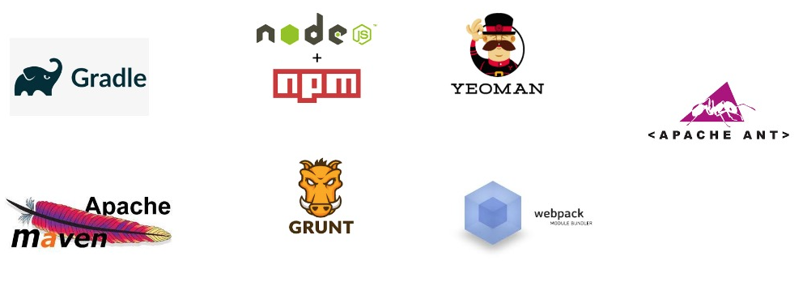

# Automatisation de la construction

## Qu'est-ce que l'automatisation de la construction ?

- automatisation de la construction: automatisation du processus de préparation du code pour le déploiement dans un environnement réel.

- Selon les langages utilisés, le code doit être compilé, linté, minifié, transformé, testé unitairement, etc.

- L'automatisation de la construction consiste à suivre ces étapes et à les exécuter de manière cohérente et automatisée à l'aide d'un script ou d'un outil.

- Les outils d'automatisation de la construction diffèrent souvent selon les langages de programmation et les frameworks utilisés, mais ils ont un point commun : l'automatisation !

## À quoi ressemble l'automatisation de la construction ?

- Habituellement, l'automatisation de la construction ressemble à l'exécution d'un outil de ligne de commande qui construit du code à l'aide de fichiers de configuration et/ou de scripts traités comme faisant partie du code source.

- L'automatisation de la construction est indépendante d'un IDE

- Même si nous pouvons construire dans l'IDE, cela devrait pouvoir fonctionner de la même manière en dehors de l'IDE.

- Dans la mesure du possible, l'automatisation de la construction doit être indépendante de la configuration de la machine sur laquelle elle est construite.

- Notre code doit pouvoir s'appuyer sur la machine de quelqu'un d'autre de la même manière qu'il s'appuie sur la nôtre.

## Pourquoi faire de l'automatisation de la construction (RCRPF) ?

- L'automatisation de la construction est **rapide**. Elle gère les tâches qui devraient autrement être effectuées manuellement.

- L'automatisation de la construction est **cohérente**. La construction se déroule de la même manière à chaque fois, éliminant les problèmes et la confusion qui peuvent survenir avec les constructions manuelles.

- L'automatisation de la construction est **reproductible**. La construction peut être effectuée plusieurs fois avec le même résultat. Toute version du code source peut toujours être transformée en code déployable de manière cohérente.

- L'automatisation de la construction est **portable**. La construction peut être effectuée de la même manière sur n'importe quelle machine. Tous les membres de l'équipe peuvent compiler sur leur machine, ainsi que sur un serveur de construction partagé. Le code issu de la construction ne dépend pas de personnes ou de machines spécifiques.

- L'automatisation de la construction est plus **fiable**. Il y aura moins de problèmes causés par de mauvaises constructions.

 

