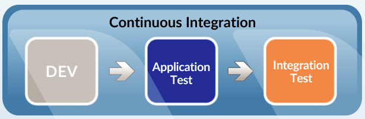
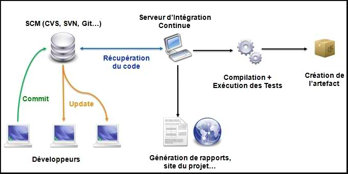

# Intégration Continue ?

## Qu'est-ce que l'Intégration Continue ?

- Intégration continue (CI) : la pratique consistant à fusionner fréquemment les modifications de code effectuées par les développeurs

- Traditionnellement, les développeurs travaillaient séparément, peut-être pendant des semaines à la fois, puis fusionnaient tout leur travail à la fin en un seul gros effort

- L'intégration continue signifie fusionner constamment tout au long de la journée, généralement avec l'exécution de tests automatisés pour détecter tout problème causé par la fusion.

- Fusionner tout le temps peut représenter beaucoup de travail, alors pour éviter cela il doit être automatisé !

## Pourquoi faire de l'Intégration Continue ?

- Détection précoce de certains types de bogues. Si le code ne se compile pas ou si un test automatisé échoue, les développeurs sont avertis et peuvent le corriger immédiatement. Plus ces bugs sont détectés tôt, plus ils sont faciles à corriger !

- Élimine la bousculade pour intégrer juste avant une grande version. Le code est constamment fusionné, il n'est donc pas nécessaire de faire une grande fusion à la fin.

- Rend les versions fréquentes possibles. Le code est toujours dans un état qui peut être déployé en production.

- Rend les tests continus possibles - Étant donné que le code peut toujours être exécuté, les testeurs QA peuvent mettre la main dessus tout au long du processus de développement, pas seulement à la fin.

- Encourage les bonnes pratiques de codage. Les commits fréquents encouragent un code simple et modulaire.

 

