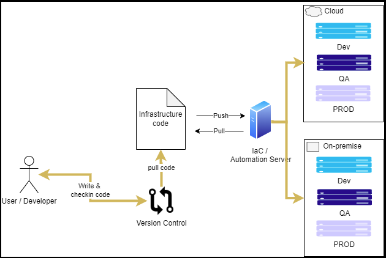
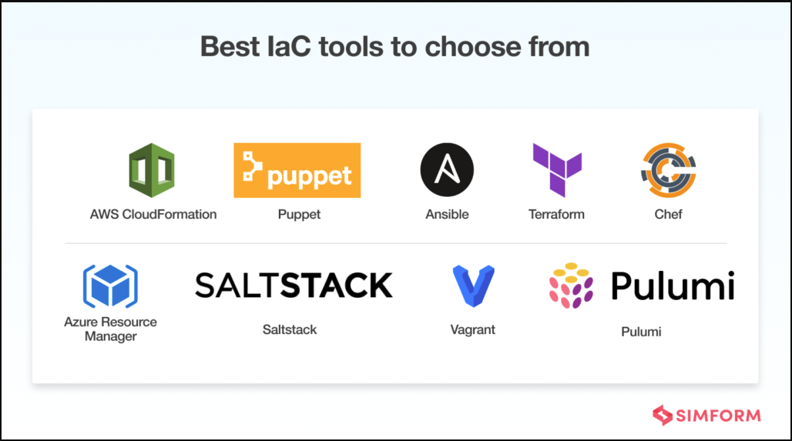

# Infrastructure en tant que code

## Qu'est-ce que l'infrastructure en tant que code ?

- Infrastructure en tant que code (IaC) : gérer et provisionner l'infrastructure via le code et l'automatisation.

- Avec l'infrastructure en tant que code, au lieu de faire les choses manuellement, nous utilisons l'automatisation et le code pour créer et modifier :  
--- Les serveurs  
--- Instances  
--- Environnements  
--- Conteneurs  
--- Autres infrastructures

## À quoi ressemble l'infrastructure en tant que code ?

- Sans infrastructure en tant que code, nous pourrions :  
--- ssh dans un hôte  
--- Émettre une série de commandes pour effectuer le changement

- Avec l'infrastructure en tant que code :  
--- Modifier certains fichiers de code ou de configuration pouvant être utilisés avec un outil d'automatisation pour effectuer des modifications  
--- Les pousser dans un serveur de contrôle des sources  
--- Utiliser un outil d'automatisation pour appliquer les modifications définies dans le code et/ou les fichiers de configuration

- Avec IaC, le provisionnement de nouvelles ressources et la modification des ressources existantes se font tous les deux par automatisation.

## Pourquoi faire de l'infrastructure en tant que code ?

- Cohérence dans la création et la gestion des ressources - La même automatisation fonctionnera de la même manière à chaque fois.

- Réutilisabilité - Le code peut être utilisé pour effectuer le même changement de manière cohérente sur plusieurs hôtes et peut être réutilisé à l'avenir.

- Évolutivité – Besoin d'une nouvelle instance ? Nous pouvons en avoir une configurée exactement de la même manière que les instances existantes en quelques minutes (ou secondes).

- Auto-documentation - Avec IaC, les modifications apportées à l'infrastructure se documentent dans une certaine mesure. La façon dont un serveur est configuré peut être visualisée dans le contrôle de source, plutôt que de se demander qui s'est connecté au serveur et a fait quelque chose.

- Simplifier la complexité – Les infrastructures complexes peuvent être mises en place rapidement une fois qu'elles sont définies en tant que code. Un groupe de plusieurs serveurs interdépendants peut être provisionné à la demande.

