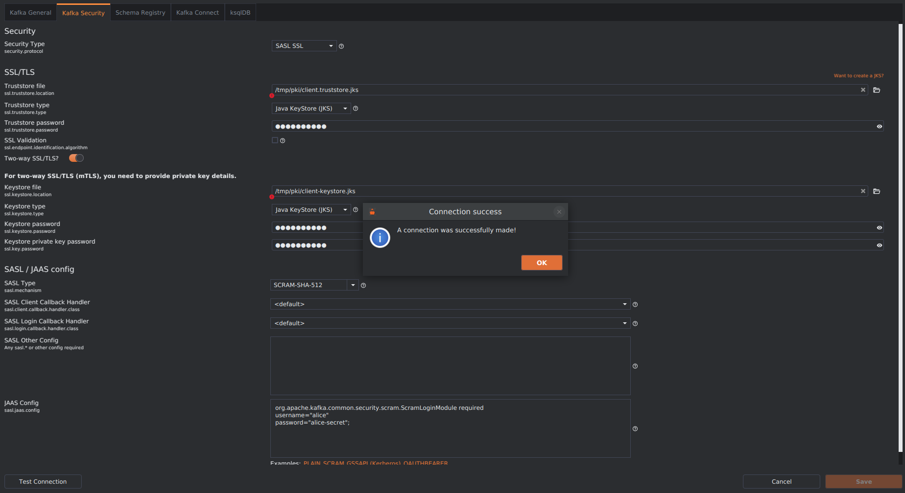

# Mise en place d'une authentification SASL/SCRAM-SHA-512 avec SSL dans un cluster kafka

Apache Kafka permet aux clients d'utiliser `SSL` pour le chiffrement du trafic et l'authentification. Par défaut, `SSL` est désactivé, mais peut être activé si nécessaire.

Nous allons mettre en place notre propre **infrastructure PKI**, l'utiliser pour créer des **certificats** et configurer Kafka pour les utiliser.

### Configuration initiale [sandbox : servertools]

- Nous créons le repertoire des données ssl

```
mkdir -p $HOME/pki && cd $HOME/pki
```

- Installons **keytool** à travers l'installation de **java-21-openjdk**

```
sudo dnf install java-21-openjdk
```

Vérifions de l'installation de **keytool**

```
keytool --version
```

### Génération d'une clé et d'un certificat SSL pour chaque broker Kafka [sandbox : servertools]

Pour activer SSL pour chacun de nos brokers Kafka, il faut d’abord générer pour chaque broker une paire de clés **publique/privée** avec sa demande de signature de certificat. Kafka impose que ces clés et certificats soient stockés dans un **keystore**. On utilise pour cela l’outil Java **keytool** au format **PKCS12**.

- Pour le broker **kafka-1**

```
keytool -genkeypair -keystore kafka-1-keystore.jks -alias localhost -validity 730 -keyalg RSA -storetype pkcs12

keytool -certreq -keystore kafka-1-keystore.jks -alias localhost -ext SAN=DNS:localhost,DNS:kafka-1,IP:192.168.56.209 -file kafka-1.csr
```

- Pour le broker **kafka-2**

```
keytool -genkeypair -keystore kafka-2-keystore.jks -alias localhost -validity 730 -keyalg RSA -storetype pkcs12

keytool -certreq -keystore kafka-2-keystore.jks -alias localhost -ext SAN=DNS:localhost,DNS:kafka-2,IP:192.168.56.209 -file kafka-2.csr
```

- Pour le broker **kafka-3**

```
keytool -genkeypair -keystore kafka-3-keystore.jks -alias localhost -validity 730 -keyalg RSA -storetype pkcs12

keytool -certreq -keystore kafka-3-keystore.jks -alias localhost -ext SAN=DNS:localhost,DNS:kafka-3,IP:192.168.56.209 -file kafka-3.csr
```

> NB: Pour toutes les premières commandes, on a le même mot de passe : `test2025` et les différentes réponses aux questions

```
What is your first and last name?
  [Unknown]: kafka-1                           # kafka-2, kafka-3
What is the name of your organizational unit?
  [Unknown]: devsecops-dojo
What is the name of your organization?
  [Unknown]: devsecops-dojo
What is the name of your City or Locality?
  [Unknown]: idf
What is the name of your State or Province?
  [Unknown]: idf 
What is the two-letter country code for this unit?
  [Unknown]: FR
```

### Création de notre propre CA et signature de nos demandes de certificats [sandbox : servertools]

- Créons notre propre CA

```
vi openssl-ca.cnf
```

```
HOME            = .
RANDFILE        = $ENV::HOME/.rnd

[ ca ]
default_ca    = CA_default

[ CA_default ]

base_dir      = .
certificate   = $base_dir/cacert.pem
private_key   = $base_dir/cakey.pem
new_certs_dir = $base_dir
database      = $base_dir/index.txt
serial        = $base_dir/serial.txt
default_days     = 1000
default_crl_days = 30
default_md       = sha256
preserve         = no
x509_extensions = ca_extensions

email_in_dn     = no
copy_extensions = copy

[ req ]
default_bits       = 4096
default_keyfile    = cakey.pem
distinguished_name = ca_distinguished_name
x509_extensions    = ca_extensions
string_mask        = utf8only
prompt             = no

[ ca_distinguished_name ]
countryName                 = FR
stateOrProvinceName         = idf
localityName                = idf
organizationName            = devsecops-dojo
organizationalUnitName      = devsecops-dojo
commonName                  = devsecopsdojo
emailAddress                = ngaswilly77@gmail.com

[ ca_extensions ]

subjectKeyIdentifier   = hash
authorityKeyIdentifier = keyid:always, issuer
basicConstraints       = critical, CA:true
keyUsage               = keyCertSign, cRLSign

[ signing_policy ]
countryName            = optional
stateOrProvinceName    = optional
localityName           = optional
organizationName       = optional
organizationalUnitName = optional
commonName             = supplied
emailAddress           = optional

[ signing_req ]
subjectKeyIdentifier   = hash
authorityKeyIdentifier = keyid,issuer
basicConstraints       = CA:FALSE
keyUsage               = digitalSignature, keyEncipherment
```

```
echo 01 > serial.txt

touch index.txt
```

```
openssl req -x509 -config openssl-ca.cnf -newkey rsa:4096 -sha256 -nodes -out cacert.pem -outform PEM
```

Deux fichiers seront créés : **cacert.pem** et **cakey.pem**.

- Signons de nos 3 demandes de certificats

```
openssl ca -config openssl-ca.cnf -policy signing_policy -extensions signing_req -out kafka-1.crt -infiles kafka-1.csr

openssl ca -config openssl-ca.cnf -policy signing_policy -extensions signing_req -out kafka-2.crt -infiles kafka-2.csr

openssl ca -config openssl-ca.cnf -policy signing_policy -extensions signing_req -out kafka-3.crt -infiles kafka-3.csr
```

- Importons les fichiers certificats signés pour chaque broker avec leur CA

```
keytool -keystore kafka-1-keystore.jks -alias CARoot -import -file cacert.pem

keytool -keystore kafka-1-keystore.jks -alias localhost -import -file kafka-1.crt
```

```
keytool -keystore kafka-2-keystore.jks -alias CARoot -import -file cacert.pem

keytool -keystore kafka-2-keystore.jks -alias localhost -import -file kafka-2.crt
```

```
keytool -keystore kafka-3-keystore.jks -alias CARoot -import -file cacert.pem

keytool -keystore kafka-3-keystore.jks -alias localhost -import -file kafka-3.crt
```

Le mot de passe demandé est celui créé lors de la génération des fichiers keystore : `test2025`.

- Générons les fichiers **client-keystore.jks** et **client.csr** du client, signons avec le CA pour générer le fichier **client.crt** et importons le CA et le client crt dans le keystore client

```
keytool -genkeypair -keystore client-keystore.jks -alias localhost -validity 730 -keyalg RSA -storetype pkcs12

keytool -certreq -keystore client-keystore.jks -alias localhost -ext SAN=DNS:localhost,DNS:kafka-client,IP:192.168.56.1,IP:192.168.56.212 -file client.csr
```

> NB: Pour la première commande, on a le mot de passe : `client2025` et les différentes réponses aux questions

```
What is your first and last name?
  [Unknown]: kafka-client
What is the name of your organizational unit?
  [Unknown]: devsecops-dojo
What is the name of your organization?
  [Unknown]: devsecops-dojo
What is the name of your City or Locality?
  [Unknown]: idf
What is the name of your State or Province?
  [Unknown]: idf 
What is the two-letter country code for this unit?
  [Unknown]: FR
```

```
openssl ca -config openssl-ca.cnf -policy signing_policy -extensions signing_req -out client.crt -infiles client.csr
```

```
keytool -keystore client-keystore.jks -alias CARoot -import -file cacert.pem

keytool -keystore client-keystore.jks -alias localhost -import -file client.crt
```

- Générons des fichiers **server.truststore.jks** et **client.truststore.jks**

Cette étape consiste à ajouter l'autorité de certification générée au magasin de certificats de confiance des brokers ou des clients afin que ces derniers puissent lui faire confiance.

```
keytool -keystore server.truststore.jks -alias CARoot -import -file cacert.pem
```

Mot de passe du magasin de certificats de confiance des brokers : `test2027`.

```
keytool -keystore client.truststore.jks -alias CARoot -import -file cacert.pem
```

Mot de passe du magasin de certificats de confiance des brokers : `client2027`.

### Configuration des 3 services kafka [sandbox : broker]

- Nous allons commencer par arrêter les trois services Kafka conteneurisés actuellement en cours d’exécution et ne pas supprimer les données kafka persistées issues des configurations précédentes.

```
systemctl --user stop kafka-1.service

systemctl --user stop kafka-2.service

systemctl --user stop kafka-3.service
```

- Copie des fichiers **keystore** et **trustore** générés pour le cluster kafka

```
mkdir -p $HOME/kafka/ssl
```

```
scp vagrant@192.168.56.214:/home/vagrant/pki/kafka-1-keystore.jks $HOME/kafka/ssl/

scp vagrant@192.168.56.214:/home/vagrant/pki/kafka-2-keystore.jks $HOME/kafka/ssl/

scp vagrant@192.168.56.214:/home/vagrant/pki/kafka-2-keystore.jks $HOME/kafka/ssl/

scp vagrant@192.168.56.214:/home/vagrant/pki/server.truststore.jks $HOME/kafka/ssl/
```

- Création du repertoire de configuration des fichiers pki pour les brokers

```
mkdir -p $HOME/kafka/ssl
```

```
cd $HOME/kafka/pki

cp kafka-1-keystore.jks kafka-2-keystore.jks kafka-3-keystore.jks server.truststore.jks $HOME/kafka/ssl/.
```

- Nous éditons nos fichiers service

Nous allons définir les variables d'environnement 

--- KAFKA_SECURITY_PROTOCOL <br>
--- KAFKA_LISTENER_SECURITY_PROTOCOL_MAP <br>
--- KAFKA_SSL_CLIENT_AUTH <br>
--- KAFKA_SSL_KEYSTORE_LOCATION <br>
--- KAFKA_SSL_KEYSTORE_PASSWORD <br>
--- KAFKA_SSL_KEY_PASSWORD <br>
--- KAFKA_SSL_TRUSTSTORE_LOCATION <br>
--- KAFKA_SSL_TRUSTSTORE_PASSWORD

```
vi $HOME/.config/containers/systemd/kafka-1.container
```

```
[Unit]
Description=kafka
After=local-fs.target

[Container]
ContainerName=kafka-1
...
Environment=KAFKA_SECURITY_PROTOCOL='SASL_SSL'
...
Environment=KAFKA_LISTENER_SECURITY_PROTOCOL_MAP=INTERNAL:SASL_SSL,CONTROLLER:SASL_SSL,EXTERNAL:SASL_SSL
...
Environment=KAFKA_SSL_CLIENT_AUTH='required'
Environment=KAFKA_SSL_KEYSTORE_LOCATION='/etc/kafka/secrets/kafka-1-keystore.jks'
Environment=KAFKA_SSL_KEYSTORE_PASSWORD='test2025'
Environment=KAFKA_SSL_KEY_PASSWORD='test2025'
Environment=KAFKA_SSL_TRUSTSTORE_LOCATION='/etc/kafka/secrets/server.truststore.jks'
Environment=KAFKA_SSL_TRUSTSTORE_PASSWORD='test2027'
Environment=KAFKA_SASL_MECHANISM=SCRAM-SHA-512
Environment=KAFKA_SASL_MECHANISM_CONTROLLER_PROTOCOL=PLAIN
Environment=KAFKA_SASL_MECHANISM_INTER_BROKER_PROTOCOL=SCRAM-SHA-512
Environment=KAFKA_SASL_ENABLED_MECHANISMS='PLAIN,SCRAM-SHA-512'
Environment=KAFKA_OPTS=-Djava.security.auth.login.config=/etc/kafka/kafka_server_jaas.conf
Environment=KAFKA_LOG_DIRS='/tmp/kraft-combined-logs'
...
...
Volume=/home/vagrant/kafka/data1:/tmp/kraft-combined-logs:Z
Volume=/home/vagrant/kafka/kafka_server_saslscram_jaas.conf:/etc/kafka/kafka_server_jaas.conf:z
Volume=/home/vagrant/kafka/ssl:/etc/kafka/secrets:z

[Service]
Restart=always

[Install]
WantedBy=default.target
```

```
vi $HOME/.config/containers/systemd/kafka-2.container
```

```
[Unit]
Description=kafka
After=local-fs.target

[Container]
ContainerName=kafka-2
...
Environment=KAFKA_SECURITY_PROTOCOL='SASL_SSL'
...
Environment=KAFKA_LISTENER_SECURITY_PROTOCOL_MAP=INTERNAL:SASL_SSL,CONTROLLER:SASL_SSL,EXTERNAL:SASL_SSL
...
Environment=KAFKA_SSL_CLIENT_AUTH='required'
Environment=KAFKA_SSL_KEYSTORE_LOCATION='/etc/kafka/secrets/kafka-1-keystore.jks'
Environment=KAFKA_SSL_KEYSTORE_PASSWORD='test2025'
Environment=KAFKA_SSL_KEY_PASSWORD='test2025'
Environment=KAFKA_SSL_TRUSTSTORE_LOCATION='/etc/kafka/secrets/server.truststore.jks'
Environment=KAFKA_SSL_TRUSTSTORE_PASSWORD='test2027'
Environment=KAFKA_SASL_MECHANISM=SCRAM-SHA-512
Environment=KAFKA_SASL_MECHANISM_CONTROLLER_PROTOCOL=PLAIN
Environment=KAFKA_SASL_MECHANISM_INTER_BROKER_PROTOCOL=SCRAM-SHA-512
Environment=KAFKA_SASL_ENABLED_MECHANISMS='PLAIN,SCRAM-SHA-512'
Environment=KAFKA_OPTS=-Djava.security.auth.login.config=/etc/kafka/kafka_server_jaas.conf
Environment=KAFKA_LOG_DIRS='/tmp/kraft-combined-logs'
...
...
Volume=/home/vagrant/kafka/data2:/tmp/kraft-combined-logs:Z
Volume=/home/vagrant/kafka/kafka_server_saslscram_jaas.conf:/etc/kafka/kafka_server_jaas.conf:z
Volume=/home/vagrant/kafka/ssl:/etc/kafka/secrets:z

[Service]
Restart=always

[Install]
WantedBy=default.target
```

```
vi $HOME/.config/containers/systemd/kafka-3.container
```

```
[Unit]
Description=kafka
After=local-fs.target

[Container]
ContainerName=kafka-3
...
Environment=KAFKA_SECURITY_PROTOCOL='SASL_SSL'
...
Environment=KAFKA_LISTENER_SECURITY_PROTOCOL_MAP='INTERNAL:SASL_SSL,CONTROLLER:SASL_SSL,EXTERNAL:SASL_SSL'
...
Environment=KAFKA_SSL_CLIENT_AUTH='required'
Environment=KAFKA_SSL_KEYSTORE_LOCATION='/etc/kafka/secrets/kafka-1-keystore.jks'
Environment=KAFKA_SSL_KEYSTORE_PASSWORD='test2025'
Environment=KAFKA_SSL_KEY_PASSWORD='test2025'
Environment=KAFKA_SSL_TRUSTSTORE_LOCATION='/etc/kafka/secrets/server.truststore.jks'
Environment=KAFKA_SSL_TRUSTSTORE_PASSWORD='test2027'
Environment=KAFKA_SASL_MECHANISM=SCRAM-SHA-512
Environment=KAFKA_SASL_MECHANISM_CONTROLLER_PROTOCOL=PLAIN
Environment=KAFKA_SASL_MECHANISM_INTER_BROKER_PROTOCOL=SCRAM-SHA-512
Environment=KAFKA_SASL_ENABLED_MECHANISMS='PLAIN,SCRAM-SHA-512'
Environment=KAFKA_OPTS=-Djava.security.auth.login.config=/etc/kafka/kafka_server_jaas.conf
Environment=KAFKA_LOG_DIRS='/tmp/kraft-combined-logs'
...
...
Volume=/home/vagrant/kafka/data3:/tmp/kraft-combined-logs:Z
Volume=/home/vagrant/kafka/kafka_server_saslscram_jaas.conf:/etc/kafka/kafka_server_jaas.conf:z
Volume=/home/vagrant/kafka/ssl:/etc/kafka/secrets:z

[Service]
Restart=always

[Install]
WantedBy=default.target
```

```
systemctl --user daemon-reload
```

```
systemctl --user start kafka-1.service

systemctl --user start kafka-2.service

systemctl --user start kafka-3.service
```

Vérification du statut du service kafka

```
systemctl --user status kafka-1.service

systemctl --user status kafka-2.service

systemctl --user status kafka-3.service
```

```
podman container ls
```

### Tests de connexion depuis le client kafkaio

[https://kafkio.com/](https://kafkio.com/)

Tentative de connexion au cluster en utilisant un paramètre d'authentification SCRAM SSL avec l'outil **kafkaio**




Nous constatons que la connexion réussie.
