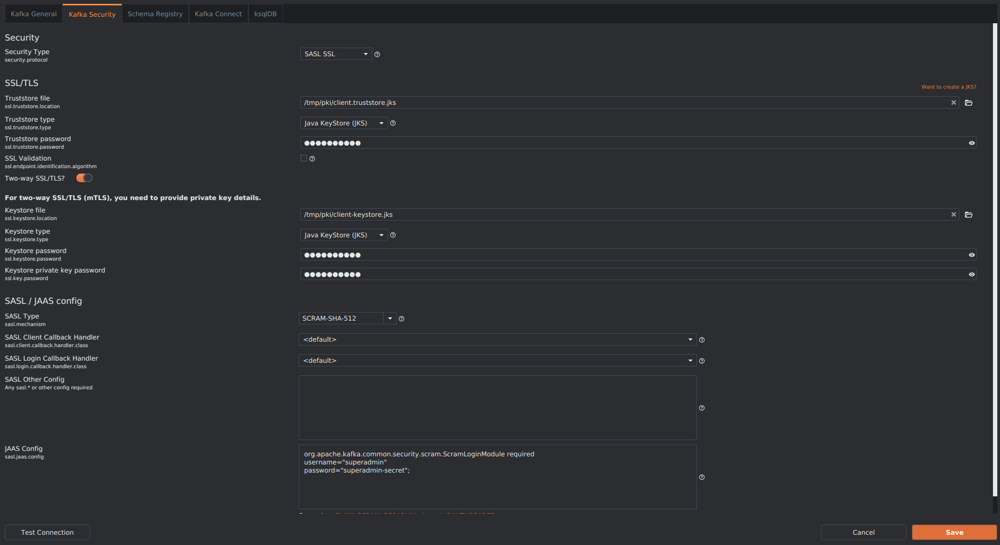

# Mise en place d'une autorisation couplée à une authentification SASL-SCRAM/SSL dans un cluster kafka

Kafka intègre un système d'autorisation modulaire, configurable via la propriété `authorizer.class.name` dans la configuration du serveur. Les implémentations configurées doivent étendre `org.apache.kafka.server.authorizer.Authorizer`. Kafka fournit une implémentation (`org.apache.kafka.metadata.authorizer.StandardAuthorizer`) par défaut qui stocke les listes de contrôle d'accès (ACL) dans les métadonnées du cluster (journal des métadonnées KRaft).

> NB: Cette section s’inscrit dans la continuité des configurations précédentes.

### Configuration initiale

- Création d'un utilisateur `superadmin` avec pour mot de passe `superadmin-secret`

```
podman container exec --workdir /opt/kafka/bin/ -it kafka-1 /bin/bash
```

```
vi /opt/kafka/config/client.properties
```

```
security.protocol=SASL_SSL
sasl.mechanism=SCRAM-SHA-512
ssl.truststore.location=/etc/kafka/secrets/server.truststore.jks
ssl.truststore.password=test2027
ssl.keystore.location=/etc/kafka/secrets/kafka-1-keystore.jks
ssl.keystore.password=test2025
ssl.key.password=test2025
sasl.jaas.config=org.apache.kafka.common.security.scram.ScramLoginModule required \
    username="admin" \
    password="admin-secret";
```

```
./kafka-configs.sh --bootstrap-server localhost:9092 --alter --add-config 'SCRAM-SHA-512=[iterations=8192,password=superadmin-secret]' --entity-type users --entity-name superadmin --command-config /opt/kafka/config/client.properties
```

On peut vérifier la liste des utilisateurs avec la commande

```
./kafka-configs.sh --bootstrap-server localhost:9092 --describe --entity-type users --command-config /opt/kafka/config/client.properties
```

### Configuration des 3 services kafka

Nous allons définir les variables d'environnement 

--- KAFKA_AUTHORIZER_CLASS_NAME <br>
--- KAFKA_ALLOW_EVERYONE_IF_NO_ACL_FOUND <br>
--- KAFKA_SUPER_USERS

```
vi $HOME/.config/containers/systemd/kafka-1.container
```


```
[Unit]
Description=kafka
After=local-fs.target

[Container]
ContainerName=kafka-1
...
...
...
Environment=KAFKA_AUTHORIZER_CLASS_NAME='org.apache.kafka.metadata.authorizer.StandardAuthorizer'
Environment=KAFKA_ALLOW_EVERYONE_IF_NO_ACL_FOUND=false
Environment=KAFKA_SUPER_USERS='User:admin;User:superadmin'
Environment=KAFKA_LOG_DIRS='/tmp/kraft-combined-logs'
...
...

[Service]
Restart=always

[Install]
WantedBy=default.target
```


```
vi $HOME/.config/containers/systemd/kafka-2.container
```


```
[Unit]
Description=kafka
After=local-fs.target

[Container]
ContainerName=kafka-2
...
...
...
Environment=KAFKA_AUTHORIZER_CLASS_NAME='org.apache.kafka.metadata.authorizer.StandardAuthorizer'
Environment=KAFKA_ALLOW_EVERYONE_IF_NO_ACL_FOUND=false
Environment=KAFKA_SUPER_USERS='User:admin;User:superadmin'
Environment=KAFKA_LOG_DIRS='/tmp/kraft-combined-logs'
...
...

[Service]
Restart=always

[Install]
WantedBy=default.target
```

```
vi $HOME/.config/containers/systemd/kafka-3.container
```


```
[Unit]
Description=kafka
After=local-fs.target

[Container]
ContainerName=kafka-3
...
...
...
Environment=KAFKA_AUTHORIZER_CLASS_NAME='org.apache.kafka.metadata.authorizer.StandardAuthorizer'
Environment=KAFKA_ALLOW_EVERYONE_IF_NO_ACL_FOUND=false
Environment=KAFKA_SUPER_USERS='User:admin;User:superadmin'
Environment=KAFKA_LOG_DIRS='/tmp/kraft-combined-logs'
...
...

[Service]
Restart=always

[Install]
WantedBy=default.target
```

```
systemctl --user daemon-reload
```

```
systemctl --user restart kafka-1.service

systemctl --user restart kafka-2.service

systemctl --user restart kafka-3.service
```

Vérification du statut du service kafka

```
systemctl --user status kafka-1.service

systemctl --user status kafka-2.service

systemctl --user status kafka-3.service
```

```
podman container ls
```

Nous avons défini deux super utilisateurs : <br>
--- `admin` : pour la communication interne dans le cluster <br>
--- `superadmin` : pour la communication depuis l'extérieur

Les autres utilisateurs `alice` et `bob` n'ont aucun droit pour l'instant.

### Tests de connexion depuis le client kafkaio avec l'utilisateur superadmin

- Tentative de connexion au cluster en utilisant un paramètre d'authentification SCRAM SSL avec l'outil **kafkaio** avec l'utilisateur `superadmin`.




- Création d'une acl avec le script `kafka-acls.sh` sur les utilisateurs `alice` et `bob`concernant le sujet `usertokens`.

Les listes de contrôle d'accès (ACL) Kafka sont définies selon le format général suivant : « **Le principal {P} est [allow|deny] Opération {O} depuis l'hôte {H} sur toute ressource {R} correspondant au modèle de ressource {RP}** ». Pour ajouter, supprimer ou lister les ACL, vous pouvez utiliser l'interface de ligne de commande Kafka : **kafka-acls.sh** .

```
vi /opt/kafka/config/client.properties
```

```
security.protocol=SASL_SSL
sasl.mechanism=SCRAM-SHA-512
ssl.truststore.location=/etc/kafka/secrets/server.truststore.jks
ssl.truststore.password=test2027
ssl.keystore.location=/etc/kafka/secrets/kafka-1-keystore.jks
ssl.keystore.password=test2025
ssl.key.password=test2025
sasl.jaas.config=org.apache.kafka.common.security.scram.ScramLoginModule required \
    username="admin" \
    password="admin-secret";
```

--- Créons le sujet `usertokens`

```
./kafka-topics.sh --create --topic usertokens --bootstrap-server localhost:9092 --command-config /opt/kafka/config/client.properties
```

--- Ajoutons le droit de lecture sur le sujet `usertokens` à l'utilisateur `alice`

```
./kafka-acls.sh --bootstrap-server localhost:9092 --add --allow-principal User:alice --allow-host * --operation Read --topic usertokens --command-config /opt/kafka/config/client.properties
```

--- Ajoutons le droit d'écriture sur le sujet `usertokens` à l'utilisateur `bob`

```
./kafka-acls.sh --bootstrap-server localhost:9092 --add --allow-principal User:bob --allow-host * --operation Write --topic usertokens --command-config /opt/kafka/config/client.properties
```