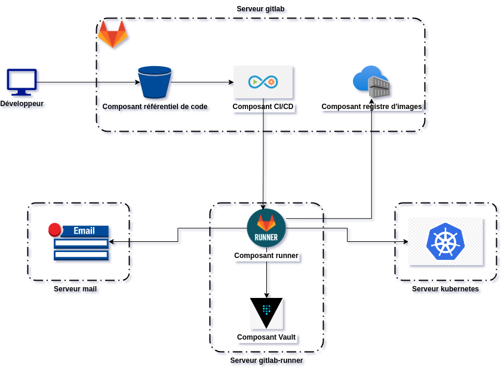

# Sandbox de l'architecture

Supposons que nous souhaiterons mettre en place une architecture **ci/cd** avec **gitlab** où nous avons 4 serveurs :
- un serveur **gitlab** (domaine : **gitlab.willbrid.com**) intégrant un système de gestion de code source, un système de gestion des images et un composant ci/cd
- un serveur **gitlab-runner** (domaine : **gitlab-runner.willbrid.com**) constitué d'un composant **runner** permettant d'exécuter les jobs **ci/cd** et un composant **vault** permettant de gérer les informations sensibles
- un serveur **kubernetes** (domaine : **k8s.willbrid.com**) constitué d'un composant **kubernetes** permettant de faire de la gestion et de l'orchestration de conteneurs.
- un serveur **mail** (domaine : **mail.willbrid.com**)  intégrant un composant de messagerie

<p align="center">

</p>

Nous utiliserons **vagrant** avec **virtualbox 7.0** depuis une machine hôte **ubuntu 20.04**. Nous suivons les étapes ci-dessous pour provisionner nos 4 serveurs.


```
cd ~ && mkdir gitlab-devops
```

```
cd gitlab-devops
```

```
wget https://download.virtualbox.org/virtualbox/7.0.12/VBoxGuestAdditions_7.0.12.iso
```

```
vi Vagrantfile
```

```
# -*- mode: ruby -*-
# vi: set ft=ruby :

$script = <<-SCRIPT
goBinPath="/etc/profile.d/go_bin_path_setting.sh"
if [[ ":$PATH:" != *":/usr/local/go/bin:"* ]]; then
  echo "Go is not installed, installation in progress..."
  wget -q https://go.dev/dl/go1.21.7.linux-amd64.tar.gz 2>&1
  tar -C /usr/local -xzf go1.21.7.linux-amd64.tar.gz
  echo 'export PATH=$PATH:/usr/local/go/bin' > $goBinPath
fi
if [ -f "$goBinPath" ]; then
  source $goBinPath
fi
SCRIPT

VAGRANTFILE_API_VERSION = "2"

Vagrant.configure(VAGRANTFILE_API_VERSION) do |config|
  config.vbguest.auto_update = false
  config.vbguest.no_remote = true
  config.vbguest.iso_path = "./VBoxGuestAdditions_7.0.12.iso"

  # General Vagrant VM configuration.
  config.vm.box = "willbrid/rockylinux8"
  config.vm.box_version = "0.0.2"
  config.ssh.insert_key = false
  config.vm.synced_folder ".", "/vagrant", disabled: true
  config.vm.provider :virtualbox do |v|
    v.memory = 4096
    v.cpus = 2
    v.linked_clone = true
  end

  # Serveur gitlab.
  config.vm.define "gitlab" do |gt|
    gt.vm.hostname = "gitlab"
    gt.vm.network :private_network, ip: "192.168.56.170"
    gt.vm.provider :virtualbox do |v|
        v.memory = 7168
    end
  end

  # Serveur gitlab-runner. 
  config.vm.define "gitlab-runner" do |gtr|
    gtr.vm.hostname = "gitlab-runner"
    gtr.vm.network :private_network, ip: "192.168.56.171"
    gtr.trigger.after :up do |trigger|
      trigger.run_remote = { inline: $script, privileged: true }
    end
  end

  # Serveur kubernetes.
  config.vm.define "kubernetes" do |k8s|
    k8s.vm.hostname = "kubernetes"
    k8s.vm.network :private_network, ip: "192.168.56.172"
    k8s.vm.provider :virtualbox do |v|
        v.cpus = 3
    end
  end

  # Serveur mail.
  config.vm.define "mail" do |msg|
    msg.vm.hostname = "mail"
    msg.vm.network :private_network, ip: "192.168.56.173"
    msg.vm.provider :virtualbox do |v|
        v.cpus = 1
        v.memory = 2048
    end
  end
end
```

```
vagrant up
```