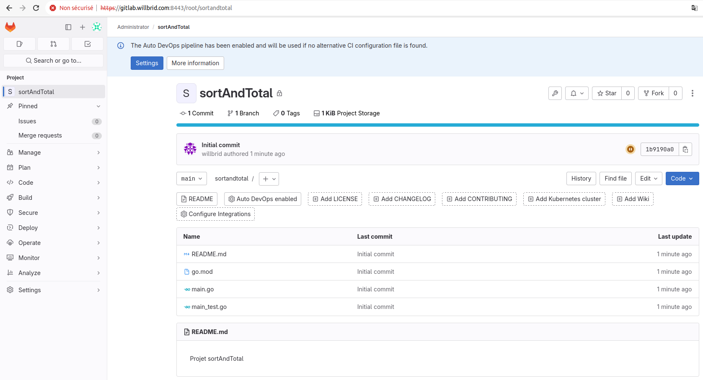

# Construire du code dans un pipeline CI/CD

Chaque langage construit son code de manière différente, en utilisant des outils différents. Même au sein d’un seul langage, il existe parfois plusieurs outils ou techniques pour créer du code. Examinons comment compiler du code **Go**.

Nous prendrons l'exemple d'un mini-project permettant de trier un tableau d'entier (repertoire **sortAndTotal** se trouvant à la racine de l'emplacement de ce fichier).

### Initialisation du projet sortAndTotal sur notre plateforme gitlab

Toutes les tâches suivantes s'effectueront depuis notre machine hôte **Ubuntu 20.04**.

- Créons le projet **sortAndTotal** sur notre plateforme sur gitlab

--- cliquons sur le bouton **New Project** <br>
--- selectionnons le menu **Create blank project** <br>
--- donnons le nom de notre project : **sortAndTotal** <br>
--- choisissons le groupe **root** <br>
--- décochons la case **Initialize repository with a README** <br>
---  cliquons sur le bouton **Create project**

Notre projet **sortAndTotal** est créé.

- Sur notre système hôte, créons un repertoire **sortAndTotal** et un simple fichier **README.md**

```
mkdir $HOME/sortAndTotal && cd $HOME/sortAndTotal
```

```
vi README.md
```

```
Projet sortAndTotal
```

- Copions le code source du repertoire **sortAndTotal** de ce référentiel vers le repertoire **sortAndTotal** de notre machine hôte

```
git clone https://github.com/willbrid/DevSecOps-SRE-light.git
```

```
cp DevSecOps-SRE-light/gitlab/4-verification_de_code/sortAndTotal/* $HOME/sortAndTotal/
```

- Poussons le code source vers notre plateforme **gitlab**

```
git init
git add .
git commit -m "Initial commit"
git branch -M main
git remote add origin https://gitlab.willbrid.com:8443/root/sortandtotal.git
git push --set-upstream origin main
```

Il nous est demandé un login et un mot de passe au niveau de la commande **git push**, nous saisissons :

```
Login : root
Mot de passe : SuperSecret
```

<p align="center">

</p>


### Configuration de notre pipeline

Nous allons configurer notre pipeline pour builder notre code source.

- Créons le fichier **.gitlab-ci.yml** à la racine de notre projet **sortAndTotal**

```
vi .gitlab-ci.yml
```

```
variables:
  OUTPUT_NAME: __bin__/$CI_PROJECT_NAME

stages:
  - build

compilation:
  tags:
    - dev
    - linux
  stage: build
  script:
    - mkdir -p $OUTPUT_NAME
    - podman run --rm -v $OUTPUT_NAME:/build:z -v "$PWD":/tmp:z -w /tmp docker.io/library/golang:1.21.9 go build -o /build ./...
  artifacts:
    paths:
      - $OUTPUT_NAME
```

Ce fichier est un exemple de configuration de pipeline pour GitLab CI/CD, qui définit une étape de compilation pour un projet Go (Golang).

**1-** **variables** : cette section est utilisée pour définir des variables globales qui peuvent être utilisées dans tout le pipeline. Dans cet exemple, la variable **OUTPUT_NAME** définit le nom du répertoire de sortie de la compilation où **$CI_PROJECT_NAME** est un nom de varibale prédéfini par Gitlab et correspondant au nom du projet GitLab actuel.

**2-** **stages:** : cette section définit les différentes étapes du pipeline. Dans cet exemple, il y a une seule étape nommée **build**.

**3-** **compilation:** : c'est le nom donné à la tâche de **build**.

**4-** **tags** : cette section permet de préciser les tags défini au niveau de la configuration de notre exécuteur sur Gitlab.

**5-** **stage: build** : cette ligne spécifie dans quelle étape (définie dans stages) cette tâche doit être exécutée. Dans cet exemple, la tâche de compilation est exécutée dans l'étape **build**.

**6-** **image: golang:1.21.9** : cela indique l'image Docker à utiliser pour exécuter cette tâche. Dans ce cas, il utilise l'image Docker officielle de Go version **1.21.9**. cela signifie que le code sera compilé dans un environnement **Go 1.21.9**.

**7-** **script:** : c'est la section où nous définissons les commandes à exécuter dans cette tâche.

**8-** **- mkdir -p $OUTPUT_NAME** : cette commande crée un répertoire nommé **$OUTPUT_NAME**. $OUTPUT_NAME est la variable définie au préalable.

**9-** **- go build -o $OUTPUT_NAME ./...** : cette commande utilise le compilateur Go (go build) pour construire le projet. L'option **-o** est utilisée pour spécifier le nom du fichier de sortie de la compilation. Le fichier de sortie est nommé d'après la valeur de **$OUTPUT_NAME**. L'argument **./...** signifie que tous les fichiers du répertoire courant et de ses sous-répertoires seront compilés.

**10-** Tous les fichiers créés par une tâche de pipeline, y compris les versions compilées des fichiers générés lors d'une tâche de **build**, sont supprimés dès que la tâche est terminée. La définition de la section **artifacts** nous permet de spécifier certains fichiers ou répertoires que GitLab doit conserver d'une tâche et mettre à disposition de toutes les tâches ultérieures. L'on définit avec la sous-section **paths**, les chemins des fichiers ou des répertoires à archiver. Dans cet exemple, cette sous-section spécifie que tous les fichiers situés dans le répertoire de sortie défini par la variable **OUTPUT_NAME** seront archivés en tant qu'**artefacts** de build.

**NB:** Le mot-clé **artefacts** est l’un des mots-clés les plus importants que nous pouvons utiliser lors de la configuration des pipelines CI/CD, et oublier de l’utiliser lorsque cela est nécessaire est une erreur courante. Si notre pipeline ne fonctionne pas comme prévu, l'une des premières étapes de dépannage que nous devrions essayer consiste à vérifier si nous spécifions des artefacts dans toutes les tâches qui génèrent des fichiers auxquels nous souhaitons accéder dans des tâches ultérieures.

- Validons et poussons la modification effectuée depuis notre machine hôte

```
git add .gitlab-ci.yml
```

```
git commit -m "feat: define pipeline for build process"
```

```
git push --set-upstream origin main
```

Accédons à la liste des pipelines de notre projet, ensuite zoomons sur l'exécution du pipeline qui a été automatiquement déclenchée par notre commit, puis zoomons sur la tâche de **compilation**, nous pouvons voir que la commande **go build** s'est exécutée sans émettre d'erreur.