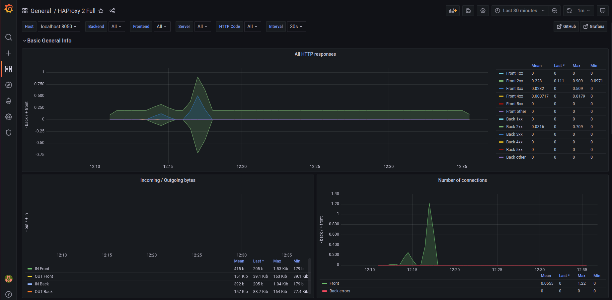

# Monitoring de HAProxy avec Prometheus

Nous allons mettre en place le monitoring de HAProxy avec prometheus.

#### Préréquis

- Nous supposerons que les services prometheus et grafana sont déjà installés sur le serveur **haproxy-server**

Lien : [github-willbrid-installation-de-prometheus](https://github.com/willbrid/DevSecOps-SRE-light/blob/main/observabilite/prometheus/1-installation-et-configuration/1-installation-de-prometheus.md)

- Au préalable, nous avons installé HAProxy avec la prise en charge de prometheus via son service **prometheus-exporter**. Nous pouvons vérifier à nouveau avec la commande :

```
haproxy -vv
```

Et nous verrons la ligne 

```
...
Available services : prometheus-exporter
...
```

#### Activation du endpoint de prometheus dans HAProxy

```
sudo vi /etc/haproxy/haproxy.cfg
```

```
...
# Stats Page
listen stats
  bind *:8050
  http-request use-service prometheus-exporter if { path /metrics }
  stats enable
  stats uri /
  stats hide-version
...
```

```
sudo systemctl restart haproxy
sudo systemctl status haproxy
```

La ligne **http-request use-service** intercepte toutes les requêtes pour **/metrics** et les redirige vers l'exportateur **prometheus-exporter**. L'exportateur peut résider sous n'importe quel chemin, mais **/metrics** est le chemin attendu par Prometheus.

#### Configuration de prometheus

Nous allons configurer prometheus pour ajouter le port de stats de haproxy.

```
sudo vi /etc/prometheus/prometheus.yml
```

```
- job_name: 'haproxy'
  scrape_interval: 5s
  static_configs:
  - targets: ['localhost:8050']
```

```
sudo systemctl restart prometheus
sudo systemctl status prometheus
```

Nous pouvons visualiser via l'interface web de prometheus **http://192.168.56.8:9090/** avec la métrique **haproxy_backend_http_requests_total**.

#### Configuration de Grafana

- Nous allons configurer le template HAProxy pour grafana. <br>

Lien : [HAPROXY_DASHBOARD](https://grafana.com/grafana/dashboards/12693-haproxy-2-full/)

Nous téléchargeons ce template via sa version JSON.

- Nous ajoutons prometheus comme source de données dans grafana.

```
Configuration > Data sources > Add data source
```

- Nous ajoutons notre dashboard HAProxy téléchargé

```
Create > Import > Upload JSON file
```

Nous choisissons notre fichier dashboard téléchargé puis notre sélectionnons **Prometheus** comme source de données et enfin nous cliquons sur le bouton **Import**.

