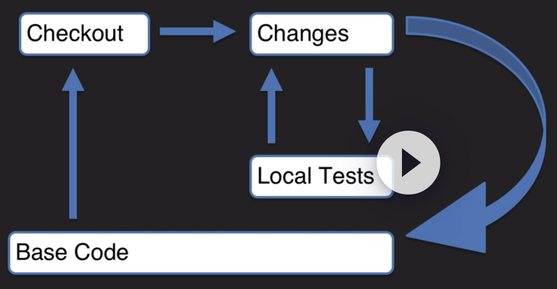
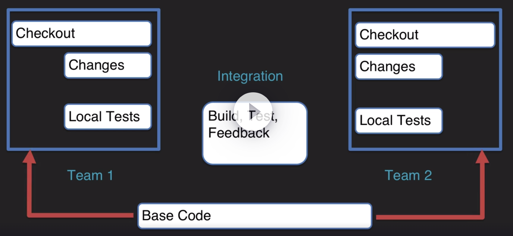
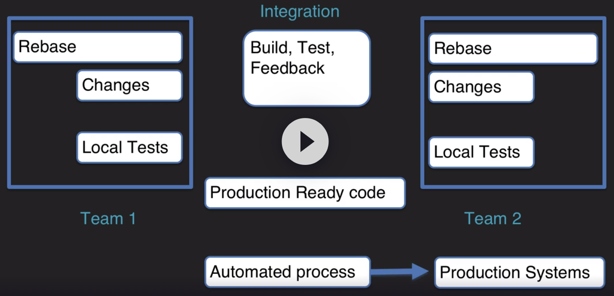

# CI / CD

L'intégration continue, est une pratique de développement logiciel dans laquelle les membres d'une équipe intègrent leur travail fréquemment, au moins quotidiennement, conduisant à plusieurs intégrations par jour. 

**Illustrations**

Dans 1 équipe, nous avons en quelque sorte 4 étapes de ce qui se passe. Donc, encore une fois, nous avons notre code de base en bas, puis en haut sur le côté gauche, nous récupérons ce code de base, ce qui signifie que nous avons un mécanisme de contrôle de source à partir duquel nous extrayons une branche. 

- Donc, une fois que nous avons récupéré le code :

nous allons commencer à apporter nos modifications. Et donc notre code diffère maintenant du code de base parce que nous commençons à y apporter des modifications. Une fois que nous avons commencé à apporter nos modifications, nous sommes dans notre processus de développement, nous devons tester ces modifications en utilisant une construction et une conception pilotées par les tests pour nous assurer que toutes nos modifications de code seront efficaces et qu'elles vont opérer.

- Et une fois que ces modifications échouent :

si nous avons des modifications qui échouent, à partir du test local, nous revenons en arrière et nous entrons dans un cycle où nous corrigeons le problème, continuons à tester, jusqu'à ce que nous obtenions du code bien construit . Et une fois que nous avons ce code bien construit et que tout va bien, nous le remettons au code de base.
Nous avons donc maintenant mis à jour le référentiel disponible avec des modifications testées, des modifications dont le fonctionnement a été garanti. Donc, nous testons ces modifications, nous alignons tout, puis nous l'exécutons dans le code de base. Cette action permet de s'assurer que le code de base est toujours un code prêt à être déployé. 

- Alors, que se passe-t-il si nous prenons ce flux de travail et que nous avons maintenant plusieurs équipes ? 

**Illustrations**

Dans ce cas, notre code de base est le code commun au milieu, et nous avons 2 équipes qui travaillent sur ce code. La première chose qui va se passer dans le même cycle de développement est que ces 2 équipes doivent vérifier le code. Ainsi, l'équipe 1 et l'équipe 2 vérifient toutes les deux le code. Cela signifie qu'ils ont des copies locales qui sont locales dans leur environnement. Ils font leurs changements et leurs tests locaux. Tout se passe à l'intérieur de leur environnement. Puis l'équipe 2 décide qu'ils ont une version candidate : lorsque l'équipe 2 intègre leur code, elle fait sa construction, ses tests et ses commentaires par rapport aux tests créés avec l'apport de l'équipe 1. Ainsi, tous ces tests s'assurent que cette intégration se construit par rapport au dernier code produit par l'équipe 1 afin que lorsqu'ils valident cela, cela fonctionne. Il interagit avec le dernier bon code connu de l'équipe 1. Donc, une fois que cela est fait, ce code est vérifié. Cela fonctionne contre la dernière version, puis il est repoussé dans le code de base. Une fois cela fait, l'équipe 1 doit faire ce qu'on appelle un rebase. Autrement dit, ils intègrent les modifications apportées par l'équipe 2, uniquement les modifications, nous parlons donc de petites étapes progressives. Une fois qu'ils ont fait le rebase, ils retournent dans leur cycle de développement.

- La prochaine étape est la livraison continue.

Il s'agit d'une discipline de développement logiciel où le logiciel est construit de telle sorte que cela permet un déploiement chez les clients à tout moment.

**Illustrations**

Donc, tout ce qui est dans le référentiel central est un code prêt pour la production, ce code est toujours prêt à être déployé en production.

Le **déploiement continu** prolonge le processus de livraison continue en automatisant le processus de déploiement afin que le code soit automatiquement déployé en production après avoir passé les tests automatisés.

Ainsi l'équipe 1 et l'équipe 2 parcourent et ils utilisent l'intégration continue. Ils se font part de leurs commentaires. Ils s'assurent que leur code passe les tests. Ils fournissent ce code sous forme de code prêt pour la production. Ce code est prêt à être déployé. Dès que le code est validé en tant que code prêt pour la production, un processus automatisé est utilisé pour prendre ce code prêt pour la production et le pousser vers les systèmes de production. Ainsi, le processus automatisé prend le relais. Ce code est mis en production. Tout cela est complètement automatique. Il s'agit d'un déploiement continu : cela signifie que le code est automatiquement déployé. Il n'y a pas d'étape manuelle.

La **livraison continue**, c'est que nous livrons continuellement du code : c'est un candidat pour être poussé en production.  
Le **déploiement continu** est que nous déployons continuellement du code sur les systèmes de production de façon automatisée.