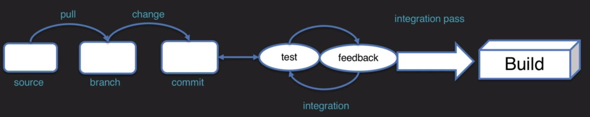
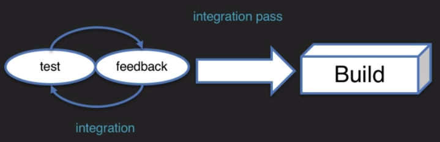

# Qu'est ce que le build ?

## Le build

Un build est le résultat d'une seule exécution d'un projet. 
Et donc ce que nous examinons ici, c'est le processus de production de logiciels. Donc sur le côté gauche, on voit le pull, le changement, la branche, le commit. C'est tout ce que font les développeurs. Au milieu, nous avons la boucle de test et de rétroaction, et les passes d'intégration, puis nous produisons une version. C'est pourquoi le build est le résultat d'une seule exécution d'un projet.

## Etape de build

Une étape de build est une tâche unique au sein d'un projet.
Si nous voulions décrire ce qui se passe lors du build, cela ressemblerait à quelque chose comme : 
- nous vérifions le système de gestion du contrôle des sources pour les changements, 
- nous effectuons une vérification propre, 
- nous construisons le code, 
- nous effectuons des tests et nous vérifions s'il échoue à la passe : c'est la partie intégration. 
- puis nous fournissons des commentaires. 
- Nous donnons une notification et nous disons : "Hey, le code est bon ou alors "Hey, il y a un bogue que vous devez corriger." 
 
Chacun de ces petits morceaux est une étape dans le build.

## Déclencheur de build

Un déclencheur de build est un critère pour démarrer une nouvelle exécution de pipeline. Nous pouvons donc automatiser une partie de ce processus pour nous assurer que le build est automatiquement lancée. Nous déclencherions donc si le gestionnaire de contrôle de source montrait des changements.

## Mais que produit réellement ce build ?

Eh bien, le build produit des **artefacts**, et ces **artefacts** sont des fichiers immuables qui sont générés lors d'une construction ou d'une exécution de pipeline. Ils sont archivés sur le master Jenkins afin que nous puissions en sortir plus tard. L'idée ici est que c'est le fruit réel de ce que nous faisons. C'est l'exécutable. Il s'agit du fichier JAR ou du fichier WAR ou de l'un des artefacts associés à un build. S'il y a un fichier de configuration, il y a un XML : tout cela est considéré comme des artefacts de build.
Ainsi, les artefacts sont conservés dans un référentiel. Cela peut être sur le master Jenkins, dans le gestionnaire de contrôle de code source. Habituellement, cependant, les artefacts se trouvent sur un gestionnaire de contrôle de source, puis ils sont archivés, ou ils sont archivés sur Jenkins, puis archivés ultérieurement dans le gestionnaire de contrôle de source. Ainsi, les référentiels contiennent des éléments qui doivent être récupérés. Le code source, les artefacts de code compilés, les fichiers de configuration, tout ce qui contient notre code ou nos fichiers est considéré comme un référentiel.

## Outils de build

Ce sont les logiciels qui exécutent réellement la partie build du pipeline. Les outils de build peuvent inclure des scripts **maven**, **ant** et **shell**.
 
La configuration varie selon l'outil de build, mais les processus sont similaires. 
- démarrer jenkins et installer les plugins requis
- effectuer les étapes de configuration globale
- créer un job / pipeline qui utilise l'outil de build
- mettre à jour les fichiers de configuration des outils : pom, xml, .config ...