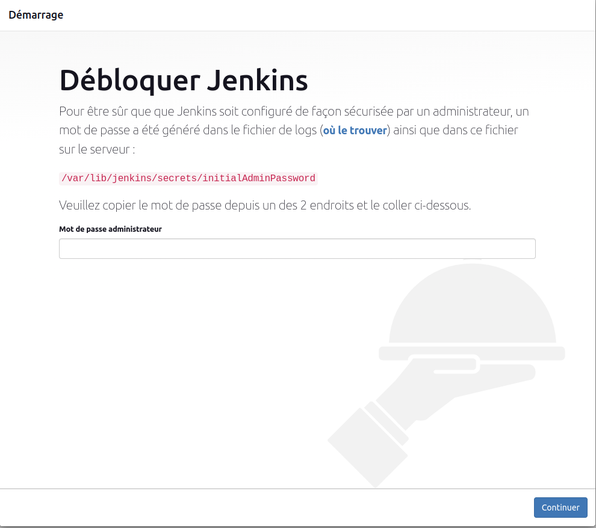
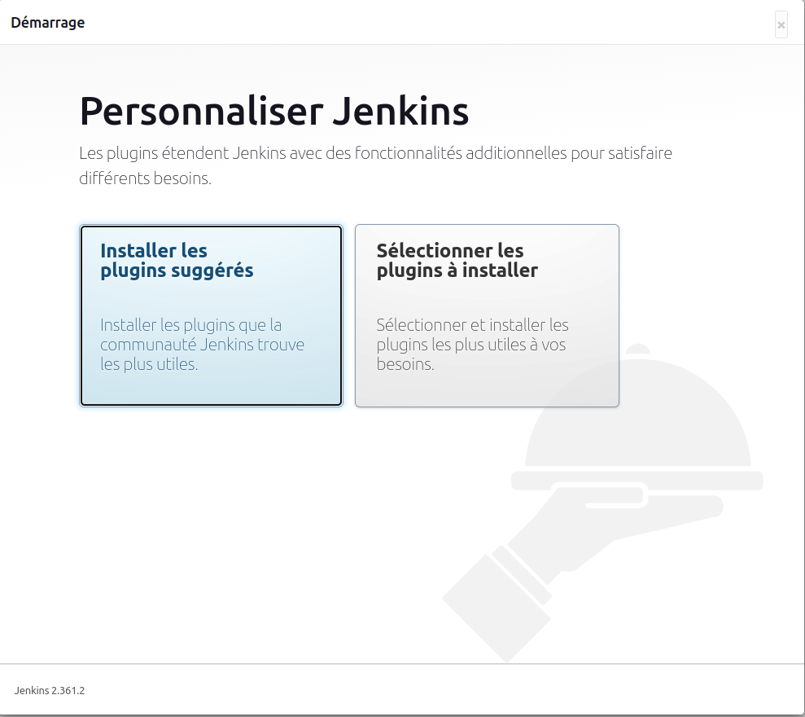
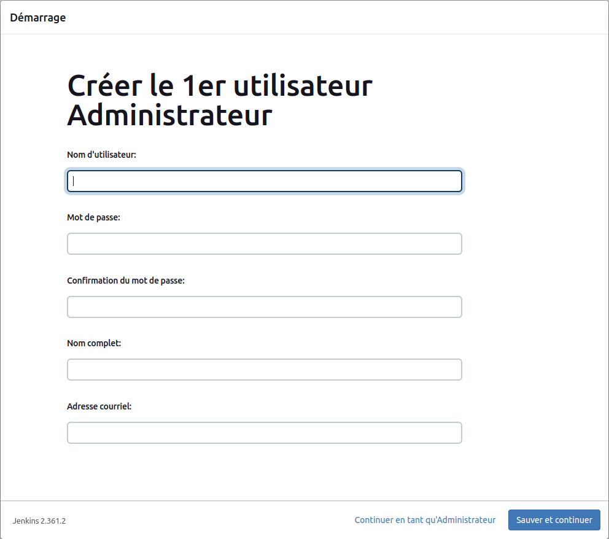
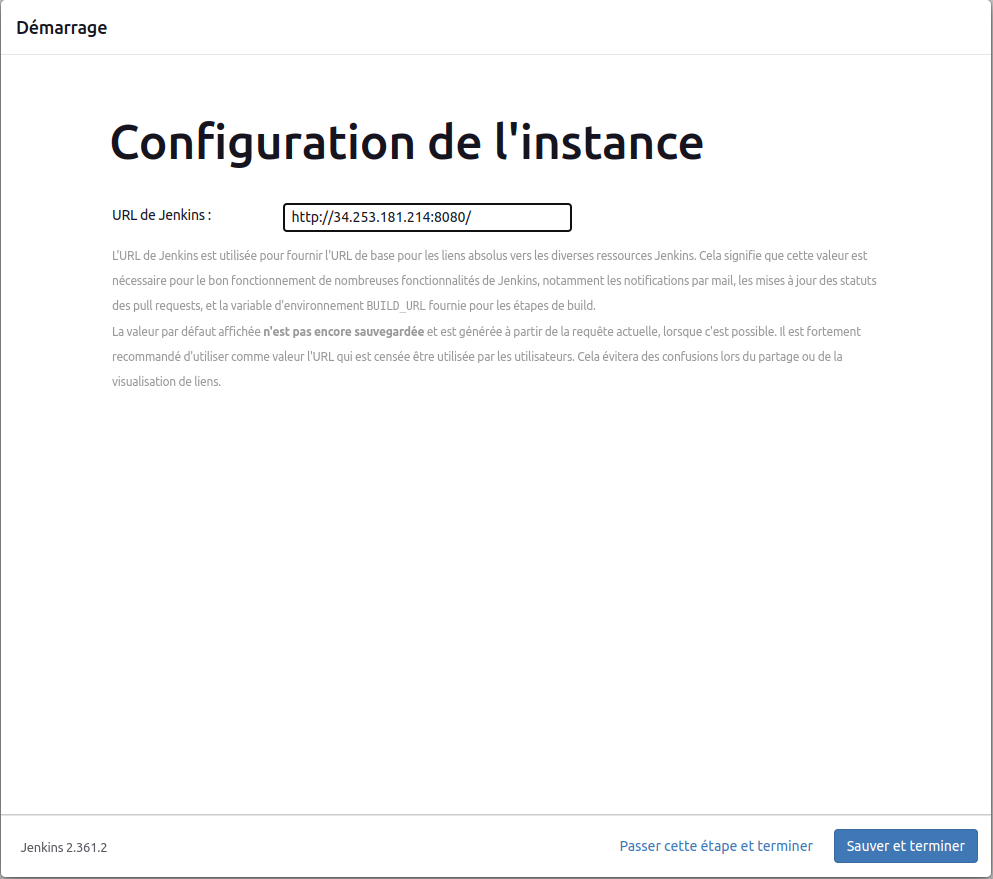

# Installation de Jenkins (version 2.36) sur Rocky linux 8.6

Nous installerons la version stable de jenkins 2.

- Installons les dépendances de jenkins

```
sudo wget -O /etc/yum.repos.d/jenkins.repo https://pkg.jenkins.io/redhat-stable/jenkins.repo
sudo rpm --import https://pkg.jenkins.io/redhat-stable/jenkins.io.key
```

```
sudo yum install epel-release -y
```

```
sudo yum install yum-utils
sudo yum-config-manager --enable epel
```

```
sudo yum install git daemonize fontconfig java-11-openjdk -y
```

- Installons jenkins

```
sudo yum install jenkins

sudo systemctl enable jenkins
```

Démarrons jenkins et vérifions qu'il est bien démarré

```
sudo systemctl start jenkins

sudo systemctl status jenkins
```

- Configurons la permission du port par défaut 8080 de jenkins

```
JENKINSPORT=8080
PERM="--permanent"
SERV="$PERM --service=jenkins"

sudo firewall-cmd $SERV --set-short="jenkins ports"
sudo firewall-cmd $SERV --set-description="jenkins port exception"
sudo firewall-cmd $SERV --add-port=$JENKINSPORT/tcp
sudo firewall-cmd $PERM --add-service=jenkins
sudo firewall-cmd --zone=public --add-service=http --permanent
sudo firewall-cmd --reload
```

- Configurons jenkins

Lorsque nous accédons pour la première fois à une nouvelle instance Jenkins, nous sommes invités à débloquer jenkins à l'aide d'un mot de passe généré automatiquement. 



Nous saisissons la commande ci-dessous pour afficher le mot de passe temporaire d'administration de jenkins :

```
sudo cat /var/lib/jenkins/secrets/initialAdminPassword
```

Dans notre cas, le mot de passe est par exemple :
```
f6606cf00ea44b02902f88af0e1db178
```

Il sera différent pour une autre installation et nous ne devons pas la divulguer.
<br>

Après avoir déverrouillé Jenkins, la page **Personnaliser Jenkins** apparaît. 



Ici, nous pouvons installer n'importe quel nombre de plugins utiles dans le cadre de notre configuration initiale.
<br>
Cliquons sur l'une des deux options affichées :

- Installer les plugins suggérés - pour installer l'ensemble de plugins recommandé, basé sur les cas d'utilisation les plus courants.

- Sélectionner les plugins à installer - pour choisir l'ensemble de plugins à installer initialement. Lorsque nous accédons pour la première fois à la page de sélection des plugins, les plugins suggérés sont sélectionnés par défaut.<br>

Enfin, après avoir personnalisé Jenkins avec des plugins, Jenkins nous demande de créer notre premier utilisateur administrateur.



Après avoir spécifié les détails de notre utilisateur administrateur dans les champs respectifs et cliquez sur **Sauver et continuer**, nous sommes redirigés vers la page de configuration de l'url de jenkins :



Nous cliquons sur **Sauver et terminer** pour accéder à la page **Jenkins est prêt** puis, nous cliquons sur **Commencer à utiliser Jenkins**.