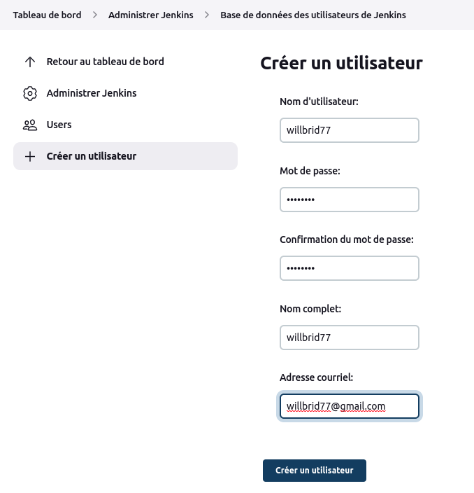
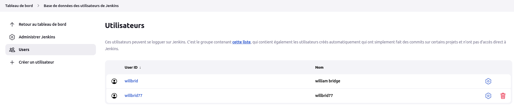
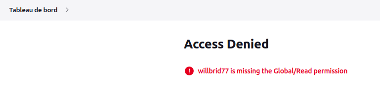
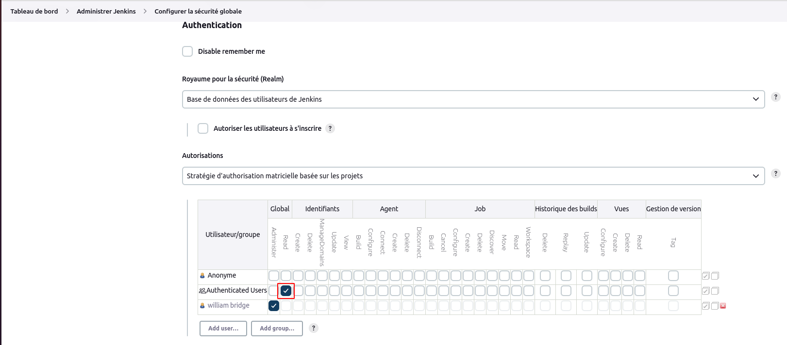
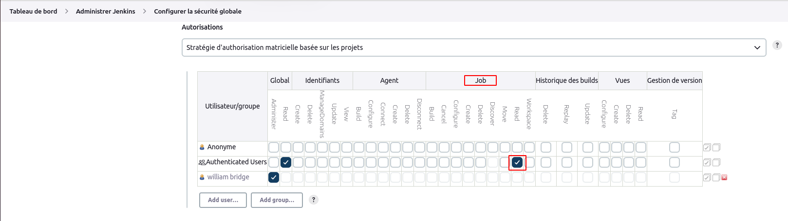
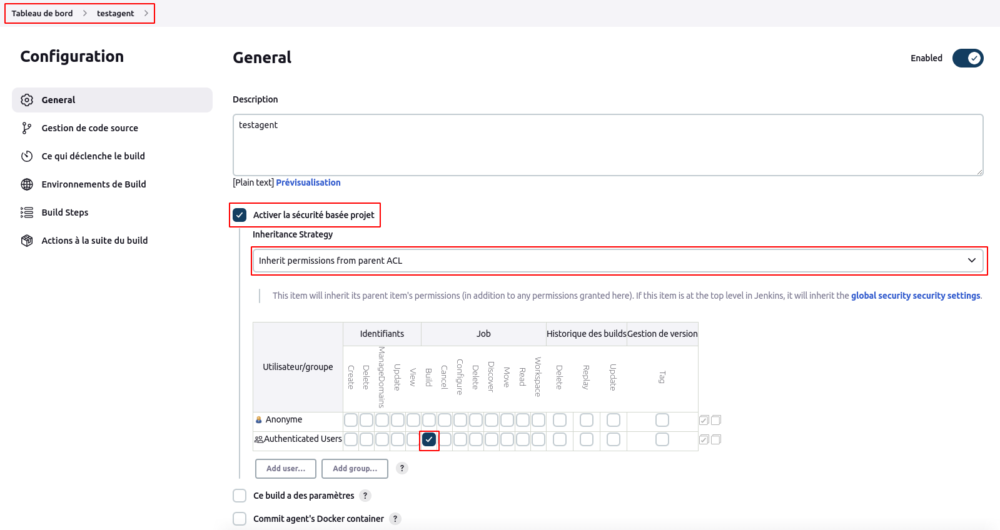
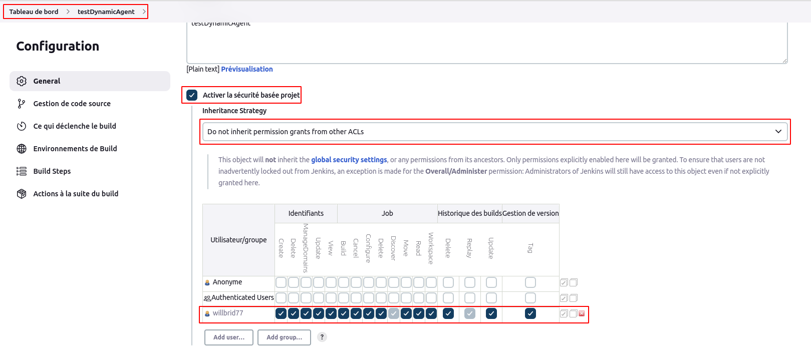

# Sécurité

- Créer un utilisateur sur jenkins

Pour créer un utilisateur sur jenkins, nous naviguons sur **Tableau de bord > Administrer Jenkins > Base de données des utilisateurs de Jenkins**, puis nous cliquons sur le menu **Créer un utilisateur**. Une page formulaire s'ouvre où nous renseignons les informations de l'utilisateur : nom d'utilisateur, mot de passe, confirmation du mot de passe, nom complet, adresse couriel. Enfin nous validons.

- Configurer la stratégie d'autorisation globale

Par défaut après installation de jenkins, tous les utilisateurs créés ont toutes les autorisations comme l'administrateur. Nous allons configurer la **stratégie d'autorisation matricielle basée sur les projets** qui permet d'attribuer des privilèges précis aux utilisateurs de jenkins. 

Pour configurer cette stratégie, nous naviguons sur **Tableau de bord > Administrer Jenkins > Configurer la sécurité globale**. Au niveau de la section **Autorisations**, nous choisissons l'option intitulé : **stratégie d'autorisation matricielle basée sur les projets**, puis nous validons.

Si nous nous connectons avec l'utilisateur précédemment créé alors nous n'aurons aucun droit d'accès sur tous les objets de jenkins.

- Donner les droits de lecture à tous les utilisateurs créés de jenkins sous le contexte **global**

Nous allons donner les droits de lecture à tous les utilisateurs créés sur tous les objets jenkins du contexte **global**. Pour cela, nous naviguons sur **Tableau de bord > Administrer Jenkins > Configurer la sécurité globale**. Au niveau de la section **Autorisations** où nous avons choisi précédemment l'option **stratégie d'autorisation matricielle basée sur les projets**, nous cochons sous le contexte **global** de la ligne **Authenticated Users** le privilège **Read**, puis nous validons.

Si nous nous connectons avec l'utilisateur précédemment créé, nous verrons les pages globales de jenkins uniquement en lecture.

- Donner les droits de lecture à tous les utilisateurs créés de jenkins sous le contexte **job**

Nous allons donner les droits de lecture à tous les utilisateurs créés sur tous les objets jenkins du contexte **job** qui leur permettront de consulter les jobs. Pour cela, nous naviguons sur **Tableau de bord > Administrer Jenkins > Configurer la sécurité globale**. Au niveau de la section **Autorisations** où nous avons choisi précédemment l'option **stratégie d'autorisation matricielle basée sur les projets**, nous cochons sous le contexte **job** de la ligne **Authenticated Users** le privilège **Read**, puis nous validons.

Si nous nous connectons avec l'utilisateur précédemment créé, nous verrons les jobs de jenkins uniquement en lecture.

- Donner les droits de **build** sur un job précis à tous les utilisateurs de jenkins

Nous allons donner les droits de **build** à notre job **testagent** à tous les utilisateurs de jenkins. Pour cela nous naviguons sur la page détail de notre job. Ensuite nous cliquons sur le menu **Configurer**. Ensuite sur la page de configuration du job, nous sélectionnons la stratégie d'héritage **inheritance permissions from parent ACL**. Enfin nous cochons sous le contexte **job** de la ligne **Authenticated Users** le privilège **Build**, puis nous validons.

Si nous nous connectons avec l'utilisateur précédemment créé, nous verrons sur la page détail de notre job **testagent** le menu **Lancer un build**.

- Donner tous les droits uniquement sur un job à un utilisateur précis

Nous allons donner tous les droits uniquement sur notre job **testDynamicAgent** à notre utilisateur **willbrid77**. Pour cela nous naviguons sur la page détail de notre job. Ensuite nous cliquons sur le menu **Configurer**. Ensuite sur la page de configuration du job, nous sélectionnons la stratégie d'héritage **Do not inherit permission grants from other ACLs**. Nous cliquons sur le bouton **add user** pour ajouter notre utilisateur **willbrid77**, puis nous lui donnons tous les droits et nous validons.

Si nous nous connectons avec l'utilisateur précédemment créé, nous verrons sur la page détail de notre job **testDynamicAgent** tous les menus d'un job.