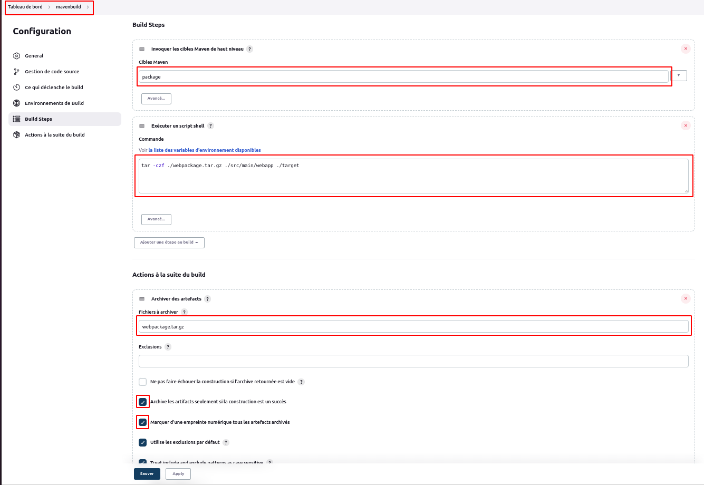
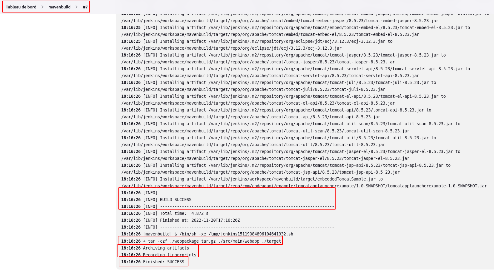
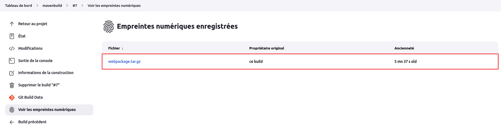

# Artéfact

Dans le contexte de jenkins, un artefact est un fichier immuable, généré lors d'une exécution de build ou de pipeline dans Jenkins. Ces artefacts sont ensuite archivés sur le contrôleur Jenkins pour une utilisation ultérieure.
<br>
Nous allons créer un job **mavenbuild** sous lé référentiel **https://github.com/willbrid/content-jenkinscert** qui génèrera un artéfact de build.
<br>
Nous suivrons la même démarche de création d'un job vu dans les articles précédents avec une légère différence :

- au niveau de la section **Build Steps**, nous choisissons l'option **Invoquer les cibles maven de haut niveau**, puis les paramètres **Version de Maven** : selection de la version installée, **Cibles Maven** : **package** et **POM** : **pom.xml**.
<br>
Sous la même section, nous ajoutons aussi l'option **Exécuter un script shell** afin de renseigner la commande

```
tar -czf ./webpackage.tar.gz ./src/main/webapp ./target
```

- au niveau de la section **Actions à la suite du build**, nous choisissons l'option **Archiver des artefacts**, ensuite nous renseignons le nom du fichier à archiver **webpackage.tar.gz**, ensuite nous cliquons sur le bouton **Avancé**, puis nous sélectionnons les options : **Archive les artifacts seulement si la construction est un succès** et **Marquer d'une empreinte numérique tous les artefacts archivés**, enfin nous validons.



Nous lançons un build de notre job.



