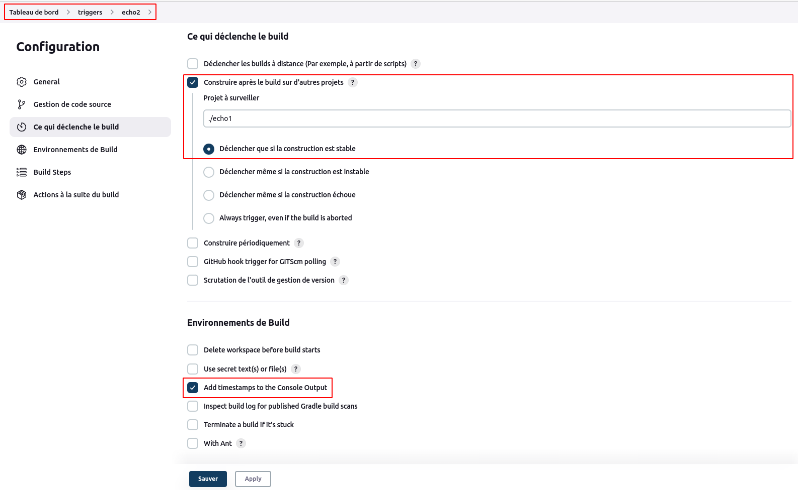
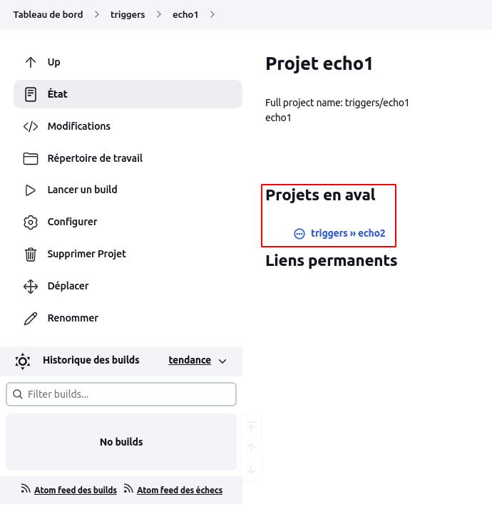
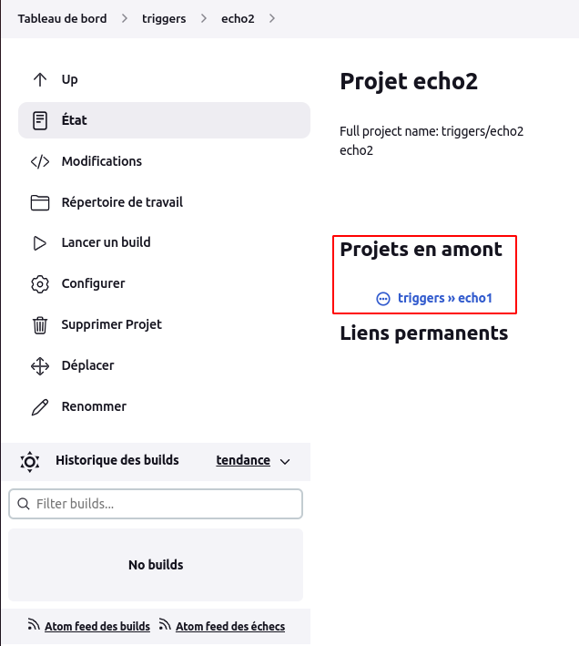
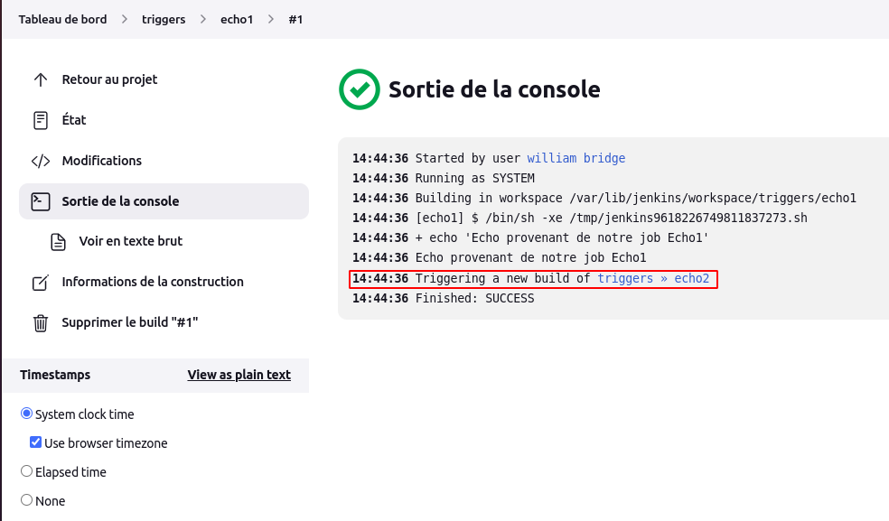
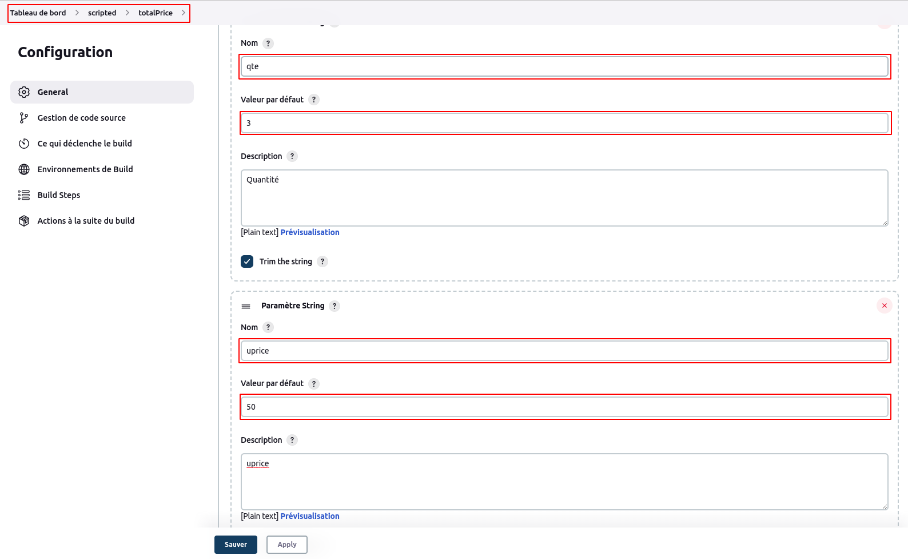
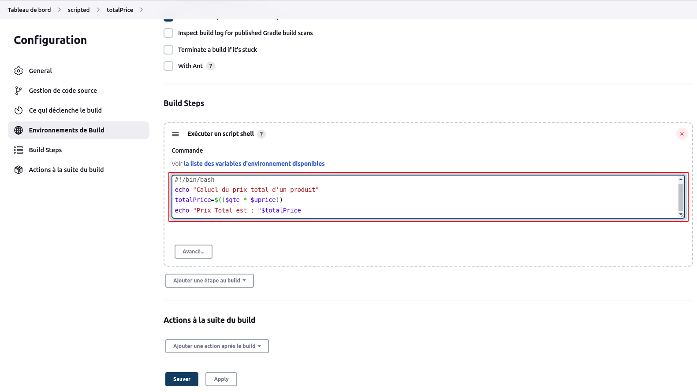
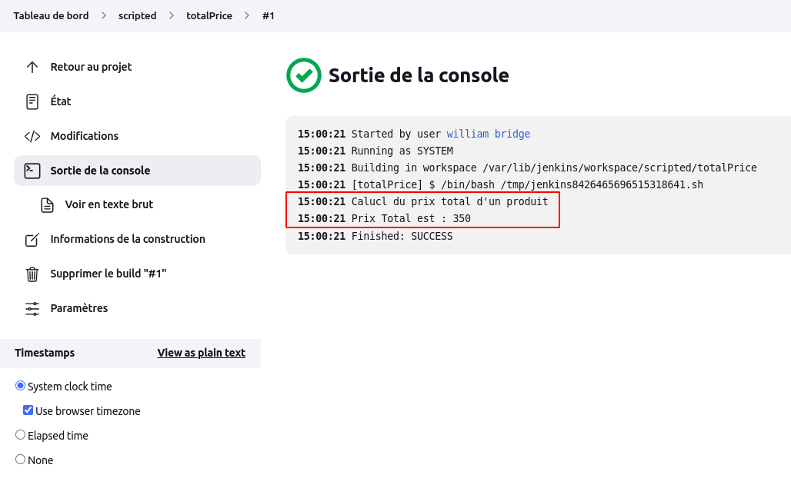

# Build

### Lancer un build automatiquement après un autre build

En utilisant les notions précédentes sur les jobs(1-jobs.md), nous allons ici créer un dossier **triggers** (depuis le **Tableau de bord**) où nous allons créer un premier job via le script shell, nommé **echo1** permettant d'éxécuter la commande :

```
echo "Echo provenant de notre job Echo1"
```

Nous allons ensuite créer notre deuxième job via le script shell, nommé **echo2** qui sera lancé après le job **echo1** et exécutant la commande :

```
echo "Echo provenant de notre job Echo2"
```

Nous utiliserons l'option **Construire après le build sur d'autres projets** de la section **Ce qui déclenche le build**, puis nous insérons notre job **echo1** : **./echo1** .



Si nous consultons la page détails du job **echo1**, nous verrons mentionner **Projets en aval**.



Puis sur la page détails du job **echo2** nous verrons mentionner **Projets en amont**.



Si nous lançons le build du job **echo1**, nous constaterons via sa page **Sortie console** du build que le build du job **echo2** s'est aussi déclenché.



### Lancer un build d'un job défini via un script bash

Nous pouvons définir un job script en mentionnant un script bash comme contenu. Nous créeons pour cela un dossier **scripted**, puis un job **totalPrice** via un script qui calcule le prix total d'un produit avec pour quantité **qte** et pour prix unitaire **uprice**. Ces variables seront paramétrées dans la définition de notre job.





Si nous lançons le build de ce job **totalPrice** et nous consultons sa sortie console, nous aurons :

