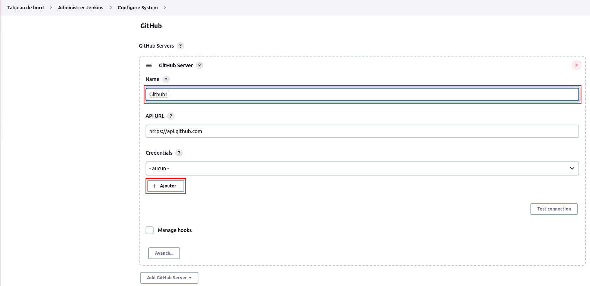
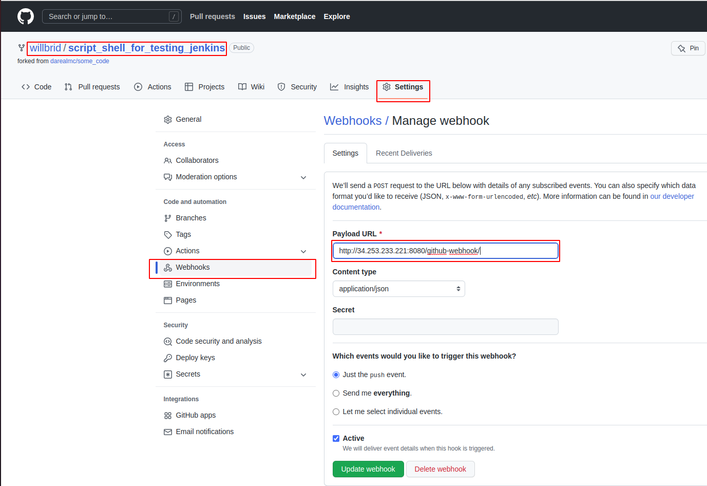

# Gestion des codes sources (github)

## Lancer un build de script shell à partir d'un référentiel github

En utilisant les notions précédentes sur les jobs(1-jobs.md), nous allons ici créer un dossier **sourced** (depuis le **Tableau de bord**) où nous allons créer un job via le script shell, nommé **scmjob** permettant d'éxécuter le script **testscript.sh** provenant de notre référentiel : **https://github.com/willbrid/script_shell_for_testing_jenkins**
<br>
Nous configurons le job avec pour paramètres : **NUMBERONE** et **NUMBERTWO** (voir 1-jobs.md), puis au niveau de la section **Gestion de code source**, nous insérons l'adresse de notre référentiel. Il ne serait pas nécessaire de préciser les paramètres d'authentification puis qu'il s'agit d'un référentiel public.


Ensuite nous ajoutons les lignes d'exécution de notre script shell au niveau de la section **Build Steps**.

```
chmod +x ./testscript.sh
./testscript.sh
```


Une fois que nous lançons le build de notre job **scmjob**, nous verrons en **sortie console** :


## Lancer un build de script shell à partir d'un webhook écoutant les commit sur un référentiel github

De prime abord, nous allons configurer jenkins afin de définir les paramètres d'authentification sur notre référentiel github. Pour cela nous naviguons sur **Tableau de bord** > **Administrer Jenkins** > **Configurer le système**.
<br>
Ensuite, sur github (un autre onglet de navigateur), nous déroulons le menu à côté de notre indicateur de profil, puis nous cliquons sur **settings**.


Ensuite nous cliquons sur le menu **Developer settings**, puis sur **Personal access tokens** > **Tokens (classic)**, puis nous cochons la case **admin:repo_hook** et enfin nous validons.


Nous revenons sur notre interface jenkins pour ajouter un serveur github.



Nous cliquons sur **Ajouter** de la section **Credentials** afin de définir les crédentials de type **secret text** pour github nommé : **github-token**.


Nous cochons la case **Manage hooks** et nous testons notre connexion afin de se rassurer de la bonne configuration de notre serveur github.


Enfin nous validons notre configuration.
<br>

Nous revenons sur l'interface détails de notre job **scmjob** pour configurer notre projet github.


Au niveau de la section **Ce qui déclenche le build** nous cochons la case **GitHub hook trigger for GITScm polling** pour dire à jenkins d'écouter les événements commit de notre référentiel et de déclencher un build.


Aussi, nous devons configurer un webhook **push event** depuis notre référentiel github afin de permettre à github de pousser une nouvelle mise à jour lorsque nos commit ont été poussés vers notre référentiel.

```
http://@IP_PUBLIC_DE_JENKINS:8080/github-webhook/
```



Pour tester notre configuration, nous éditons notre référentiel **https://github.com/willbrid/script_shell_for_testing_jenkins**, nous enregistrons un commit et nous poussons notre code.