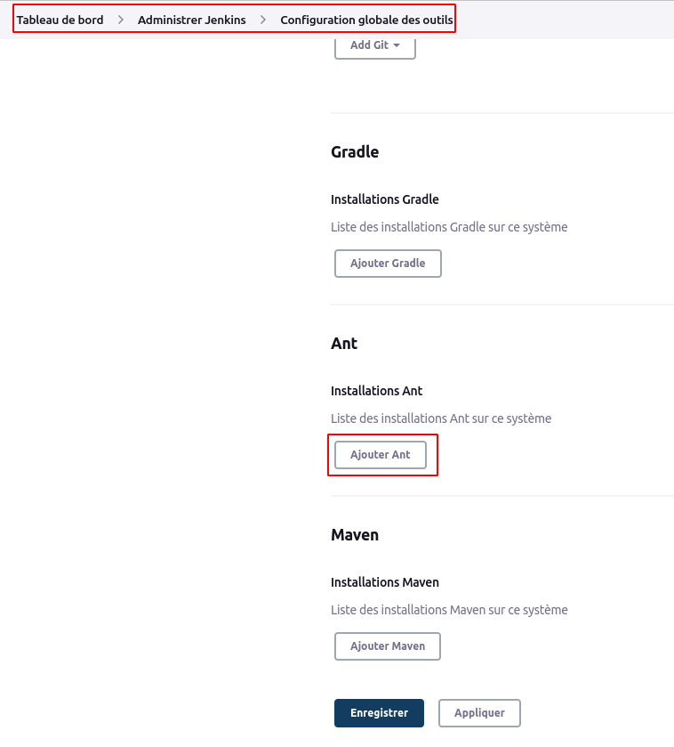
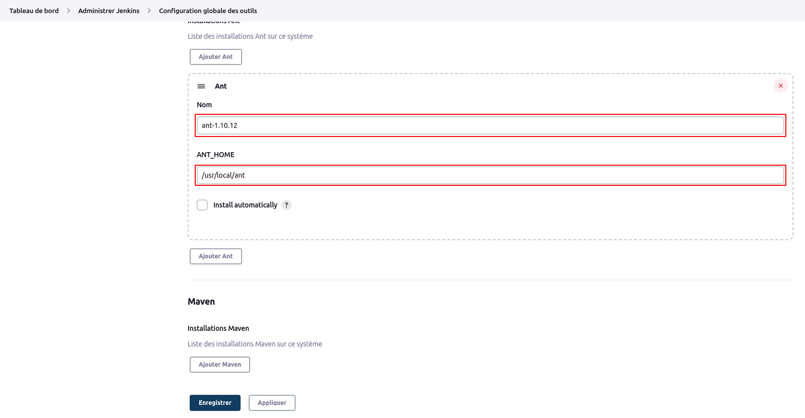
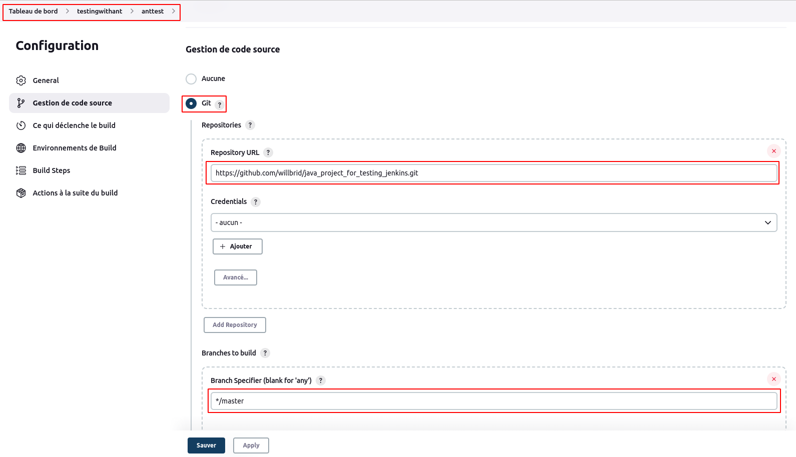
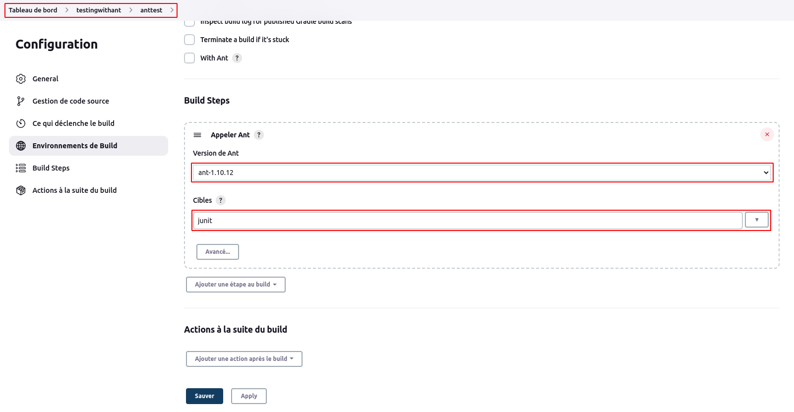
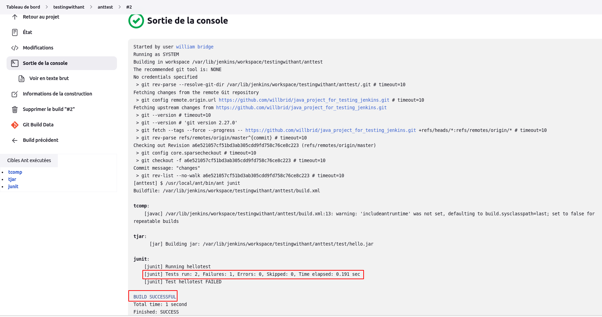
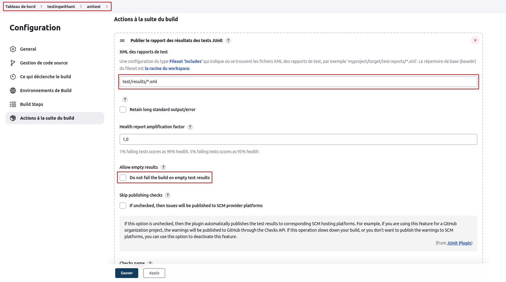
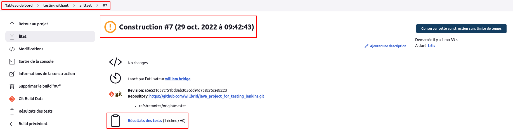
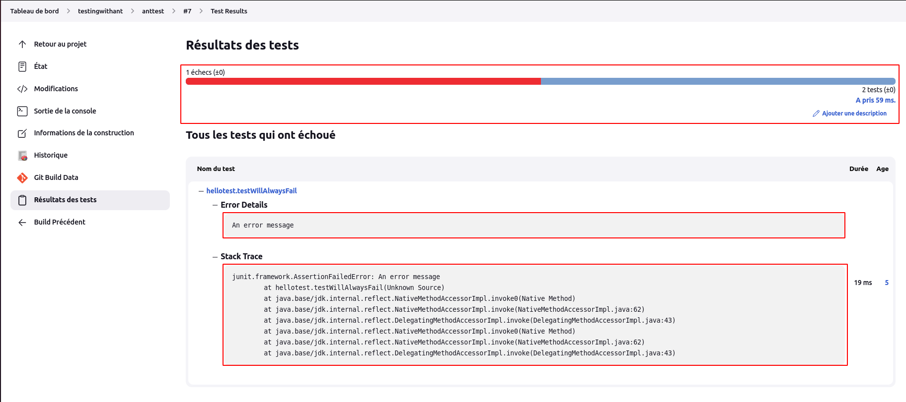

# Test

Nous utilserons l'outil **Ant** qui est une bibliothèque Java et un outil de ligne de commande dont la mission est de piloter les processus décrits dans les fichiers de build en tant que cibles et points d'extension dépendant les uns des autres. Il fournit un certain nombre de tâches intégrées permettant de compiler, assembler, tester et exécuter des applications Java, et non Java (C++, C, PHP). [[apache_ant](https://ant.apache.org/)]


- Installer Ant (version **1.10.12**) sous Rocky Linux 

```
wget https://dlcdn.apache.org//ant/binaries/apache-ant-1.10.12-bin.zip
```

```
unzip apache-ant-1.10.12-bin.zip
sudo mv apache-ant-1.10.12 /usr/local/ant
```

Nous allons maintenant configurer la variable d'environnement **PATH** pour inclure le répertoire **bin** d'Apache Ant. Pour ce faire, créeons un nouveau fichier nommé **ant.sh** dans le répertoire **/etc/profile.d/**

```
sudo vi etc/profile.d/ant.sh
```

```
ANT_HOME="/usr/local/ant"
PATH="$PATH:/usr/local/ant/bin"
export ANT_HOME
export PATH
```

```
sudo chmod +x /etc/profile.d/ant.sh
```

Chargeons les variables d'environnement pour la session en cours à l'aide de la commande suivante.

```
source /etc/profile.d/ant.sh
```

Vérifions que Ant est installé 

```
which ant
```

Puisque le contenu **/usr/local/ant/lib** contient **ant-junit4.jar**, nous allons aussi intégrer **junit.jar** (version 4.13.2) et hamcrest-core.jar (version 1.3) dans ce répertoire de librairie de **ant** (/usr/local/ant/lib).

```
curl -L https://search.maven.org/remotecontent?filepath=junit/junit/4.13.2/junit-4.13.2.jar --output junit-4.13.2.jar
```

```
curl -L https://search.maven.org/remotecontent?filepath=org/hamcrest/hamcrest-core/1.3/hamcrest-core-1.3.jar --output hamcrest-core-1.3.jar
```

```
sudo mv junit-4.13.2.jar /usr/local/ant/lib/junit.jar
sudo mv hamcrest-core-1.3.jar /usr/local/ant/lib/hamcrest-core.jar
```

Référence :
[junit4](https://junit.org/junit4/)
[junit4/wiki/Download-and-Install](https://github.com/junit-team/junit4/wiki/Download-and-Install)

- Configurer le répertoire de **ant** dans Jenkins

Nous naviguons sur la page de configuration globale des outils : **Tableau de bord > administrer Jenkins > Configuration globale des outils** , puis nous cliquons sur **Ajouter Ant** .



Nous décochons la case **install automatically**, puis nous mettons un nom (avec sa version) associé à ant et son répertoire **home** (**/usr/local/ant**), puis nous enregistrons.



- Créer un job utilisant ant sur un référentiel github

Nous créeons un dossier **testingwithant**. Nous utiliserons ici notre référentiel : 

```
https://github.com/willbrid/java_project_for_testing_jenkins.git
```

Nous créeons un job **anttest** sur notre référentiel ci-dessus



Au niveau de la section **Build Steps**, nous choisissons l'option **Appeler Ant** . Une mini-fenêtre s'ouvre où nous allons sélectionner la version de ant configurée et le nom (**junit**) de notre cible provenant du fichier **build.xml** de notre référentiel au niveau de la dernière balise **target**.



En lançant le build, nous constatons qu'il s'effectue avec succès selon Jenkins pourtant nous savons que le test échoue en observant le fichier de test et la console de sortie.

```
java_project_for_testing_jenkins/test/hellotest.java
```



Jenkins ne connait pas encore que le test a échoué, c'est pourquoi nous allons montrer à Jenkins comment le test échoue. Pour cela nous allons configurer une action post-build permettant de publier le rapport de test de **junit**.
<br>
Au niveau de la section **Actions à la suite du build**, nous choisissons **Publier le rapport des résultats des tests JUnit**. Ensuite au niveau du champ **XML des rapports de test**, nous précisons la valeur **test/results/*.xml** provenant du fichier **build.xml**

```
<project>
...
  <target name="junit" depends="tjar">
...
    <test name="hellotest" haltonfailure="no" todir="test/results">
  </target>
</project>
```



Nous lançons à nouveau le build et nous constatons que Jenkins cette fois interprête les résultats du build et nous précise que le build échoue.



