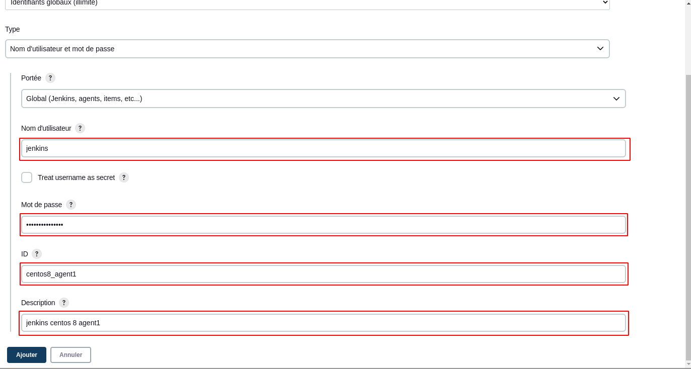
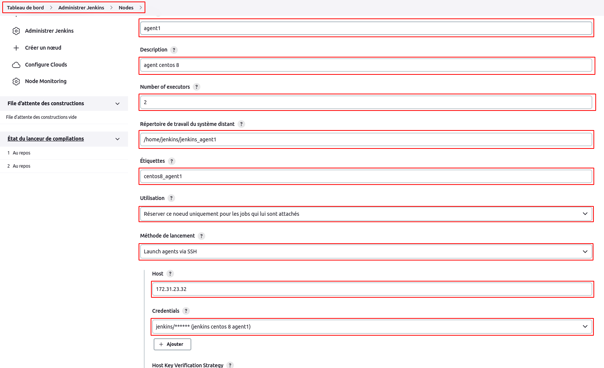
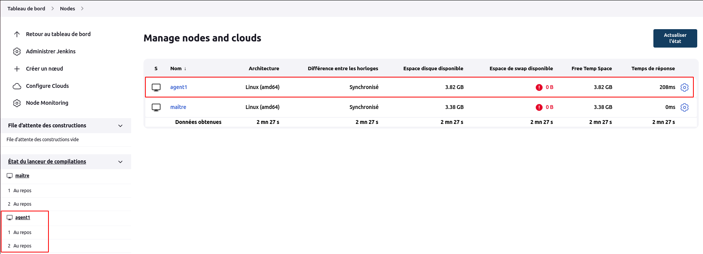
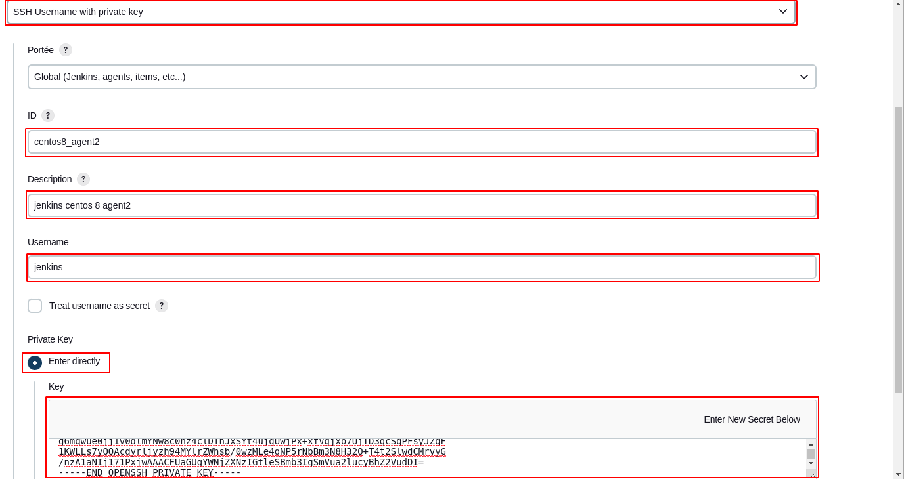
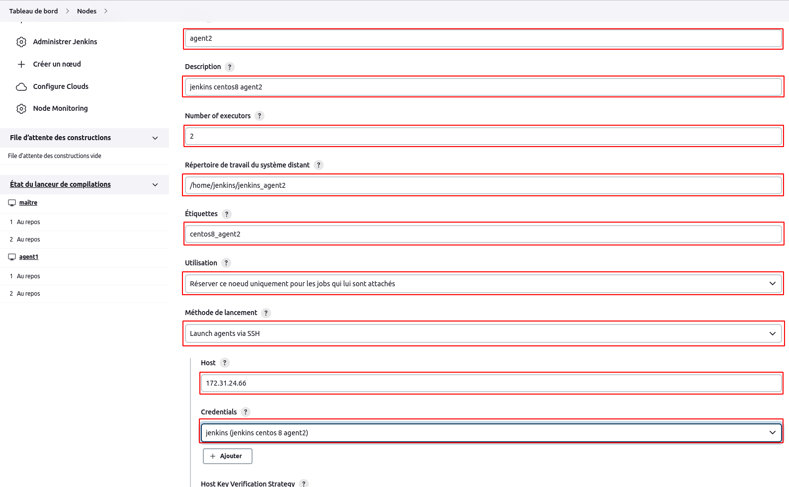
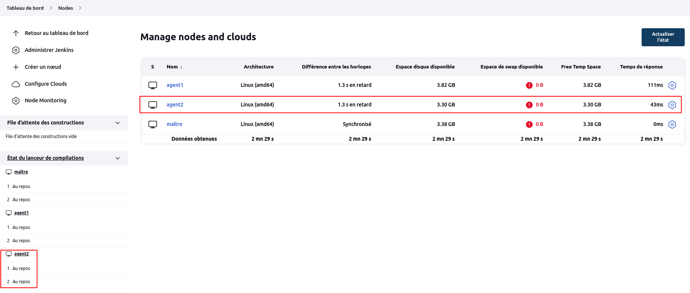
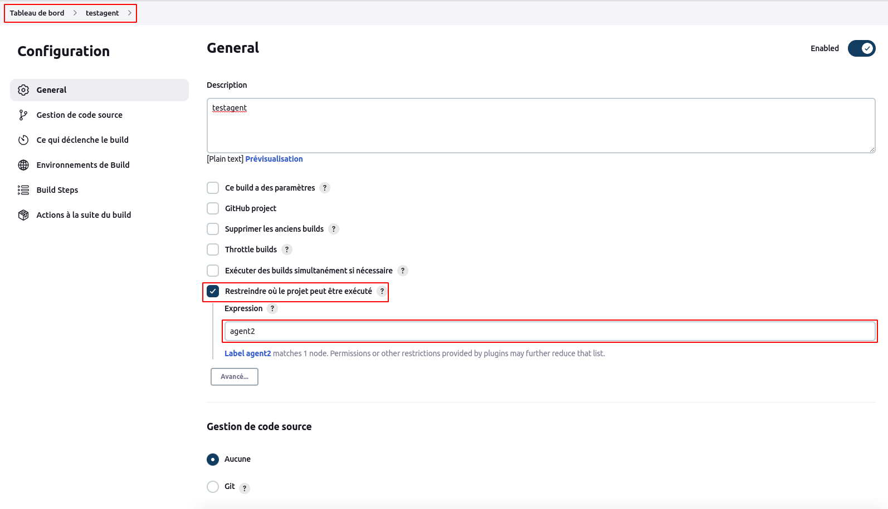
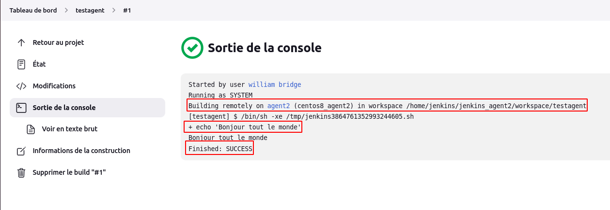

# Builds distribués [Partie1]

Dans cette partie, nous allons configurer les agents statiques : un agent statique via les crédentials : login et mot de passe, et un autre agent statique par clé ssh.

Comme préréquis, certains dépendances seront nécessaires sur ces agents : java et git

```
sudo yum install epel-release -y
sudo yum install yum-utils
sudo yum-config-manager --enable epel
```

```
sudo yum install git java-11-openjdk -y
```

### Création d'un agent via login et mot de passe

- Connectons-nous au serveur **agent1**

- Créeons un utilisateur jenkins et un mot de passe

```
sudo adduser jenkins --shell /bin/bash
```

```
sudo passwd jenkins
```

Par exemple nous mettons comme mot de passe : **jenkins12345678**

- Maintenant, connectons-nous en tant qu'utilisateur jenkins.

```
su jenkins
```

- Créeons un répertoire "jenkins_agent1" sous **/home/jenkins**

```
mkdir /home/jenkins/jenkins_agent1
```

- Configurons notre noeud agent1 sur la master jenkins

Naviguons sur **Tableau de bord > Administrer Jenkins > Gérer les nœuds**, puis cliquons sur **Créer un noeud**. Donnons-lui un nom (agent1), sélectionnons l'option **agent permanent** et cliquons sur **créer**.
<br>
Une nouvelle fenêtre s'ouvre où nous allons renseigner les informations de l'agent : <br>
--- le nom de l'agent <br>
--- sa description <br>
--- son nombre d'exécuteurs <br>
--- son répertoire de travail (/home/jenkins/jenkins_agent1) <br>
--- son étiquette qui sera utilisable lors de la configuration d'un job <br>
--- son utilisation: ici nous avons sélectionné l'option **utiliser ce noeud uniquement pour les jobs qui lui sont attachés** <br>
--- sa méthode de connexion : connexion par ssh avec son adresse IP, ses crédentials (login et mot de passe) créés grace au bouton **ajouter** 





Au niveau de la section **Host Key Verification Strategy**, nous sélectionnons l'option **pas de stratégie de vérification**, puisque nous faisons confiance à notre serveur.
<br>
Si tout se passe bien alors, nous verrons notre agent synchronisé.



### Création d'un agent par clé ssh

- Connectons-nous au serveur **agent2**

- Créeons un utilisateur jenkins et un mot de passe

```
sudo adduser jenkins --shell /bin/bash
```

```
sudo passwd jenkins
```

Par exemple nous mettons comme mot de passe : **jenkins12345678**

- Maintenant, connectons-nous en tant qu'utilisateur jenkins.

```
su jenkins
```

- Créeons un répertoire "jenkins_agent2" sous **/home/jenkins**

```
mkdir /home/jenkins/jenkins_agent2
```

- Configurons notre noeud agent2 sur la master jenkins

Naviguons sur **Tableau de bord > Administrer Jenkins > Gérer les nœuds**, puis cliquons sur **Créer un noeud**. Donnons-lui un nom (agent2), sélectionnons l'option **agent permanent** et cliquons sur **créer**. Nous renseignons les informations du noeud **agent2** similaire à celui du noeud **agent1** sauf la méthode d'authentification qui sera par clé ssh.

Nous créeons un répertoire **.ssh** au niveau du répertoire **/home/jenkins** et cd dans le répertoire.

```
mkdir ~/.ssh && cd ~/.ssh
```

Nous créeons une paire de clés ssh sans mot de passe

```
ssh-keygen -t rsa -C "The access key for Jenkins agent2"
```

Nous ajoutons la clé publique au fichier **authorized_keys**

```
cat id_rsa.pub > ~/.ssh/authorized_keys
```

Nous définissons les permissions sur le répertoire **.ssh** et son fichier **.ssh/authorized_keys**

```
sudo chmod 700 .ssh
sudo chmod 600 .ssh/authorized_keys
```

Maintenant, nous copions le contenu de la clé privée

```
cat id_rsa
```





Si tout se passe bien alors, nous verrons notre agent synchronisé.




### Testons nos agents jenkins

Pour tester nos agents jenkins, nous configurons un simple job script shell (**testagent**) qui utilise notre agent (par exemple **agent2**).

```
echo "Bonjour tout le monde"
```



Nous lançons un build et nous constaterons via la console de sortie que jenkins utilise notre noeud **agent2**.

