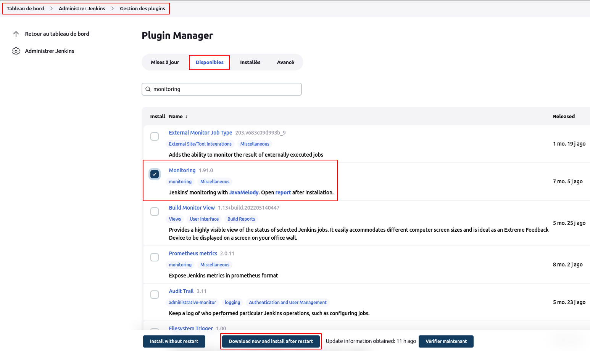
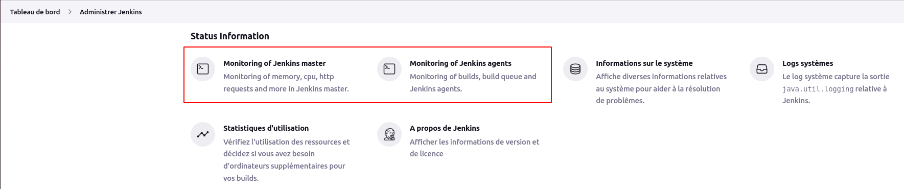
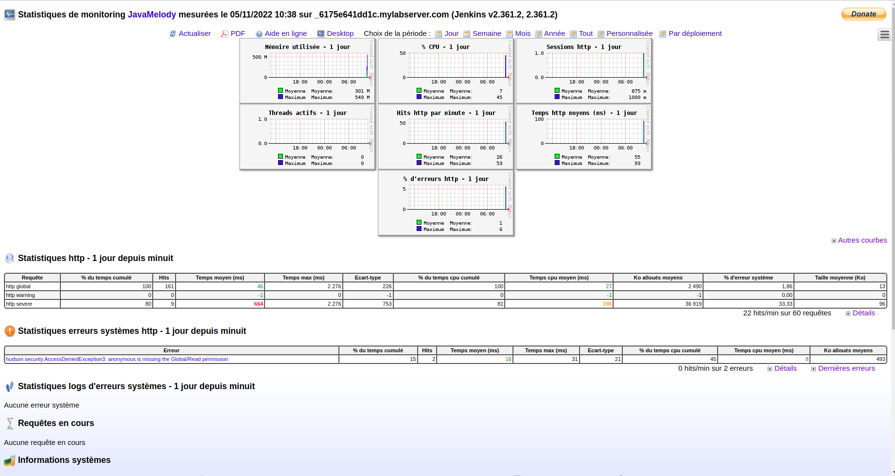
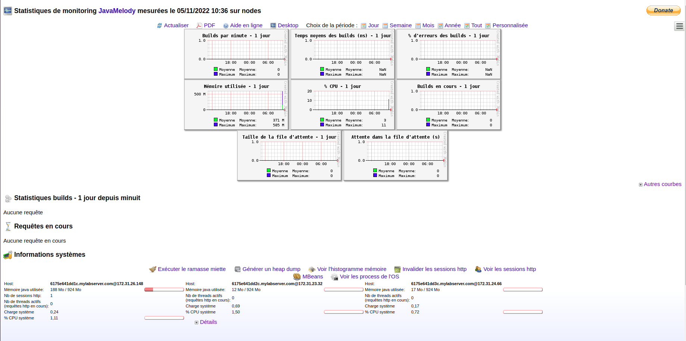

# Plugins

Les plugins sont le principal moyen d'améliorer les fonctionnalités d'un environnement Jenkins pour répondre aux besoins spécifiques de l'organisation ou de l'utilisateur. Il existe plus d'un millier de plugins différents qui peuvent être installés sur un contrôleur Jenkins et pour intégrer divers outils de construction, fournisseurs cloud, outils d'analyse, et bien plus encore.
 
 
En guise d'illustration, nous installerons le plugin de **monitoring**.
 
Naviguons sur **Tableau de bord > Administrer Jenkins > Gestion des plugins**, puis sélectionnons l'onglet **Disponibles**. Dans le champ de recherche saisissons le mot clé **monitoring**, ensuite sélectionnons le plugins **monitoring**, puis cliquons sur le bouton **Download now and install after restart**.

Après installation, nous verrons les fonctionnalités **Monitoring of jenkins master** and **Monitoring of jenkins agents** sous la section **Status Information** du menu **Tableau de bord > Administrer Jenkins**

- Monitoring de la master

- Monitoring des agents
