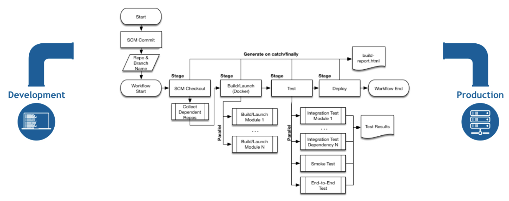

# Concepts de pipeline
## Définition

**Jenkins Pipeline** est une suite de plugins qui prend en charge la mise en œuvre et l'intégration de pipelines de livraison continue dans Jenkins.
<br><br>
Un **pipeline de livraison continue (CD)** est une expression automatisée de notre processus pour faire passer le logiciel du contrôle de version jusqu'à nos utilisateurs et clients. Chaque modification apportée à notre logiciel (engagée dans le contrôle de code source) passe par un processus complexe avant d'être publiée. Ce processus implique de construire le logiciel de manière fiable et reproductible, ainsi que de faire progresser le logiciel construit (appelé "build") à travers plusieurs étapes de test et de déploiement.
<br><br>
**Pipeline** fournit un ensemble extensible d'outils pour modéliser des pipelines de distribution simples à complexes "en tant que code" via la syntaxe de langage spécifique au domaine (DSL) de Pipeline.
<br><br>
La définition d'un pipeline Jenkins est écrite dans un fichier texte (appelé **Jenkinsfile**) qui, à son tour, peut être validé dans le référentiel de contrôle des sources d'un projet. C'est le fondement du "Pipeline-as-code" ; traiter le pipeline de CD comme une partie de l'application à versionner et à réviser comme n'importe quel autre code.
<br>
La création d'un fichier **Jenkinsfile** et sa validation dans le contrôle de code source offrent un certain nombre d'avantages immédiats :

- Crée automatiquement un processus de construction de pipeline pour toutes les branches et demandes d'extraction.

- Révision/itération du code sur le Pipeline (avec le code source restant).

- Piste d'audit pour le Pipeline.

- Source unique de vérité pour le Pipeline, qui peut être consultée et modifiée par plusieurs membres du projet.

Bien que la syntaxe de définition d'un pipeline, soit dans l'interface utilisateur Web, soit avec un fichier **Jenkinsfile**, est la même, il est généralement considéré comme une bonne pratique de définir le pipeline dans un fichier **Jenkinsfile** et de l'enregistrer dans le contrôle de code source.

## Syntaxe déclarative et syntaxe de pipeline scripté
Un fichier **Jenkinsfile** peut être écrit en utilisant deux types de syntaxe : déclarative et scriptée.

Les pipelines déclaratifs et scriptés sont construits fondamentalement différemment. Le **Pipeline déclarative** est une fonctionnalité plus récente de Jenkins Pipeline qui :

- fournit des fonctionnalités syntaxiques plus riches par rapport à la syntaxe scriptée, et

- est conçu pour faciliter l'écriture et la lecture du code Pipeline.

Cependant, de nombreux composants syntaxiques individuels (ou "étapes") écrits dans un fichier **Jenkinsfile** sont communs aux pipelines déclaratifs et scriptés.

## Pourquoi Pipeline ?
Jenkins est, fondamentalement, un moteur d'automatisation qui prend en charge un certain nombre de modèles d'automatisation. Pipeline ajoute un ensemble puissant d'outils d'automatisation à Jenkins, prenant en charge des cas d'utilisation allant de la simple intégration continue aux pipelines de CD complets. En modélisant une série de tâches connexes, les utilisateurs peuvent tirer parti des nombreuses fonctionnalités de Pipeline :

- Code : les pipelines sont implémentés dans le code et généralement vérifiés dans le contrôle des sources, ce qui donne aux équipes la possibilité de modifier, de réviser et d'itérer sur leur pipeline de livraison.

- Durable : les pipelines peuvent survivre aux redémarrages planifiés et non planifiés du contrôleur Jenkins.

- Pause : les pipelines peuvent éventuellement s'arrêter et attendre une intervention humaine ou une approbation avant de poursuivre l'exécution du pipeline.

- Polyvalent : les pipelines prennent en charge les exigences complexes en matière de CD du monde réel, y compris la possibilité de bifurquer/joindre, de boucler et d'effectuer des travaux en parallèle.

- Extensible : le plug-in Pipeline prend en charge les extensions personnalisées de son DSL et plusieurs options d'intégration avec d'autres plug-ins.



## Syntaxe de pipeline
Les concepts suivants sont des aspects clés de Jenkins Pipeline, qui sont étroitement liés à la syntaxe Pipeline.

- Pipeline (**Pipeline**)

Un pipeline est un modèle défini par l'utilisateur d'un pipeline de CD. Le code d'un pipeline définit l'ensemble de votre processus de construction, qui comprend généralement des étapes pour créer une application, la tester, puis la livrer.
<br>
En outre, un bloc de pipeline est un élément clé de la syntaxe déclarative du pipeline.

- Nœud (**node**)

Un nœud est une machine faisant partie de l'environnement Jenkins et capable d'exécuter un Pipeline.
<br>
En outre, un bloc de nœud est un élément clé de la syntaxe du pipeline scripté.

- Groupe d'étape (**Stage**)

Un bloc d'étape définit un sous-ensemble conceptuellement distinct de tâches exécutées tout au long du pipeline (par exemple, les étapes "Build", "Test" et "Deploy"), qui est utilisé par de nombreux plugins pour visualiser ou présenter l'état/la progression du pipeline Jenkins.

- Etape (**Step**)

Une seule tâche. Fondamentalement, une étape indique à Jenkins quoi faire à un moment donné (ou "étape" dans le processus). Par exemple, pour exécuter la commande **shell make**, utiliser l'étape sh : 
```
sh 'make' 
```
Lorsqu'un plugin étend le Pipeline DSL, cela signifie généralement que le plugin a implémenté une nouvelle étape.

## Présentation de la syntaxe du pipeline
Les squelettes de code Pipeline suivants illustrent les différences fondamentales entre la syntaxe de pipeline déclarative et la syntaxe de pipeline scripté.
<br>
Sachons que **stage** et **step** sont des éléments communs à la fois à la syntaxe déclarative et scriptée.

#### Fondamentaux du pipeline déclaratif

Dans la syntaxe déclarative du pipeline, le bloc de pipeline définit tout le travail effectué tout au long de notre pipeline.

```
Jenkinsfile (pipeline déclaratif)
pipeline {
    agent any (1)
    stages {
        stage('Build') { (2)
            steps {
                //  (3)
            }
        }
        stage('Test') { (4) 
            steps {
                //  (5)
            }
        }
        stage('Deploy') { (6)
            steps {
                //  (7)
            }
        }
    }
}
```

(1) : Exécuter ce Pipeline ou l'une de ses étapes, sur n'importe quel agent disponible. <br>
(2) : Définir l'étape "Build". <br>
(3) : Effectuer certaines étapes liées à l'étape "Build". <br>
(4) : Définit l'étape "Test". <br>
(5) : Effectuez certaines étapes liées à l'étape "Test". <br>
(6) : Définit l'étape "Deploy". <br>
(7) : Effectuez certaines étapes liées à l'étape "Deploy".

#### Fondamentaux du pipeline scripté

Dans la syntaxe du pipeline scripté, un ou plusieurs blocs de nœuds effectuent le travail de base tout au long du pipeline. Bien que ce ne soit pas une exigence obligatoire de la syntaxe Scripted Pipeline, confiner le travail de notre Pipeline à l'intérieur d'un bloc de nœuds fait deux choses :

- Planifie l'exécution des étapes contenues dans le bloc en ajoutant un élément à la file d'attente Jenkins. Dès qu'un exécuteur est libre sur un nœud, les étapes s'exécutent.

- Crée un espace de travail (un répertoire spécifique à ce Pipeline particulier) où le travail peut être effectué sur les fichiers extraits du contrôle de source.

**NB** : Selon notre configuration Jenkins, certains espaces de travail peuvent ne pas être nettoyés automatiquement après une période d'inactivité. 

```
Jenkinsfile (pipeline scripté)
node {  (1)
    stage('Build') {  (2)
        //  (3)
    }
    stage('Test') {  (4)
        //  (5)
    }
    stage('Deploy') {  (6)
        //  (7)
    }
}
```

(1) : Exécuter ce Pipeline ou l'une de ses étapes, sur n'importe quel agent disponible. <br>
(2) : Définir l'étape "Build". Les blocs d'étape sont facultatifs dans la syntaxe du pipeline scripté. Cependant, l'implémentation de blocs d'étape dans un pipeline scripté fournit une visualisation plus claire du sous-ensemble de tâches/étapes de chaque étape dans l'interface utilisateur Jenkins. <br>
(3) : Effectuer certaines étapes liées à l'étape "Build". <br>
(4) : Définir l'étape "Test". <br>
(5) : Effectuer certaines étapes liées à l'étape "Test". <br>
(6) : Définir l'étape "Deploy". <br>
(7) : Effectuer certaines étapes liées à l'étape "Deploy".

<br><br>
Source: [https://www.jenkins.io/doc/book/pipeline/](https://www.jenkins.io/doc/book/pipeline/)