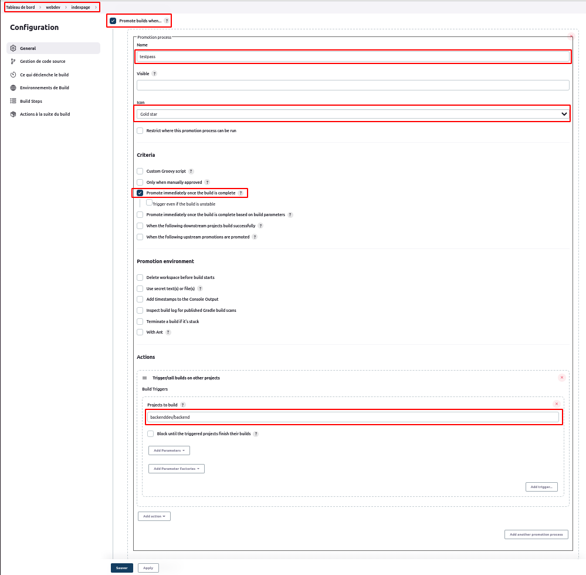
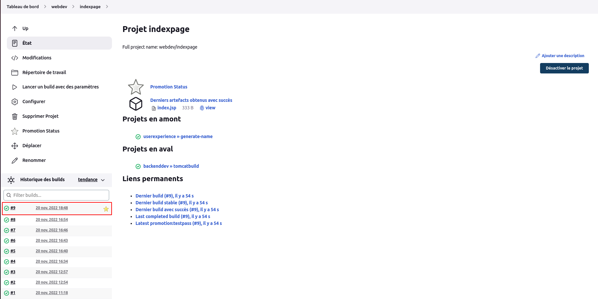
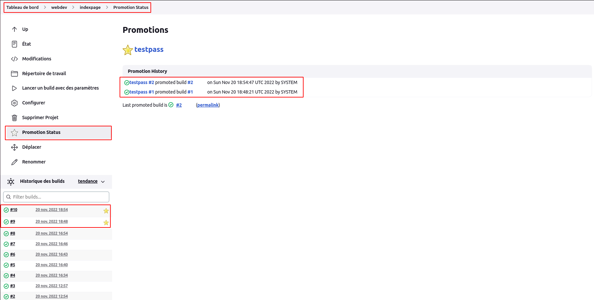

# Promotion

Avant de se pencher sur le sujet proprement dit, nous allons nous rassurer que les plugins **promoted build** (Ce plugin implémente une fonctionnalité de "build promu" où un build d'un job peut être marqué comme "promu" lorsqu'il passe certains critères.) et **Copy Artifacts** (ce plugin permet d'ajouter une étape de build pour copier les artefacts d'un autre projet) sont bien installés. Dans le cas contraire il faudrait les installer.
 

- Dossier **backenddev**

Dans notre dossier **backenddev** (créé à l'article précédent), nous créeons un job shell script **backend**.  
Au niveau de la section **General**, nous cochons l'option **Ce build a des paramètres** et nous ajoutons un paramètre de fichier avec pour valeur d'emplacement **src/main/webapp/index.jsp**.
 
Au niveau de la section **Gestion de code source**, nous cochons l'option **Git**, puis nous précisons le référentiel : **https://github.com/willbrid/content-jenkinscert.git**.
 
Au niveau de la section **Build Steps**, nous choisissons l'option **Invoquer les cibles Maven de haut niveau**, puis les paramètres **Version de Maven** : selection de la version installée, **Cibles Maven** : **package** et **POM** : **pom.xml**.
 
Sous cette même section, nous ajoutons l'option **Copy artifacts from another project** et nous définissons les options :  
--- **Project name** : **webdev/indexpage**  
--- **Which build** : **Latest successful build**  
--- **Artifacts to copy** : **index.jsp**  
--- **Target directory** : **src/main/webapp**  

Nous validons nos configurations de notre job **backend**.

- Dossier **webdev**

Dans notre dossier **webdev** (créé à l'article précédent), nous modifions la configuration de notre job **webdev/indexpage** (créé à l'article précédent) en cochant au niveau de la section **General**, l'option **Promote builds when...** où nous renseignons les paramètres : **name** : **testpass**, **icon** : **Gold star**. Ensuite nous cochons le critère (sous-section criteria de l'option **Promote builds when...**) **Promote immediately once the build is complete**. Puis au niveau de la sous-section **Actions** de l'option **Promote builds when...**, nous ajoutons l'option **Trigger/call builds on other projects** où nous renseignons comme valeur de l'option **Projects to build** : **backenddev/backend** .

Si nous lançons le build de notre job **userexperience/generate-name** (créé à l'article précédent), nous verrons dans le détails du dernier build de notre job **webdev/indexpage**, une icone étoile à gauche en bas au niveau de la première de la liste de build.

Nous pouvons consulter le statut des promotions de build de notre job **webdev/indexpage**.

