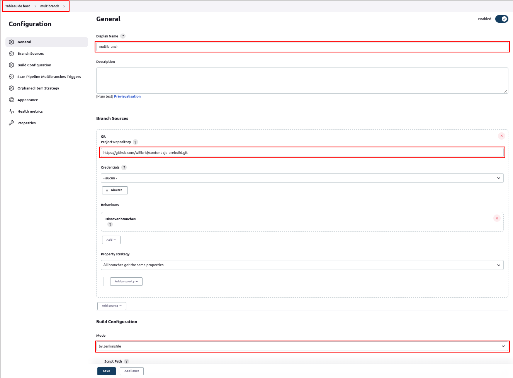
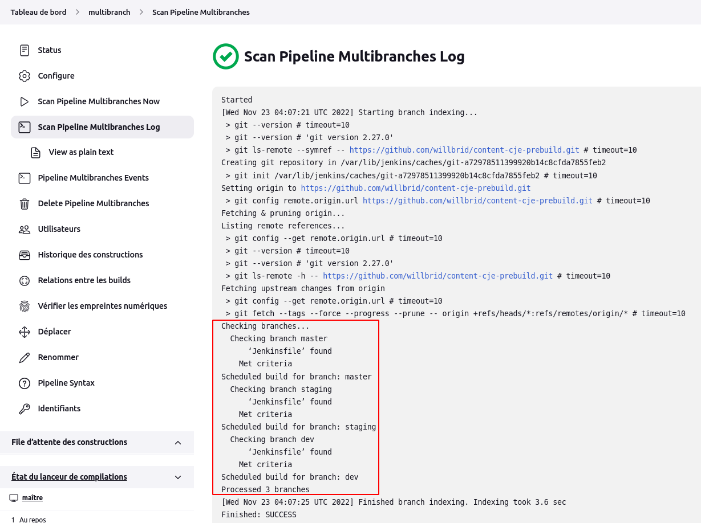
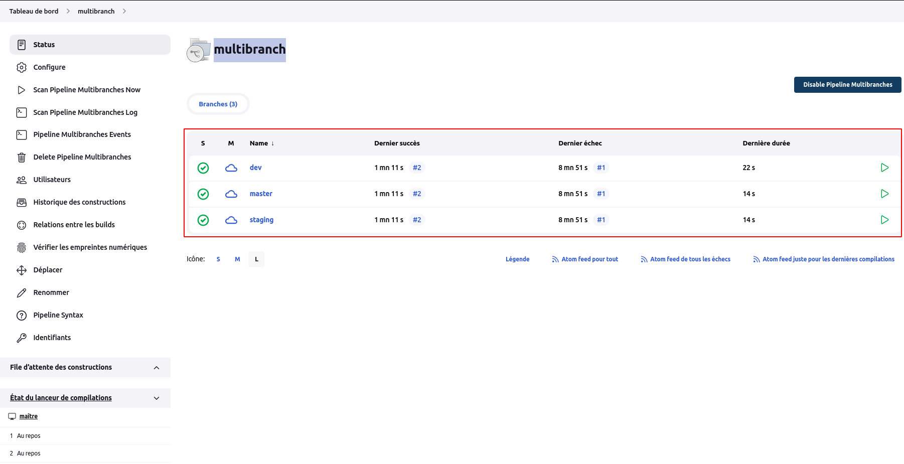

# Multibranche

Dans cet article, nous allons configurer un pipeline multibranche sur jenkins depuis le référentiel **https://github.com/willbrid/content-cje-prebuild.git** qui contient 3 branches : **master**, **dev** et **staging** et dont chacune possède un fichier **Jenkinsfile**.
 
Nous créons un pipeline multibranche appelé **multibranch** en cliquant sur le menu **nouveau item** depuis le tableau de bord, puis nous choisissons l'option **Pipeline Multibranches** et nous validons.
 
La page de configuration du pipeline multibranche s'ouvre où nous renseignons le nom au niveau de la section **General**, la branche Git au niveau de la section **Branch Sources**, le mode de build par fichier **Jenkinsfile** au niveau de la section **Build Configuration**.

Si tout se passe bien, nous verrons un scan de nos 3 branches contenant chacune un fichier **Jenkinsfile**.

Si nous consultons la page **statut** du pipeline **multibranch**, nous verrons un indicatif du résultat des builds de nos 3 branches.

