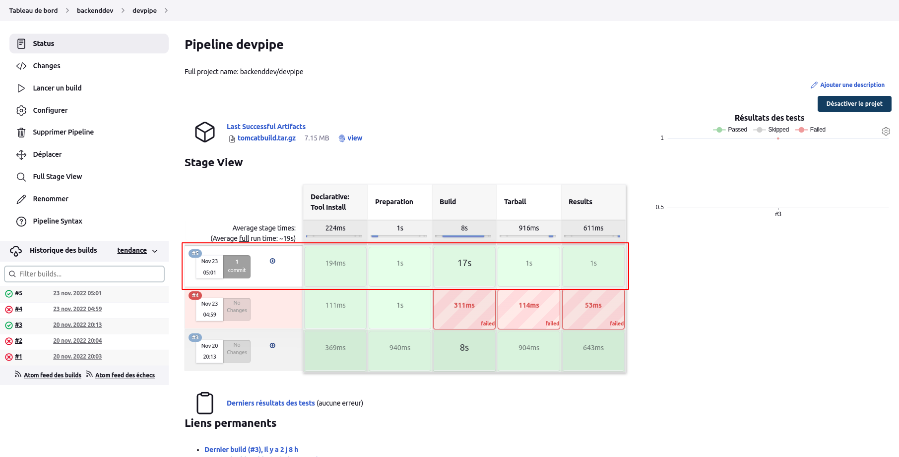

# Bibliothèques globaux de pipelines

Il s'agit de bibliothèques partageables disponibles pour toutes les tâches Pipeline exécutées sur le système. Ces bibliothèques seront approuvées, ce qui signifie qu'elles s'exécutent sans restrictions "sandbox" et peuvent utiliser **@Grab**.
<br>
La configuration d'une Bibliothèque globale peut être effectuée depuis l'espace de configuration système : **Tableau de bord > Administrer Jenkins > Configure system** qui sera accessible dans tous les espaces jenkins (dossier, pipeline, job,...) ou depuis un espace **dossier** qui sera accessible uniquement pour les tâches de cet espace **dossier**.
<br><br>
En guise d'illustration, nous allons ajouter une bibliothèque globale appelé **BuildTools** à partir du référentiel **https://github.com/willbrid/content-cje-deployment.git**. 
<br>
Pour cela naviguons sur la page **Tableau de bord > Administrer Jenkins > Configure system**. Au niveau de la section **Global Pipeline Libraries**, nous ajoutons une bibliothèque en lui donnant les paramètres :
- **Name** : BuildTools
- **Default version** : master
- **Retrieval method** : Modern SCM
- **Retrieval method > Source Code Management** : Git
- **Retrieval method > Source Code Management > Project Repository** : https://github.com/willbrid/content-cje-deployment.git

Ce référentiel ci-dessus contient un fichier **mbuild.groovy** contenant le code suivant :

```
def call(args){
  sh "${tool 'maven-3.8.6'}/bin/mvn ${args}"
}
```

où **maven-3.8.6** est le nom sur jenkins de notre outil **maven** préalablement installé.
<br>
Nous validons nos configurations de notre bibliothèque.
<br>
Nous utilisons cette bibliothèque dans notre pipeline **devpipe** en mettant à jour le script de ce pipeline comme suit :

```
pipeline {
    agent any

    // Importation de la bibliothèque
    libraries {
        lib('BuildTools@master')
    }

    tools {
        maven 'maven-3.8.6'
    }

    stages {
        stage('Preparation') {
            steps {
                copyArtifacts filter: 'index.jsp', fingerprintArtifacts: true, projectName: 'webdev/indexpage', selector: lastSuccessful(), target: 'src/main/webapp'
            
                git 'https://github.com/willbrid/content-jenkinscert.git'   
            }
        }
        stage('Build') {
            steps {
                // Utilisation de la bibliothèque
                mbuild 'clean package'
            }
        }
        stage('Tarball') {
             steps {
                sh "tar -czf tomcatbuild.tar.gz src/main/webapp/* target/*"
            }
        }
        stage('Results') {
            steps {
                junit '**/target/surefire-reports/TEST-*.xml'
                archiveArtifacts 'tomcatbuild.tar.gz'
                fingerprint 'tomcatbuild.tar.gz'
            }
        }
    
    }
}
```

Nous lançons le build de notre pipeline **devpipe** et si tout se passe bien, nous aurons en sortie :

