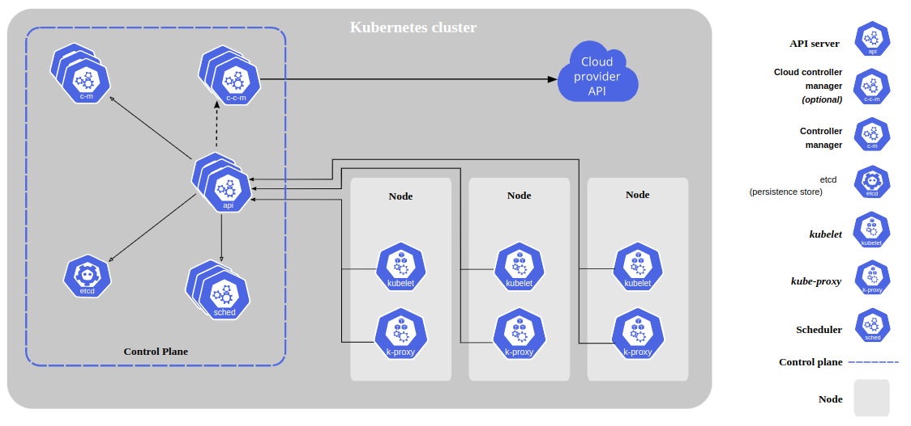

# Explorer l'architecture Kubernetes

Lorsque nous déployons Kubernetes, nous obtenons un cluster.
 
Un cluster Kubernetes se compose d'un ensemble de machines de travail, appelées nœuds, qui exécutent des applications conteneurisées. Chaque cluster a au moins un noeud worker.
 
Le ou les nœuds de travail hébergent les pods qui sont les composants de la charge de travail de l'application. Le plan de contrôle gère les noeuds worker et les pods du cluster. Dans les environnements de production, le plan de contrôle s'exécute généralement sur plusieurs ordinateurs et un cluster exécute généralement plusieurs nœuds, offrant une tolérance aux pannes et une haute disponibilité.

## Composants du plan de contrôle

Les composants du plan de contrôle prennent des décisions globales concernant le cluster (par exemple, la planification), ainsi que la détection et la réponse aux événements du cluster (par exemple, le démarrage d'un nouveau pod lorsque le champ **replicas** d'un déploiement n'est pas satisfait).
 
Les composants du plan de contrôle peuvent être exécutés sur n'importe quelle machine du cluster. Cependant, pour des raisons de simplicité, les scripts de configuration démarrent généralement tous les composants du plan de contrôle sur la même machine et n'exécutent pas de conteneurs utilisateur sur cette machine.

#### kube-apiserver

Le serveur d'API est un composant du plan de contrôle Kubernetes qui expose l'API Kubernetes. Le serveur d'API est le frontal du plan de contrôle Kubernetes.
 
La principale implémentation d'un serveur d'API Kubernetes est **kube-apiserver**. **kube-apiserver** est conçu pour évoluer horizontalement, c'est-à-dire qu'il évolue en déployant davantage d'instances. Nous pouvons exécuter plusieurs instances de **kube-apiserver** et équilibrer le trafic entre ces instances.
 
API Kubernetes - Interface HTTP pour Kubernetes. Les utilisateurs, les composants Kubernetes et les composants externes l'utilisent pour communiquer.
- L'API utilise des objets REST ou RESTful pour représenter et modifier l'état.
- Des formats tels que YAML ou JSON peuvent être utilisés pour communiquer avec l'API, mais ils sont finalement considérés comme de simples objets REST lorsqu'ils sont conservés/stockés.

#### etcd

Magasin de valeur clé cohérent et hautement disponible utilisé comme magasin de sauvegarde de Kubernetes pour toutes les données du cluster.
 
Si notre cluster Kubernetes utilise **etcd** comme magasin de sauvegarde, assurons-nous d'avoir un plan de sauvegarde pour les données.

#### kube-scheduler

Composant du plan de contrôle qui surveille les pods nouvellement créés sans nœud attribué et sélectionne un nœud sur lequel ils doivent s'exécuter.
 
Les facteurs pris en compte pour les décisions de planification incluent : les besoins en ressources individuelles et collectives, les contraintes matérielles/logicielles/politiques, les spécifications d'affinité et d'anti-affinité, la localité des données, les interférences entre les charges de travail et les délais.

- La planification est le processus d'attribution d'un pod à un nœud.
- La planification se produit lorsqu'un nouveau pod est créé et n'a pas encore été planifié.
- Le planificateur prend en compte des éléments tels que les besoins en ressources, l'affinité du pod et les rejets/tolérances lors de la sélection d'un nœud.

#### kube-controller-manager

Composant du plan de contrôle qui exécute les processus du contrôleur.
 
Logiquement, chaque contrôleur est un processus séparé, mais pour réduire la complexité, ils sont tous compilés en un seul binaire et exécutés en un seul processus.
 
Certains types de ces contrôleurs sont :

- **Contrôleur de nœud** : responsable de la détection et de la réponse lorsque les nœuds tombent en panne.
- **Contrôleur de tâches** : surveille les objets Job qui représentent des tâches ponctuelles, puis crée des pods pour exécuter ces tâches jusqu'à leur achèvement.
- **Contrôleur EndpointSlice** : remplit les objets EndpointSlice (pour fournir un lien entre les services et les pods).
- **Contrôleur ServiceAccount** : crée des comptes de service par défaut pour les nouveaux espaces de noms.

#### cloud-controller-manager

Un composant de plan de contrôle Kubernetes qui intègre une logique de contrôle spécifique au cloud. Le **cloud-controller-manager** nous permet de lier notre cluster à l'API de notre fournisseur de cloud et de séparer les composants qui interagissent avec cette plate-forme cloud des composants qui interagissent uniquement avec notre cluster.
 
Le **cloud-controller-manager** exécute uniquement les contrôleurs spécifiques à notre fournisseur de cloud. Si nous exécutons Kubernetes dans nos propres locaux ou dans un environnement d'apprentissage à l'intérieur de notre propre PC, le cluster n'a pas de gestionnaire de contrôleur cloud.
 
Comme avec le **kube-controller-manager**, le **cloud-controller-manager** combine plusieurs boucles de contrôle logiquement indépendantes en un seul binaire que nous exécutons comme un processus unique. Nous pouvons effectuer une mise à l'échelle horizontale (exécuter plusieurs copies) pour améliorer les performances ou pour aider à tolérer les pannes.
 
Les contrôleurs suivants peuvent avoir des dépendances de fournisseur de cloud :

- **Node controller** : pour vérifier le fournisseur de cloud afin de déterminer si un nœud a été supprimé dans le cloud après qu'il a cessé de répondre
- **Route controller** : pour configurer des routes dans l'infrastructure cloud sous-jacente
- **Service controller** : pour créer, mettre à jour et supprimer les équilibreurs de charge du fournisseur de cloud.

## Composants de nœud

Les composants de nœud s'exécutent sur chaque nœud, maintiennent les pods en cours d'exécution et fournissent l'environnement d'exécution Kubernetes.

#### kubelet

Un agent qui s'exécute sur chaque nœud du cluster. Il s'assure que les conteneurs s'exécutent dans un pod.
 
Le **kubelet** prend un ensemble de **PodSpecs** qui sont fournis par divers mécanismes et garantit que les conteneurs décrits dans ces **PodSpecs** fonctionnent et sont sains. Le **kubelet** ne gère pas les conteneurs qui n'ont pas été créés par Kubernetes.

#### kube-proxy

**kube-proxy** est un proxy réseau qui s'exécute sur chaque nœud de notre cluster, implémentant une partie du concept de service Kubernetes.
 
**kube-proxy** maintient les règles du réseau sur les nœuds. Ces règles de réseau autorisent la communication réseau avec nos pods à partir de sessions réseau à l'intérieur ou à l'extérieur de notre cluster.
 
**kube-proxy** utilise la couche de filtrage de paquets du système d'exploitation s'il en existe une et si elle est disponible. Sinon, **kube-proxy** transfère le trafic lui-même.

#### Container runtime

Le **Container runtime** est le logiciel responsable de l'exécution des conteneurs.
 
Kubernetes prend en charge les **Container runtime** tels que **containerd**, **CRI-O** et toute autre implémentation de Kubernetes **CRI** (Container Runtime Interface).
 
**Les conteneurs** :

- Les groupes de contrôle Linux sont utilisés pour assurer l'isolation des conteneurs.

- Conteneurs
Chaque conteneur que nous exécutons est reproductible ; la standardisation des dépendances incluses signifie que nous obtenons le même comportement partout où nous l'exécutons.
 
Les conteneurs découplent les applications de l'infrastructure hôte sous-jacente. Cela facilite le déploiement dans différents environnements de cloud ou de système d'exploitation.
 
Chaque nœud d'un cluster Kubernetes exécute les conteneurs qui forment les pods attribués à ce nœud. Les conteneurs d'un pod sont co-localisés et co-planifiés pour s'exécuter sur le même nœud.
 
Nous pouvons avoir plus d'un conteneur par Pod.

- Images de conteneurs
Une image de conteneur est un package logiciel prêt à l'emploi contenant tout ce qui est nécessaire pour exécuter une application : le code et tout environnement d'exécution dont il a besoin, les bibliothèques d'application et système, et les valeurs par défaut pour tous les paramètres essentiels.

Les conteneurs sont destinés à être sans état et immuables : nous ne devons pas modifier le code d'un conteneur déjà en cours d'exécution. Si nous avons une application conteneurisée et que nous souhaitons apporter des modifications, le processus correct consiste à créer une nouvelle image qui inclut la modification, puis à recréer le conteneur pour commencer à partir de l'image mise à jour.
 
Un Dockerfile est un fichier texte qui contient des commandes utilisées pour créer une image.

## Addons

Les addons utilisent les ressources Kubernetes (**DaemonSet**, **Deployment**, etc.) pour implémenter les fonctionnalités du cluster. Étant donné qu'ils fournissent des fonctionnalités au niveau du cluster, les ressources d'espace de noms pour les addons appartiennent à l'espace de noms **kube-system**.

#### Plug-ins réseau

Les plug-ins réseau sont des composants logiciels qui implémentent la spécification de l'interface réseau de conteneur (CNI : container network interface). Ils sont chargés d'attribuer des adresses IP aux pods et de leur permettre de communiquer entre eux au sein du cluster.

#### DNS
Bien que les autres modules complémentaires ne soient pas strictement requis, tous les clusters Kubernetes doivent avoir un DNS de cluster, car de nombreux exemples en dépendent.
 
Le cluster DNS est un serveur DNS, en plus des autres serveurs DNS de notre environnement, qui sert les enregistrements DNS pour les services Kubernetes.
 
Les conteneurs démarrés par Kubernetes incluent automatiquement ce serveur DNS dans leurs recherches DNS.

#### Interface utilisateur Web (tableau de bord)
Le tableau de bord est une interface utilisateur Web à usage général pour les clusters Kubernetes. Il permet aux utilisateurs de gérer et de dépanner les applications exécutées dans le cluster, ainsi que le cluster lui-même.

[Composants kubernetes](https://kubernetes.io/docs/concepts/overview/components/)