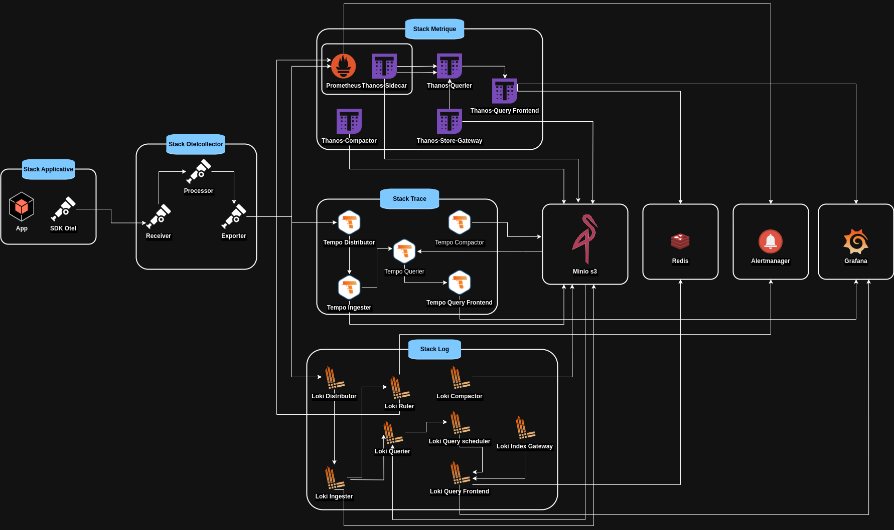

# Mise en place de la stack Loki, Tempo, Prometheus, Otelcollector, Grafana

Dans le contexte actuel de la supervision des infrastructures, la complexité croissante des environnements distribués et des applications 
en microservices impose des outils de monitoring performants et adaptatifs. La mise en œuvre d’une solution de monitoring capable de 
centraliser les métriques, traces et logs de manière efficace est devenue essentielle pour garantir la fiabilité et la disponibilité 
des systèmes.

Cet article présentera pas à pas la configuration d’un système de monitoring basé sur une stack complète et open-source. Combinant 
**OpenTelemetry Collector** pour la collecte des données, Prometheus pour la gestion des métriques, **Tempo** pour le traçage distribué, 
**Loki** pour la gestion des logs, et **Grafana** pour la visualisation, nous utiliserons également **MinIO S3** comme stockage d’objets 
pour centraliser les données de manière durable.

Pour renforcer cette solution, nous intégrons également **Alertmanager** pour la gestion des alertes, ce qui permet de détecter rapidement 
les anomalies et d’avertir l’équipe technique dès qu’un incident survient. L’ajout d’**Alertmanager** assure une réactivité accrue dans 
la résolution des incidents et améliore ainsi la fiabilité du système.

L’objectif de cette configuration est de mettre en place une solution robuste et scalable qui permet non seulement de surveiller les 
performances des applications, mais aussi d’identifier et d’alerter sur les éventuels points de défaillance.

### Architecture

