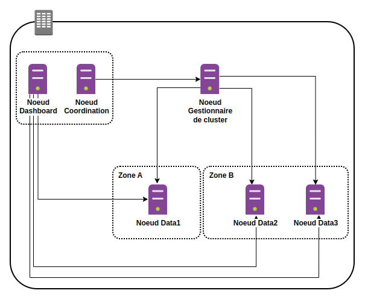

# Architecture

## Parlons-en de notre architecture en mode cluster



L'illustration ci-dessus montre une architecture de base comprenant un cluster à cinq nœuds doté d'un nœud gestionnaire de cluster dédié, d'un nœud de coordination dédié comprenant notre dashboard opensearch comme composant et de trois nœuds de données éligibles au gestionnaire de cluster et également utilisés pour l'ingestion de données.

- **noeud gestionnaire de cluster**

Il gère le fonctionnement global d'un cluster et assure le suivi de l'état du cluster. Cela inclut la création et la suppression d'index, le suivi des nœuds qui rejoignent et quittent le cluster, la vérification de la santé de chaque nœud du cluster (en exécutant des requêtes ping) et l'allocation de fragments aux nœuds.

- **noeud gestionnaire éligible**

Il élit un nœud parmi eux comme nœud de gestionnaire de cluster via un processus de vote.

- **nœud de données**

Il stocke et recherche des données. Effectue toutes les opérations liées aux données (indexation, recherche, agrégation) sur les partitions locales. Ce sont les nœuds de travail de notre cluster et nécessitent plus d'espace disque que tout autre type de nœud.

- **nœud d'ingestion**

Il prétraite les données avant de les stocker dans le cluster. Il exécute un pipeline d'ingestion qui transforme nos données avant de les ajouter à un index.

- **nœud de coordination**

Il délègue les demandes des clients aux fragments sur les nœuds de données, collecte et agrège les résultats en un seul résultat final, et renvoie ce résultat au client.

Par défaut, chaque nœud est un nœud de données, d'ingestion et de coordination éligible au gestionnaire de cluster. Décider du nombre de nœuds, attribuer des types de nœuds et choisir le matériel pour chaque type de nœud dépend de notre cas d'utilisation. Nous devons prendre en compte des facteurs tels que la durée pendant laquelle nous souhaitons conserver nos données, la taille moyenne de nos documents, notre charge de travail typique (indexation, recherches, agrégations), notre rapport qualité-prix attendu, notre tolérance au risque...

## Mise en place de notre architecture avec vagrant

#### Architecture avec machine virtuelle

Pour mettre en place notre bac à sable avec machine virtuelle, nous utiliserons vagrant avec virtualbox 6.1.38. Ci-dessous le contenu de notre fichier **Vagrantfile** :

```
mkdir ~/opensearch-project
cd ~/opensearch-project
mkdir opensearch-project-vm
cd opensearch-project-vm
vim Vagrantfile
```

```
# -*- mode: ruby -*-
# vi: set ft=ruby :

VAGRANTFILE_API_VERSION = "2"

Vagrant.configure(VAGRANTFILE_API_VERSION) do |config|
  config.vbguest.auto_update = false
  config.vbguest.no_remote = true
  config.vbguest.iso_path = "./VBoxGuestAdditions_6.1.38.iso"

  # General Vagrant VM configuration.
  config.vm.box = "willbrid/rockylinux8"
  config.ssh.insert_key = false
  config.vm.synced_folder ".", "/vagrant", disabled: true
  config.vm.provider :virtualbox do |v|
    v.memory = 2048
    v.cpus = 1
    v.linked_clone = true
  end

  # Noeud gestionnaire de cluster.
  config.vm.define "opensearch-m" do |srvm|
    srvm.vm.hostname = "opensearch-m"
    srvm.vm.network :private_network, ip: "192.168.56.70"
    srvm.vm.provider :virtualbox do |v|
      v.cpus = 2
    end
  end

  # Noeud de coordination.
  config.vm.define "opensearch-c" do |srvc|
    srvc.vm.hostname = "opensearch-c"
    srvc.vm.network :private_network, ip: "192.168.56.71"
    srvc.vm.provider :virtualbox do |v|
      v.cpus = 2
    end
  end

  # Noeud de données 1. 
  config.vm.define "opensearch-d1" do |data|
    data.vm.hostname = "opensearch-d1"
    data.vm.network :private_network, ip: "192.168.56.72"
    data.vm.provider :virtualbox do |v|
      v.memory = 4096
    end
  end

  # Noeud de données 2.
  config.vm.define "opensearch-d2" do |data|
    data.vm.hostname = "opensearch-d2"
    data.vm.network :private_network, ip: "192.168.56.73"
    data.vm.provider :virtualbox do |v|
      v.memory = 4096
    end
  end

  # Noeud de données 3.
  config.vm.define "opensearch-d3" do |data|
    data.vm.hostname = "opensearch-d3"
    data.vm.network :private_network, ip: "192.168.56.74"
    data.vm.provider :virtualbox do |v|
      v.memory = 4096
    end
  end
end
```

```
vagrant up
```

- Nous avons donné à notre noeud gestionnaire et coordination une RAM de 2048 Mo et un cpu de 2
- Nous avons donné à nous noeuds de données une RAM de 4096 Mo et un cpu de 1.

#### Architecture avec conteneur

Pour mettre en place notre bac à sable avec conteneur, nous utiliserons vagrant avec virtualbox 6.1.38 et docker. Ci-dessous le contenu de notre fichier **Vagrantfile**

```
cd ~/opensearch-project
mkdir opensearch-project-container
cd opensearch-project-container
vim Vagrantfile
```

```
# -*- mode: ruby -*-
# vi: set ft=ruby :

VAGRANTFILE_API_VERSION = "2"

Vagrant.configure(VAGRANTFILE_API_VERSION) do |config|
  config.vbguest.auto_update = false
  config.vbguest.no_remote = true
  config.vbguest.iso_path = "./VBoxGuestAdditions_6.1.38.iso"

  # General Vagrant VM configuration.
  config.vm.box = "willbrid/rockylinux8"
  config.ssh.insert_key = false
  config.vm.synced_folder ".", "/vagrant", disabled: true
  config.vm.provider :virtualbox do |v|
    v.memory = 16384
    v.cpus = 9
    v.linked_clone = true
  end

  # Opensearch cluster.
  config.vm.define "opensearch-cluster" do |srv|
    srv.vm.hostname = "opensearch-cluster"
    srv.vm.network :private_network, ip: "192.168.56.77"
  end
end
```

```
vagrant up
```

- Nous avons donné à notre machine virtuelle hôte qui contiendra notre architecture conteneurisée du cluster opensearch une RAM de 16384 Mo et un cpu de 9