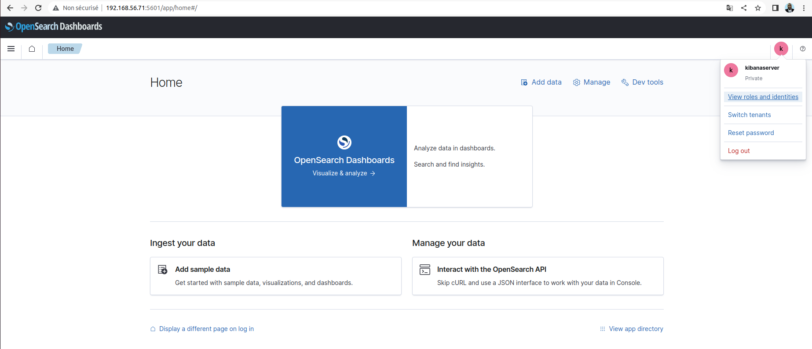

# Configuration du dashboard du service opensearch

Nous allons configurer notre service **opensearch-dashboards** qui est installé sur notre noeud de coordination.

```
sudo vi /etc/opensearch-dashboards/opensearch_dashboards.yml
```

```
server.host: 192.168.56.71
opensearchDashboards.index: ".opensearch_dashboards"
opensearch.hosts: ["https://192.168.56.71:9200"]
opensearch.ssl.verificationMode: none
opensearch.username: kibanaserver
opensearch.password: kibanaserver
opensearch.requestHeadersWhitelist: [authorization, securitytenant]
opensearch_security.multitenancy.enabled: true
opensearch_security.multitenancy.tenants.preferred: [Private, Global]
opensearch_security.readonly_mode.roles: [kibana_read_only]
opensearch_security.cookie.secure: false
```

- Le paramètre **server.host** permet de préciser l'adresse IP d'écoute de notre service dashboard.
- Le paramètre **opensearch.hosts** permet de préciser l'url (adresse IP et port) de notre noeud de coordination. <br>
- Le paramètre **opensearchDashboards.index** permet de préciser l'indexe du service dashboard qui sera créé. <br>
- Le paramètre **opensearch.ssl.verificationMode** permet de désactiver la vérification ssl auprès du backend **opensearch**.
- Le paramètre **opensearch.username** et **opensearch.password** permet de définir l'utilisateur et le mot de passe par défaut pour s'authentifier sur le dashboard.
- Le paramètre **opensearch.requestHeadersWhitelist** permet de définir une liste d'entête de requête http à autoriser.
- Le paramètre **opensearch_security.multitenancy.enabled** permet d'activer la fonctionnalité selon laquel plusieurs locataires (groupes distincts d'utilisateurs et de données) peuvent partager une seule instance d'OpenSearch tout en maintenant l'isolement les uns des autres. 
- Le paramètre **opensearch_security.multitenancy.tenants.preferred** est utilisé pour spécifier l'ordre de préférence des locataires dans un environnement multilocataire. 
- Le paramètre **opensearch_security.readonly_mode.roles** est utilisé pour spécifier les rôles qui sont autorisés à accéder à OpenSearch en mode lecture seule (readonly mode).
- Le paramètre **opensearch_security.cookie.secure** est utilisé pour spécifier si les cookies d'authentification créés par OpenSearch Security doivent être marqués comme sécurisés. Dans notre cas nous avons mis à **false** car pour l'instant **opensearch-dashboards** n'est pas encore configuré en https


Nous démarrons le service **opensearch-dashboards**

```
sudo systemctl start opensearch-dashboards
```

Nous pouvons vérifier le service est bien démarré via la commande :

```
sudo systemctl status opensearch-dashboards
```

Nous pouvons lister l'ensemble des services et leur port afin de vérifier que notre service **opensearch-dashboards** est bien lié à l'adresse **192.168.56.71:5601**.

```
ss -tupln
```

Nous pouvons accéder à la page web du service **opensearch-dashboards** via l'url 

```
http://192.168.56.71:5601
```

Login : kibanaserver <br>
Password : kibanaserver

