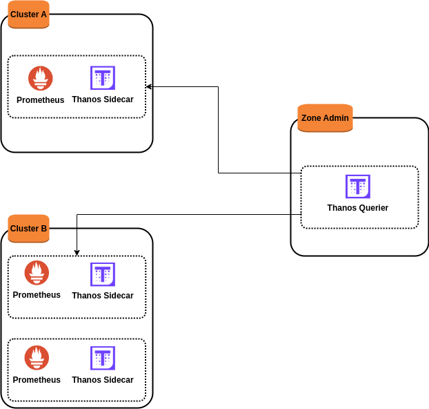

# Sandbox de l'architecture

Supposons que nous souhaiterons mettre en place une architecture intégrant **prometheus** et **thanos** où nous avons :
- deux clusters **A** et **B**, puis une zone **Admin**
- dans le cluster **A**, un serveur prometheus et un serveur thanos sidecar dont nous illustrerons avec 2 conteneurs (1 instance prometheus et 1 instance de thanos sidecar) dans un serveur.
- dans le cluster **B**, 2 répliques du couple serveur Prometheus et serveur thanos sidecar dont nous illustrerons avec 4 conteneurs (2 instances prometheus et 2 instances de thanos sidecar) dans un serveur.
- dans la zone **Admin**, un serveur thanos querier dont nous illustrerons avec un conteneur dans un serveur

<p align="center">

</p>

Nous utiliserons **vagrant** avec **virtualbox 7.0** depuis une machine hôte **ubuntu 20.04**. Nous suivons les étapes ci-dessous pour provisionner nos 3 serveurs.

```
cd ~ && mkdir architecture_thanossidecar_thanosquerier_prometheus
```

```
cd architecture_thanossidecar_thanosquerier_prometheus
```

```
wget https://download.virtualbox.org/virtualbox/7.0.12/VBoxGuestAdditions_7.0.12.iso
```

```
vi Vagrantfile
```

```
# -*- mode: ruby -*-
# vi: set ft=ruby :

VAGRANTFILE_API_VERSION = "2"

Vagrant.configure(VAGRANTFILE_API_VERSION) do |config|
  config.vbguest.auto_update = false
  config.vbguest.no_remote = true
  config.vbguest.iso_path = "./VBoxGuestAdditions_7.0.12.iso"

  # General Vagrant VM configuration.
  config.vm.box = "willbrid/rockylinux8"
  config.vm.box_version = "0.0.2"
  config.ssh.insert_key = false
  config.vm.synced_folder ".", "/vagrant", disabled: true
  config.vm.provider :virtualbox do |v|
    v.memory = 4096
    v.cpus = 2
    v.linked_clone = true
  end

  # Serveur Cluster A.
  config.vm.define "srv-clusterA" do |cla|
    cla.vm.hostname = "srv-clusterA"
    cla.vm.network :private_network, ip: "192.168.56.140"
  end

  # Serveur Cluster B. 
  config.vm.define "srv-clusterB" do |clb|
    clb.vm.hostname = "srv-clusterB"
    clb.vm.network :private_network, ip: "192.168.56.141"
  end

  # Serveur zone Admin.
  config.vm.define "srv-zoneAdmin" do |zad|
    zad.vm.hostname = "srv-zoneAdmin"
    zad.vm.network :private_network, ip: "192.168.56.142"
  end
end
```

```
vagrant up
```