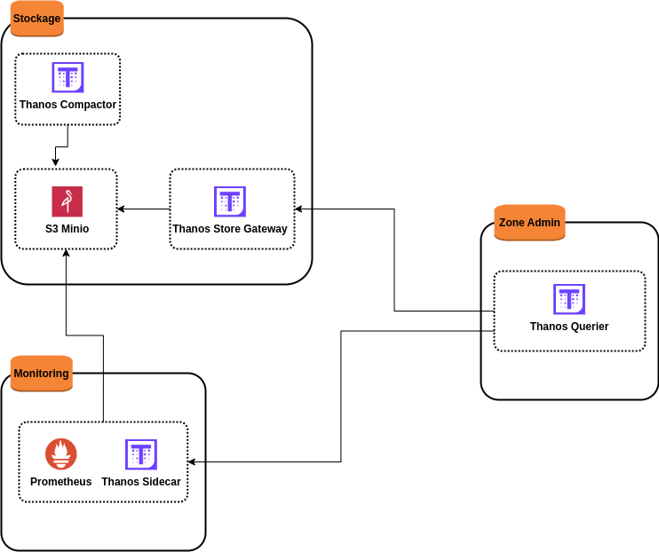

# Sandbox de l'architecture

Supposons que nous souhaiterons mettre en place une architecture intégrant **prometheus** et **thanos** dans le but de conserver nos métriques dans un stockage objet fiable en garantissant une rétention pratiquement illimitée de données de monitoring et en permettant qu'un composant **thanos** puisse récupérer et transférer ces données vers un stockage s3. Pour cela plusieurs composants de thanos vont entrer en jeu :

- **thanos sidecar** : ce composant permettra de récupérer les données de prometheus et de les sauvegarder dans un stockage s3
- **thanos store gateway** : ce composant implémente l'API Store au-dessus des données historiques dans un bucket de stockage d'objets. Il agit principalement comme une passerelle API et n'a donc pas besoin de quantités importantes d'espace disque local. Il conserve une petite quantité d'informations sur tous les blocs distants sur le disque local et les synchronise avec le bucket. Ces données peuvent généralement être supprimées en toute sécurité lors des redémarrages, au prix d'un temps de démarrage plus long.
- **thanos querier** : il permettra de lire les nouvelles données de prometheus depuis le composant **thanos sidecar** et les anciennes données de prometheus depuis le composant **thanos store gateway**
- **thanos compactor** : c'est un composant essentiel qui fonctionne sur un seul bucket de stockage d'objets pour compacter, sous-échantillonner et appliquer la rétention aux blocs TSDB contenus à l'intérieur, rendant ainsi les requêtes sur les données historiques plus efficaces. Il crée des agrégats d'anciennes métriques (basées sur les règles). Il est également responsable du sous-échantillonnage des données, en effectuant un sous-échantillonnage de 5 minutes après 40 heures et un sous-échantillonnage d'une heure après 10 jours.



Pour accomplir cette architecture ci-dessus, nous aurons besoin de 3 serveurs : 
- un serveur de stockage (**srv-storage**) hébergeant 3 services : service de stockage **s3 minio**, service **thanos gateway** et service **thanos compactor**
- un serveur de monitoring (**srv-monitoring**) provenant d'un cluster nommé **CL-A**, hébergeant 2 services : service **prometheus** et service **thanos sidecar**
- un serveur d'administration hébergeant le service **thanos querier**

Nous utiliserons **vagrant** avec **virtualbox 7.0** depuis une machine hôte **ubuntu 20.04**. Nous suivons les étapes ci-dessous pour provisionner nos 3 serveurs.

```
cd ~ && mkdir sous_echantillonnage_et_conservation_illimitee_des_metriques_pour_prometheus
```

```
cd sous_echantillonnage_et_conservation_illimitee_des_metriques_pour_prometheus
```

```
wget https://download.virtualbox.org/virtualbox/7.0.12/VBoxGuestAdditions_7.0.12.iso
```

```
vi Vagrantfile
```

```
# -*- mode: ruby -*-
# vi: set ft=ruby :

VAGRANTFILE_API_VERSION = "2"

Vagrant.configure(VAGRANTFILE_API_VERSION) do |config|
  config.vbguest.auto_update = false
  config.vbguest.no_remote = true
  config.vbguest.iso_path = "./VBoxGuestAdditions_7.0.12.iso"

  # General Vagrant VM configuration.
  config.vm.box = "willbrid/rockylinux8"
  config.vm.box_version = "0.0.2"
  config.ssh.insert_key = false
  config.vm.synced_folder ".", "/vagrant", disabled: true
  config.vm.provider :virtualbox do |v|
    v.memory = 4096
    v.cpus = 2
    v.linked_clone = true
  end

  # Serveur storage.
  config.vm.define "srv-storage" do |sst|
    sst.vm.hostname = "srv-storage"
    sst.vm.network :private_network, ip: "192.168.56.150"
    sst.vm.provider :virtualbox do |v|
      v.cpus = 3
    end
  end

  # Serveur monitoring. 
  config.vm.define "srv-monitoring" do |smo|
    smo.vm.hostname = "srv-monitoring"
    smo.vm.network :private_network, ip: "192.168.56.151"
  end

  # Serveur zone Admin.
  config.vm.define "srv-zoneAdmin" do |zad|
    zad.vm.hostname = "srv-zoneAdmin"
    zad.vm.network :private_network, ip: "192.168.56.152"
  end
end
```

```
vagrant up
```