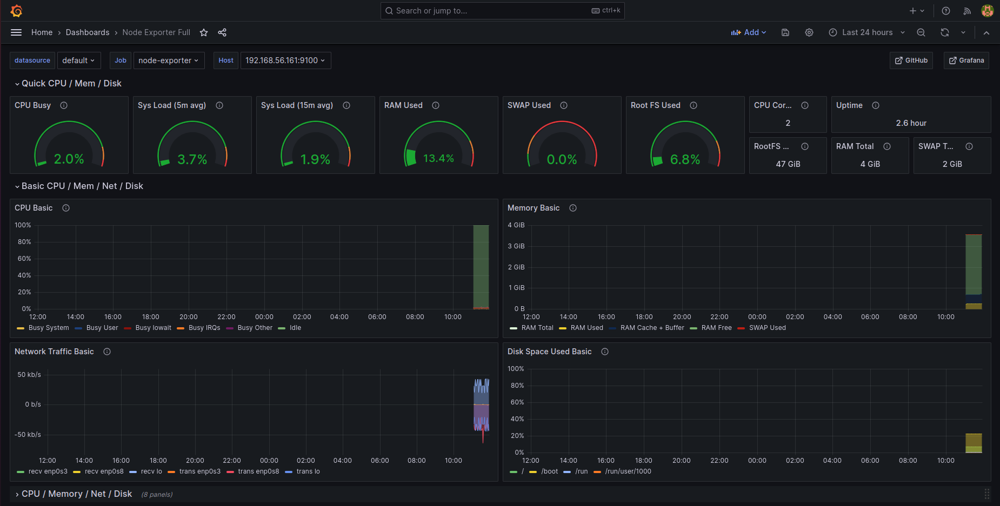

# Mise en place du composant thanos query frontend couplé à grafana

Notre but ici sera de déployer et configurer le composant **thanos query frontend** devant le composant **thanos querier** afin que nous puissions mettre en cache les réponses aux requêtes. Pour la mise en cache, nous utiliserons l'outil **redis**.

### Mise en place de redis sur le serveur srv-zoneAdmin

- Créeons le repertoire de données de **redis**

```
mkdir redis-data
```

- Démarrons un seul container **redis** qui sera l'instance master

```
podman run -d --net=host \
       -v $HOME/redis-data:/data:z \ 
       --name redis-cache \ 
       -p 6379:6379 \
       -e REDIS_ARGS="--requirepass thanos --masteruser thanos --masterauth thanos" \
       redis/redis-stack-server:7.2.0-v6
```

Ici nous avons défini l'utilisateur **masteruser** à la valeur **thanos** et les mots de passe **requirepass** et **masterauth** à la valeur **thanos**.

### Mise en place du composant thanos query frontend

- Définissons la configuration du cache redis

```
vi frontend.yml
```

```
type: REDIS
config:
  addr: "192.168.56.162:6379"
  username: "thanos"
  password: "thanos"
  db: 0
  dial_timeout: 5s
  read_timeout: 3s
  write_timeout: 3s
  max_get_multi_concurrency: 100
  get_multi_batch_size: 100
  max_set_multi_concurrency: 100
  set_multi_batch_size: 100
  expiration: 24h0m0s
```

- Démarrons le composant **thanos query frontend** à amont de notre composant **thanos querier**

```
podman run -d --net=host \
    -v $HOME/frontend.yml:/etc/thanos/frontend.yml:z \
    --name query-frontend \
    quay.io/thanos/thanos:v0.28.0 \
    query-frontend \
    --http-address 0.0.0.0:9090 \
    --query-frontend.compress-responses \
    --query-frontend.downstream-url=http://192.168.56.162:9091 \
    --query-frontend.log-queries-longer-than=5s \
    --query-range.split-interval=1m \
    --query-range.response-cache-max-freshness=1m \
    --query-range.max-retries-per-request=5 \
    --query-range.response-cache-config-file=/etc/thanos/frontend.yml \
    --cache-compression-type="snappy" && echo "Started Thanos Query Frontend!"
```

Quelques explications par rapport aux arguments de la commande **query-frontend** : <br>
--- l'argument **--http-address** permet de préciser l'IP et le port d'écoute de thanos query frontend <br>
--- l'argument **--query-frontend.compress-responses** permet d'activer la compressions des réponses HTTP <br>
--- l'argument **--query-frontend.downstream-url** permet de préciser l'adresse de notre composant **thanos querier** (**192.168.56.162:9091**) <br>
--- l'argument **--query-frontend.log-queries-longer-than** permet de spécifier la durée au-delà de laquelle les requêtes exécutées seront enregistrées dans les logs <br>
--- l'argument **--query-range.split-interval** permet de déterminer la taille de l'intervalle de découpage lorsqu'une requête de plage est fractionnée en sous-requêtes plus petites <br>
--- l'argument **--query-range.response-cache-max-freshness** permet de contrôler la durée maximale pendant laquelle une réponse mise en cache est considérée comme fraîche. Si une requête entre dans cette fenêtre, la réponse peut être renvoyée depuis le cache sans interroger réellement les composants sous-jacents <br>
--- l'argument **--query-range.max-retries-per-request** permet de spécifier le nombre maximal de tentatives de requête que le composant **thanos query frontend** effectuera en cas d'échec avant de renvoyer une erreur au client <br>
--- l'argument **--query-range.response-cache-config-file** permet de spécifier un fichier de configuration externe pour le cache des réponses : dans notre cas nous utilisons les paramètres de redis <br>
--- l'argument **--cache-compression-type** permet de spécifier le type de compression à utiliser pour les données mises en cache

### Mise en place du composant Grafana utilisant le composant thanos query frontend

- Créeons le repertoire de stockage grafana

```
mkdir grafana-storage
```

- Démarrons grafana

```
podman run -d --net=host -p 3000:3000 --name=grafana -v $HOME/grafana-storage:/var/lib/grafana:z grafana/grafana-oss:10.0.10
```

- Nous autorisons le port **3000** sur le serveur **srv-zoneAdmin**

```
sudo firewall-cmd --permanent --add-port=3000/tcp
sudo firewall-cmd --reload
```

- Nous nous connectons à grafana via l'url **http://thanos-querier-s3.local:3000** avec les paramètres par défaut

```
user : admin
password : admin
```

Il nous sera demandé de définir le nouveau mot de passe de l'interface ui de **grafana**.

- Ajoutons une nouvelle source de données

--- clic sur le bouton **Toggle menu** <br>
--- sélection du menu **Data sources** <br>
--- clic sur le bouton **add data source** <br>
--- sélection du type de source de données **prometheus** <br>
--- renseignement des paramètres du composant **thanos query frontend** <br>
----- **Name** : **Thanos-Query-Frontend** <br>
----- **Prometheus server URL** : **http://192.168.56.162:9090** <br>
--- clic sur le bouton **Save & test** : nous recevrons un message de succès

- Ajoutons un dashboard pour l'utilitaire **node-exporter**

Lien : https://grafana.com/grafana/dashboards/1860-node-exporter-full

--- clic sur le bouton **Toggle menu** <br>
--- sélection du menu **Dashboards** <br>
--- clic sur le bouton **New** <br>
--- clic sur le menu **Import** <br>
--- saisir de l'identifiant du dashboard **1860** et clic sur le bouton **Load** <br>
--- saisir des paramètres <br>
----- **Name**: **Noeud cluster CL-A** <br>
----- **Prometheus** : **thanos query frontend** <br>
--- clic sur le bouton **Import** pour sauvegarder le dashboard

