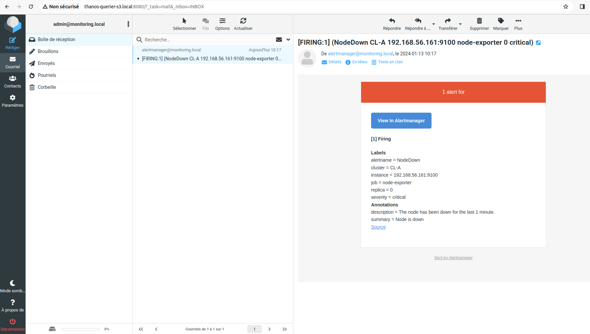

# Mise en place du composant alertmanager de prometheus

Notre but ici sera de déployer et configurer le composant **alertmanager** à côté de notre composant **prometheus** pour permettre à prometheus d'envoyer des alertes en fonction des règles préalablement définies. Nous utilerons l'outil **docker-mailserver** pour configurer un serveur de mail, couplé à l'outil **roundcubemail** pour visualiser les mails via une interface graphique.

### Mise en place de docker-mailserver et roundcubemail sur le serveur srv-zoneAdmin

- Ajoutons une entrée de nom **mail.monitoring.local** sur les serveurs **srv-zoneAdmin** et **srv-monitoring**

```
sudo vi /etc/hosts
```

```
192.168.56.162  mail.monitoring.local
```

- Créons les repertoires de mail pour **docker-mailserver**

```
mkdir dms
mkdir dms/mail-data dms/mail-state dms/mail-logs dms/config
```

- Activons **podman.socket** dans l'espace utilisateur de systemd avec un utilisateur non root : **vagrant**.

```
systemctl enable --now --user podman.socket
```

```
export DOCKER_HOST="unix:///var/run/user/1000/podman/podman.sock"
```

où est la valeur issue de la commande **id -u**

- Démarrons **docker-mailserver**

```
podman run -d \
       -e OVERRIDE_HOSTNAME=mail.monitoring.local \
       -e POSTMASTER_ADDRESS=postmaster@monitoring.local \
       -e POSTFIX_INET_PROTOCOLS=ipv4 \
       -e PERMIT_DOCKER=none \
       -e ONE_DIR=1 \
       -e NETWORK_INTERFACE=tap0 \
       -p 1025:25 \
       -p 1143:143 \
       -p 1587:587 \
       --tz local \
       -v $HOME/dms/mail-data:/var/mail:z \
       -v $HOME/dms/mail-state:/var/mail-state:z \
       -v $HOME/dms/mail-logs:/var/log/mail:z \
       -v $HOME/dms/config:/tmp/docker-mailserver:z \
       --name mailserver \
       mailserver/docker-mailserver:13.2.0
```

Puis on se connecte au container **mailserver** et on exécute la commande permettant d'ajouter deux boîtes mail : **admin@monitoring.local** et **alertmanager@monitoring.local**

```
podman exec -it mailserver /bin/sh
```

```
setup email add alertmanager@monitoring.local
```

```
setup email add admin@monitoring.local
```

```
exit
```

Le mot de passe entré pour ces deux boîtes email est **test**.

- Créons les repertoires d'installation de **roundcubemail**

```
mkdir roundcubemail
mkdir roundcubemail/www roundcubemail/sqlite
```

- Démarrons **roundcubemail**

```
podman run -d \
       -v $HOME/roundcubemail/www:/var/www/html:z \
       -v $HOME/roundcubemail/sqlite:/var/roundcube/db:z \
       -e ROUNDCUBEMAIL_DEFAULT_HOST=mail.monitoring.local \
       -e ROUNDCUBEMAIL_DEFAULT_PORT=1143 \
       -e ROUNDCUBEMAIL_SMTP_SERVER=mail.monitoring.local \
       -e ROUNDCUBEMAIL_SMTP_PORT=1025 \
       -e ROUNDCUBEMAIL_DB_TYPE=sqlite \
       -p 8080:80 \
       --name roundcubemail \
       roundcube/roundcubemail:1.5.6-apache
```

- Nous autorisons les ports **1025** et **8080** sur le serveur **srv-zoneAdmin**

```
sudo firewall-cmd --permanent --add-port=1025/tcp --add-port=8080/tcp
sudo firewall-cmd --reload
```

Nous accédons l'interface web du serveur roundcubemail via l'url : **http://thanos-querier-s3.local:8080/** et nous saisissons les paramètres d'authentification de notre compte créé plus haut :

```
Login : alertmanager@monitoring.local
Password : test
```

### Mise en place du composant alertmanager sur le serveur srv-monitoring

- Créons le repertoire de données **alertmanager-data** et le fichier de configuration **alertmanager.yml**

```
mkdir alertmanager-data
```

```
vi alertmanager.yml
```

```
global:
  smtp_require_tls: false
  smtp_smarthost: 'mail.monitoring.local:1025'
  smtp_hello: 'mail.monitoring.local'

route:
  receiver: 'mail'
  repeat_interval: 1h
  group_by: ['NODE_CLUSTER_A']

receivers:
  - name: 'mail'
    email_configs:
      - from: 'alertmanager@monitoring.local'
        to: 'admin@monitoring.local'
```

- Démarrons le composant **alertmanager**

```
podman run -d --net=host \
       -v $HOME/alertmanager.yml:/config/alertmanager.yml:z \
       -v $HOME/alertmanager-data:/data:z \
       --name alertmanager \
       prom/alertmanager:v0.26.0 \
       --config.file=/config/alertmanager.yml \
       --log.level=debug
```

- Configurons **prometheus** pour prendre en charge **alertmanager**

Nous créons le répertoire de règles de prometheus et nous y ajoutons une règle par exemple lorsque notre serveur prometheus est down.

```
mkdir prom-rules
```

```
vi $HOME/prom-rules/linux_server_rules.yml
```

```
groups:
- name: NODE_CLUSTER_A
  rules:
  - alert: NodeDown
    expr: up{job="node-exporter"} == 0
    for: 1m
    labels:
      severity: critical
    annotations:
      summary: "Node is down"
      description: "The node has been down for the last 1 minute."
```

Nous stoppons et supprimons le serveur **prometheus**

```
podman container stop prometheus-0-CL-A
```

```
podman container rm prometheus-0-CL-A
```

Nous mettons à jour son fichier de configuration en intégrant **alertmanager**

```
vi $HOME/prometheus0_CL-A.yml
```

```
global:
  scrape_interval: 5s
  external_labels:
    cluster: CL-A
    replica: 0

rule_files:
- "/etc/prometheus/rules/*"

alerting:
 alertmanagers:
 - static_configs:
   - targets: ['192.168.56.161:9093']

scrape_configs:
  - job_name: 'prometheus'
    static_configs:
      - targets: ['192.168.56.161:9090']

  - job_name: 'node-exporter'
    static_configs:
      - targets: ['192.168.56.161:9100']

remote_write:
- url: 'http://192.168.56.160:10908/api/v1/receive'
```

Nous démarrons à nouveau **prometheus**

```
podman run -d --net=host \
    -v $HOME/prometheus0_CL-A.yml:/etc/prometheus/prometheus.yml:z \
    -v $HOME/prom-data:/prometheus:z \
    -v $HOME/prom-rules:/etc/prometheus/rules:z \
    -u root \
    --name prometheus-0-CL-A \
    quay.io/prometheus/prometheus:v2.38.0 \
    --config.file=/etc/prometheus/prometheus.yml \
    --storage.tsdb.retention.time=1d \
    --storage.tsdb.path=/prometheus \
    --storage.tsdb.max-block-duration=2h \
    --storage.tsdb.min-block-duration=2h \
    --web.listen-address=:9090 \
    --web.external-url=http://prometheus-cla.local:9090 \
    --web.enable-lifecycle \
    --web.enable-admin-api
```

Une fois prometheus redémarré, nous pouvons déjà remarquer les données de monitoring de notre serveur **srv-monitoring** via l'interface de **grafana**. Afin de simuler l'arrêt du serveur **srv-monitoring**, nous stoppons le container **node_exporter**.

```
podman container stop node_exporter
```

Nous nous connectons sur l'interface web de **roundcubemail** avec le compte **admin@monitoring.local** et nous remarquerons un mail d'alerte.

