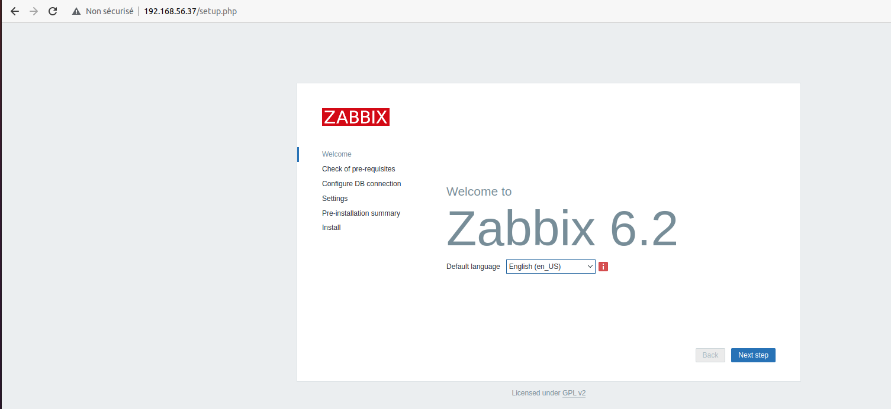
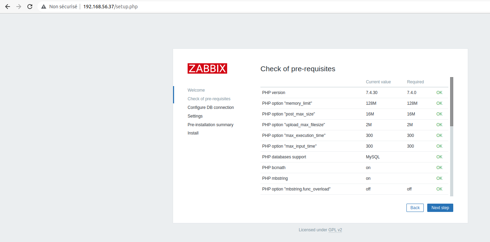
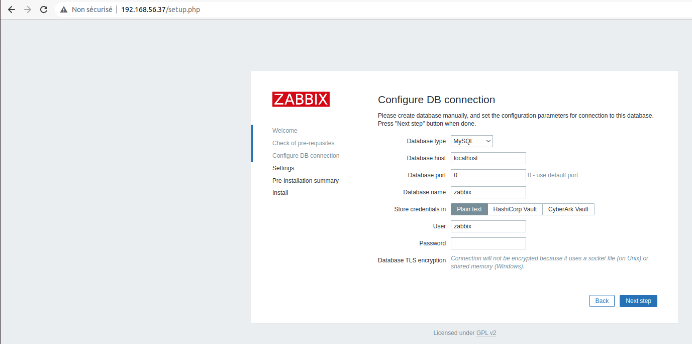
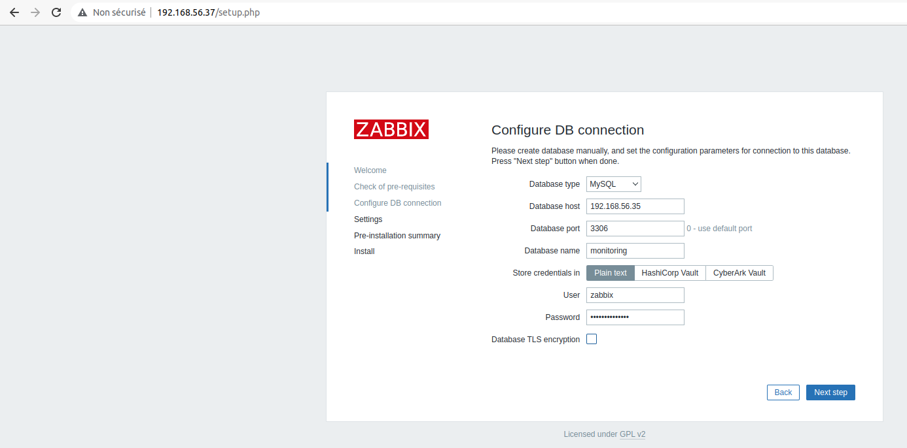
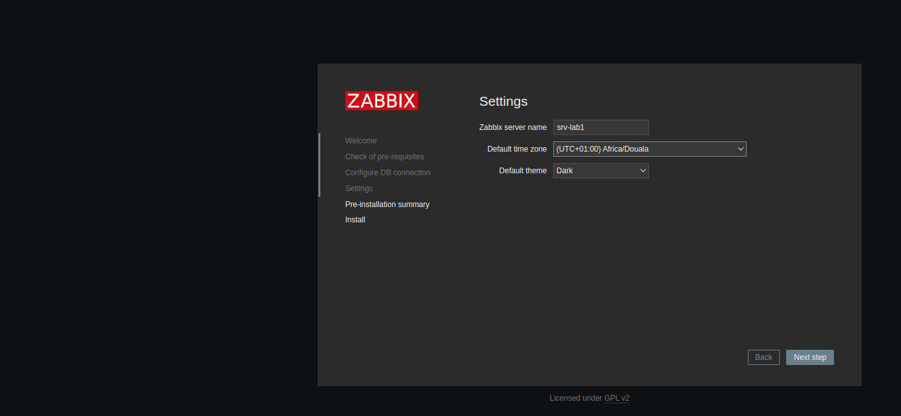
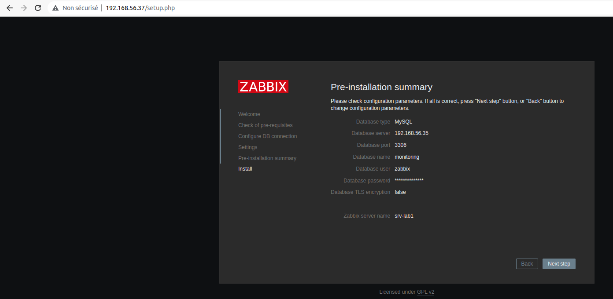
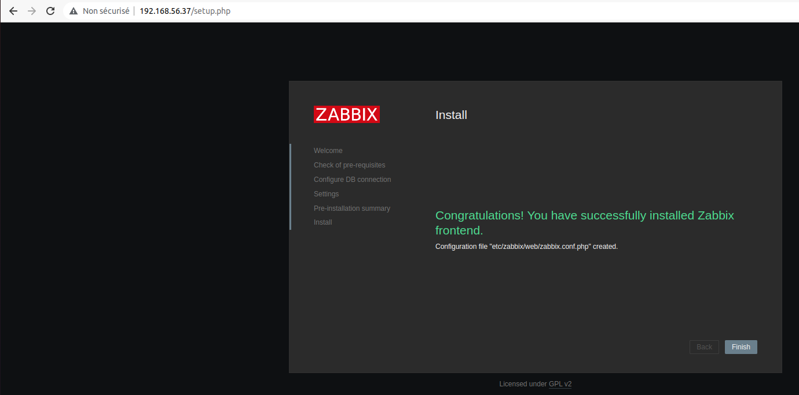

# Configuration de l'interface zabbix

L'interface Zabbix est la partie graphique de notre serveur. C'est là que nous configurerons tous nos hôtes, modèles, tableaux de bord, cartes et tout le reste. Sans cela, nous serions aveugles à ce qui se passe, côté serveur.

- Changeons la version du module DNF pour PHP 7.4 sur notre serveur **srv-lab1**

```
sudo su
dnf module switch-to php:7.4
```

- Installons les packages frontend sur notre serveur **srv-lab1**

```
dnf install zabbix-web-mysql zabbix-nginx-conf
```

- Redémarrons les composants Zabbix et assurons-nous qu'ils démarrent lorsque le serveur est démarré

```
systemctl enable nginx php-fpm
systemctl restart zabbix-server nginx php-fpm
```

- Nous configurons **nginx** pour prendre en charge notre serveur interface web zabbix (**srv-lab1**) <br>
--- nous commentons le bloc de définition de la page par défaut dans le fichier **/etc/nginx/nginx.conf**

```
vim /etc/nginx/nginx.conf
```

```
# server {
#        listen       80 default_server;
#        listen       [::]:80 default_server;
#        server_name  _;
#        root         /usr/share/nginx/html;
#
#        # Load configuration files for the default server block.
#        include /etc/nginx/default.d/*.conf;
#
#        location / {
#        }
#
#        error_page 404 /404.html;
#            location = /40x.html {
#        }
#
#        error_page 500 502 503 504 /50x.html;
#            location = /50x.html {
#        }
#    }
```

--- nous configurons le port **80** dans le fichier **/etc/nginx/conf.d/zabbix.conf** 

```
vim /etc/nginx/conf.d/zabbix.conf
```

```
listen  80;
```

--- nous redemarrons **nginx** et vérifions s'il est bien demarré

```
systemctl restart nginx
systemctl status nginx
```

--- nous activons notre service parefeu **firewalld.service** sur notre serveur **srv-lab1** 

```
systemctl enable firewalld.service
systemctl start firewalld.service
```

--- nous autorisons la communication sur le port 80 via le parfeu de notre serveur **srv-lab1**

```
firewall-cmd --permanent --add-port=80/tcp
firewall-cmd --reload
```

Nous devrions maintenant pouvoir accéder à notre interface Zabbix sans aucun problème et commencer les dernières étapes pour configurer l'interface Zabbix.<br>
Nous devrions maintenant voir la page d'accueil de configuration initiale de zabbix suivante en accédant via l'url **http://192.168.56.37**.



Continuons en cliquant sur **Next Step** sur cette page, qui nous servira à la page suivante.



Chaque option ici devrait afficher OK maintenant; sinon, corrigeons l'erreur qu'il nous montre. Si tout est OK, nous pouvons continuer en cliquant à nouveau sur **Next Step**, ce qui nous amènera à la page suivante.



Nous configurons les paramètres de notre base de données comme suit :




Nous cliquons sur **Next Step** et nous configurons le nom de notre serveur, le timezone et le thème zabbix comme suit :



Une dernière page s'ouvre, qui nous donne le résumé de notre configuration. Nous cliquons sur **Next Step** pour terminer.



Une page de confirmation de nos configurations s'affiche.



Nous avons installé avec succès l'interface Zabbix. Nous pouvons maintenant cliquer sur le bouton **Finish** et nous pouvons commencer à utiliser l'interface. Nous serons servi avec une page de connexion où nous pouvons utiliser les informations d'identification par défaut suivantes :

```
Username: Admin
Password: zabbix
```