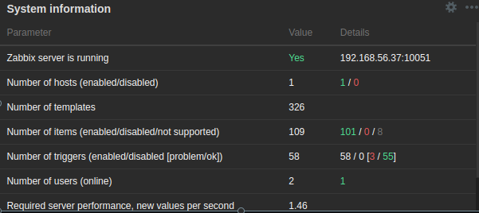
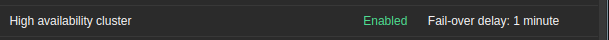

# Mise en place de la haute disponibilité de zabbix

La haute disponibilité amènera votre configuration Zabbix au niveau supérieur en nous assurant que si l'un de vos serveurs Zabbix rencontre des problèmes, un autre prendra le relais.
Une grande chose à propos de cette implémentation est qu'elle prend en charge un moyen propriétaire simple de mettre un à plusieurs serveurs Zabbix dans un cluster. Un excellent moyen de nous assurer que notre surveillance reste actif à tout moment (ou du moins autant que possible).

## configuration du HA sur les deux serveurs

Nous allons utilisons notre 2ème serveur **srv-lab2** pour configurer une autre instance de zabbix. Pour il suffira de suivre la démarche faite précédemment pour la configuration du service zabbix sur le serveur **srv-lab1** avec quelques détails.

Sur le serveur **srv-lab2**, nous procédons comme suit :

```
sudo su
rpm -Uvh https://repo.zabbix.com/zabbix/6.2/rhel/8/x86_64/zabbix-release-6.2-3.el8.noarch.rpm
dnf clean all
```

```
dnf install zabbix-server-mysql zabbix-sql-scripts
```

```
systemctl enable firewalld.service
systemctl start firewalld.service
```

```
firewall-cmd --permanent --add-port=80/tcp
firewall-cmd --reload
```

```
vim /etc/zabbix/zabbix_server.conf
```

```
DBHost=192.168.56.35 # adresse IP du serveur srv-db-lab
DBPort=3306
DBName=monitoring
DBUser=zabbix
DBPassword=strongpassword
LogFileSize=100
HANodeName=srv-lab2
NodeAddress=192.168.56.34
```

Les lignes **HANodeName** (nom du serveur) et **NodeAddress** (adresse IP du serveur **srv-lab2**)permettent de configurer la haute disponibilité.

Nous stoppons le service zabbix sur le serveur **srv-lab1**,

```
systemctl stop zabbix-server
```

Terminons la configuration du serveur **srv-lab2** en installation son interface graphique

```
systemctl enable zabbix-server
systemctl start zabbix-server
systemctl status zabbix-server
```

```
dnf module switch-to php:7.4
```

```
dnf install zabbix-web-mysql zabbix-nginx-conf
```

```
systemctl enable nginx php-fpm
systemctl restart zabbix-server nginx php-fpm
```
Nous configurons **nginx** pour prendre en charge notre serveur interface web zabbix (**srv-lab2**) comme nous l'avons fait pour le serveur  **srv-lab1**.

Nous accédons à l'interface web via l'IP du serveur **srv-lab2** et nous faisons les dernières configurations comme nous l'avons fait avec le serveur **srv-lab1**

Nous ajoutons la configuration de haute disponibilité de zabbix sur le serveur **srv-lab1** et redemarrons son service **zabbix-server**

```
vim /etc/zabbix/zabbix_server.conf
```

```
HANodeName=srv-lab1
NodeAddress=192.168.56.37 # adresse IP du serveur srv-lab1
```

Sur les deux serveurs **srv-lab1** et **srv-lab2**, autorisons le port **10051** afin que les deux serveurs puissent vérifier leur disponibilité entre eux. Puis redemarrons le service zabbix.

```
firewall-cmd --permanent --add-port=10051/tcp
firewall-cmd --reload
```

```
systemctl restart zabbix-server
systemctl status zabbix-server
```

Nous constaterons via les logs de zabbix (**/var/log/zabbix/zabbix_server.log**) que l'un des serveurs va demarrer le service zabbix en mode **standby**

## Configuration de la haute disponibilité de nginx

Sur les deux serveurs **srv-lab1** et **srv-lab2**, nous installons le package **keepalived**

```
dnf install -y keepalived
```

sur le serveur **srv-lab1**, nous configurons le fichier **/etc/keepalived/keepalived.conf**

```
vim /etc/keepalived/keepalived.conf
```

```
vrrp_track_process chk_nginx_service {
  process nginx
  weight -50
}

vrrp_instance ZBX_1 {
  state MASTER
  interface enp0s8
  virtual_router_id 51
  priority 150
  advert_int 1

  unicast_src_ip 192.168.56.37 
  unicast_peer {
      192.168.56.34 # adresse IP du backup
  }

  authentication {
    auth_type PASS
    auth_pass haPassword
  }

  track_process {
    chk_nginx_service
  }

  virtual_ipaddress {
    192.168.56.36/24
  }
}
```

sur le serveur **srv-lab2**, nous configurons le fichier **/etc/keepalived/keepalived.conf**

```
vim /etc/keepalived/keepalived.conf
```

```
vrrp_track_process chk_nginx_service {
  process nginx
  weight 30
}

vrrp_instance ZBX_1 {
  state BACKUP
  interface enp0s8
  virtual_router_id 51
  priority 100
  advert_int 1

  unicast_src_ip 192.168.56.34 
  unicast_peer {
      192.168.56.37 # adresse IP de la master
  }

  authentication {
    auth_type PASS
    auth_pass haPassword
  }

  track_process {
    chk_nginx_service
  }

  virtual_ipaddress {
    192.168.56.36/24
  }
}
```

Sur les deux serveurs **srv-lab1** et **srv-lab2**, nous activons la communication VRRP. Puis nous activons le service **keepalived** et vérifions sons statut.

```
firewall-cmd --direct --permanent --add-rule ipv4 filter INPUT 0 --in-interface enp0s8 --destination 224.0.0.18 --protocol vrrp -j ACCEPT

firewall-cmd --direct --permanent --add-rule ipv4 filter OUTPUT 0 --out-interface enp0s8 --destination 224.0.0.18 --protocol vrrp -j ACCEPT
```

```
firewall-cmd --reload
```

```
systemctl enable keepalived
systemctl start keepalived
systemctl status keepalived
```

Commençons par consulter les rapports | Page d'informations sur le système dans notre interface Zabbix en utilisant l'url : **http://192.168.56.36** (adresse IP virtuelle) et nous constatons l'état de notre haute disponibilité :





Nous constatons la haute disponibilité zabbix est activée.

<br>

Il s'agit du widget Informations système, qui détaille toutes les informations système pour nous. De cette façon, nous pouvons garder un œil sur ce qui se passe avec notre serveur Zabbix et voir si notre Zabbix fonctionne bien. Passons en revue les paramètres :

- **Zabbix server is running** : nous informe si le backend du serveur Zabbix est réellement en cours d'exécution et où il s'exécute. Dans ce cas, il est en cours d'exécution et il s'exécute sur localhost:10051 .

- **Number of hosts** : cela détaillera le nombre d'hôtes activés ( 1 ), le nombre d'hôtes désactivés ( 0 ) et le nombre de modèles que nous avons ( 326 ). Il nous donne un aperçu rapide des informations sur l'hôte de notre serveur Zabbix.

- **Number of items** : ici, nous pouvons voir les détails des éléments de notre serveur Zabbix—dans ce cas, activé ( 101 ), désactivé ( 0 ) et non pris en charge ( 8 ).

- **Number of triggers** : détaille le nombre de déclencheurs. Nous pouvons voir combien sont activés ( 58 ) et désactivés ( 0 ), mais aussi combien sont dans un état problématique ( 3 ) et combien sont dans un état ok ( 55 ).

- **Number of users** (en ligne) : La première valeur détaille le nombre total d'utilisateurs. La deuxième valeur détaille le nombre d'utilisateurs actuellement connectés à l'interface Zabbix.

- **Required server performance, new values per second** ( NVPS ).
Un serveur reçoit ou demande des valeurs via des éléments et les écrit dans notre base de données MariaDB (ou une autre base de données). Les informations NVPS détaillées ici montrent le nombre estimé de NVPS reçus par le serveur Zabbix. Gardons un œil sur cela à mesure que votre serveur Zabbix grandit, car c'est un bon indicateur pour voir à quelle vitesse nous devrions étendre notre cluster.

- **High availability cluster** : si nous exécutons un cluster haute disponibilité de serveur Zabbix, nous verrons s'il est activé ici et quel est le délai de basculement. De plus, la page d'informations système affichera des informations supplémentaires sur la haute disponibilité.

Nous pouvons également voir trois valeurs supplémentaires ici en fonction de notre configuration :

- **Database history tables upgraded** : cela indique qu'une de nos tables d'historique de la base de données n'a pas encore été mise à jour. Les tables numériques (flottantes) ont été étendues pour permettre d'enregistrer plus de caractères par point de données. 

- **Database name** : si nous voyons le nom de notre base de données avec la valeur de notre version, cela peut indiquer que nous exécutons une version de base de données non prise en charge.

**Passons au widget Problèmes** : nous voyons nos problèmes actuels sur cet écran, donc si nos déclencheurs sont correctement configurés, nous obtenons ici des informations précieuses. Un aperçu rapide du nombre d'hôtes qui rencontrent des problèmes est une chose, mais la page Problèmes nous donne également plus de détails sur le problème :

- **Time** : à quelle heure ce problème a été remarqué pour la première fois par le serveur Zabbix

- **Info** : informations sur l'événement, avec les statuts Fermeture manuelle et Supprimé représentés ici.

- **Host** : sur quel hôte ce problème s'est produit.

- **Problem/Severity** : quel est le problème et quelle est sa gravité. La gravité est indiquée par une couleur, dans ce cas, orange signifiant Moyenne.

- **Duration**: depuis combien de temps cela pose-t-il problème ?

- **Ack** : si ce problème a été reconnu ou non par nous-même ou par un autre utilisateur de Zabbix.

- **Actions** : quelles actions ont été entreprises après que ce problème se soit produit, par exemple, un script personnalisé qui s'exécute lors de la création du problème. Si nous survolons une action, elle nous montrera des informations détaillées sur toutes les actions qui ont été prises pour ce problème.

- **Tags** : quelles balises sont attribuées à ce problème.

Le widget Problèmes est très utile. Nous avons différents types de ce widget disponibles et comme mentionné précédemment, il est entièrement personnalisable, en fonction de la façon dont ce widget nous montre nos problèmes.