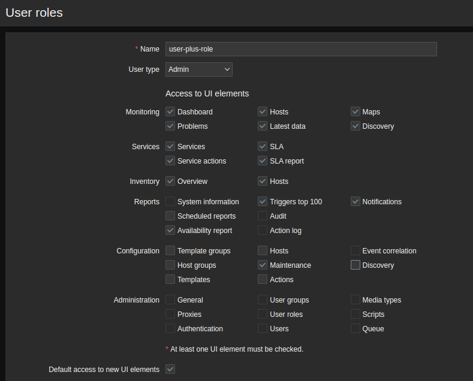
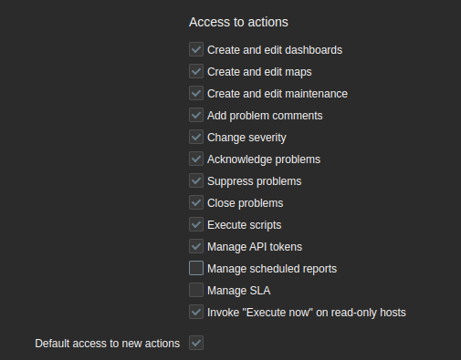

# Utilisation de nouveaux rôles d'utilisateur Zabbix

De nouvelles fonctionnalités ont été introduites à partir de la version Zabbix 6.0 LTS. Il est maintenant possible de créer nos propres rôles d'utilisateur dans Zabbix. Dans les anciennes versions de Zabbix, nous avions la possibilité d'attribuer l'un des trois types d'utilisateurs : **user**, **admin**, **super admin**
 
Ce que ces types d'utilisateurs faisaient dans les versions précédentes restreignait ce que les utilisateurs de Zabbix pouvaient voir dans l'interface. Cela a toujours été prédéfini cependant. Maintenant, avec l'ajout de rôles d'utilisateurs que nous pouvons créer nous-mêmes, nous pouvons configurer nos propres restrictions liées au frontend, permettant de ne montrer que certaines parties de l'interface utilisateur à certains utilisateurs de Zabbix, tout en respectant les autorisations configurées à l'aide des groupes d'utilisateurs .

Tout d'abord, décomposons les options dont nous disposons lors de la création de rôles d'utilisateur dans Zabbix :

- **Name**: nous pouvons définir ici un nom personnalisé pour notre rôle d'utilisateur.

- **User type** : les types d'utilisateur existent toujours dans Zabbix 6, bien qu'ils fassent désormais partie des rôles d'utilisateur. Il y a toujours une limite à ce qui peut être vu par un certain type d'utilisateur et le type **Super admin** n'est toujours pas limité en ce qui concerne les autorisations.

- **Access to UI elements** : ici, nous pouvons restreindre ce qu'un utilisateur peut voir sur l'interface utilisateur Zabbix lorsqu'il est affecté à ce rôle d'utilisateur.

- **Access to services** : la surveillance des services ou des SLA peut être restreinte ici, car nous ne souhaitons peut-être pas que tous les utilisateurs y aient accès.

- **Access to modules** : les modules frontend personnalisés de Zabbix sont entièrement intégrés dans le système de rôle de l'utilisateur, ce qui signifie que nous pouvons sélectionner les modules frontaux qu'un utilisateur Zabbix peut voir.

- **Access to API** : l'API Zabbix peut être limitée à certains rôles d'utilisateur. Par exemple, nous pouvons ne vouloir qu'un rôle d'utilisateur d'API spécifique, limitant l'accès des autres utilisateurs à l'API Zabbix.

- **Access to actions** : dans les rôles d'utilisateur Zabbix, certaines actions peuvent être limitées, comme la possibilité de modifier les tableaux de bord, les jetons d'API de maintenance, etc.

Nous allons maintenant créer un rôle appelé **user-plus-role**.

- Tout d'abord, accédons à l'interface Zabbix et accédons à la page **Administration > User roles**. Cela nous montrera les rôles d'utilisateur par défaut tels que nous les connaissons dans les anciennes versions de Zabbix.

- Ici, nous pouvons cliquer sur le bouton bleu **Create user role** dans le coin supérieur droit.

- Nous allons configurer un nouveau rôle d'utilisateur appelé **user-plus-role** . Ce rôle sera destiné aux utilisateurs de Zabbix qui n'auront que des autorisations de lecture, mais qui ont besoin de plus d'accès que les seuls éléments de navigation **Monitoring**, **Inventory** et **Reports**.

- Concentrons-nous sur la partie où il indique d'abord **Access to UI elements**. Lorsque l'utilisateur est sélectionné pour le type d'utilisateur (**User type**), nous ne sommes pas en mesure d'ajouter un accès au rôle d'utilisateur. Modifions donc le type d'utilisateur en sélectionnant **Admin** dans la liste déroulante.

- Nous souhaitons que ce rôle d'utilisateur nommé **user-plus-role** ait la possibilité d'accéder à la page de maintenance. La configuration ressemblera à ceci :

- Assurons-nous de modifier également la section **Access to actions** du formulaire en désélectionnant **Manage scheduled reports** comme suit :

- Enfin, cliquons sur le bouton bleu **Add** en bas du formulaire pour ajouter ce nouveau rôle d'utilisateur.