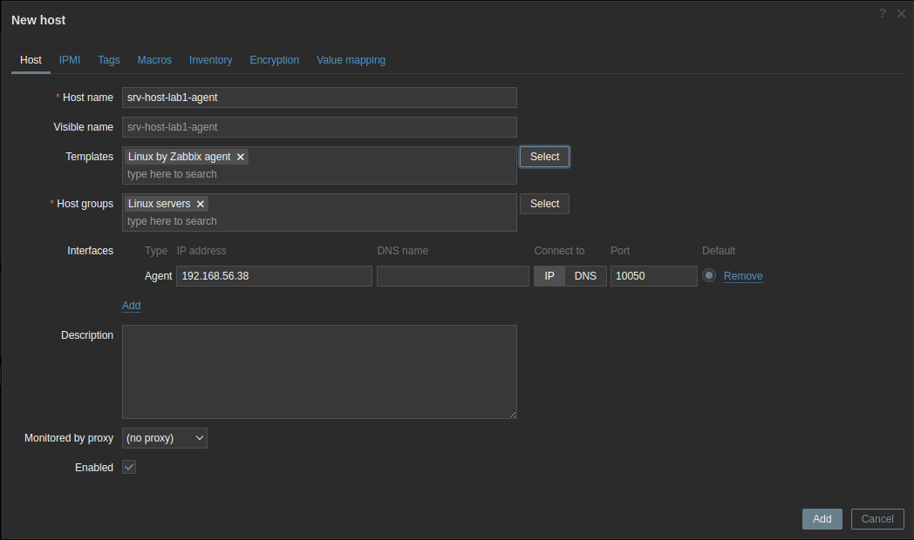
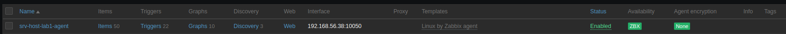
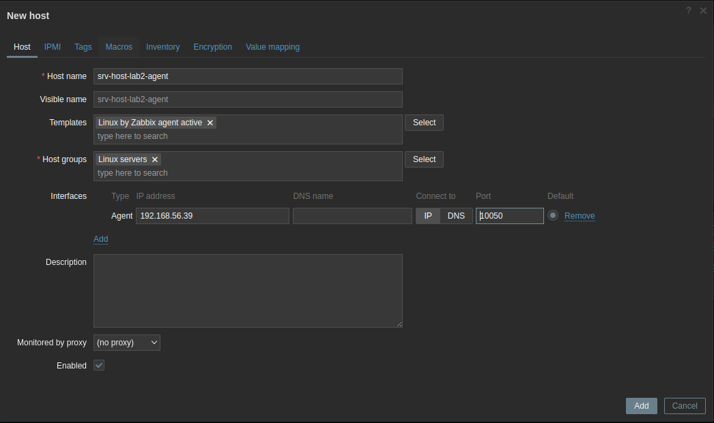

# Configuration de l'agent Zabbix

À partir de la sortie de Zabbix 5, Zabbix a également officiellement commencé à prendre en charge le nouvel **agent Zabbix 2**. L'**agent Zabbix 2** apporte des améliorations majeures et est même écrit dans un autre langage de codage, qui est Golang au lieu de C.
<br>
Nous supposons que nous souhaiterons monitorer un serveur linux Rocky Linux **srv-host-1** en mode passif et un serveur ubuntu **srv-host-2** en mode active.

<br>

C'est pourquoi nous créeons un autre fichier Vagrantfile dans un repertoire **monitoring**, avec trois nouvelles machines (la 3ème sera utilisée pour configurer le monitoring via SNMP).

```
mkdir ~/monitoring
cd ~/monitoring
vim Vagrantfile
```

```
# -*- mode: ruby -*-
# vi: set ft=ruby :

VAGRANTFILE_API_VERSION = "2"

Vagrant.configure(VAGRANTFILE_API_VERSION) do |config|
  config.vbguest.auto_update = false
  config.vbguest.no_remote = true
  config.vbguest.iso_path = "./VBoxGuestAdditions_6.1.38.iso"

  # General Vagrant VM configuration.
  config.ssh.insert_key = false
  config.vm.synced_folder ".", "/vagrant", disabled: true
  config.vm.provider :virtualbox do |v|
    v.memory = 2048
    v.cpus = 1
    v.linked_clone = true
  end

  # Server Host 1.
  config.vm.define "srv-host-lab1" do |host1|
    host1.vm.box = "willbrid/rockylinux8"
    host1.vm.hostname = "srv-host-lab1"
    host1.vm.network :private_network, ip: "192.168.56.38"
  end

  # Server Host 2.
  config.vm.define "srv-host-lab2" do |host2|
    host2.vm.box = "geerlingguy/ubuntu2004"
    host2.vm.box_version = "1.0.4"
    host2.vm.hostname = "srv-host-lab2"
    host2.vm.network :private_network, ip: "192.168.56.39"
  end

  # Server Host 3.
  config.vm.define "srv-host-lab3" do |host3|
    host3.vm.box = "geerlingguy/ubuntu2004"
    host3.vm.box_version = "1.0.4"
    host3.vm.hostname = "srv-host-lab3"
    host3.vm.network :private_network, ip: "192.168.56.40"
  end
end
```

```
vagrant up
```

- Commençons par installer l'**agent Zabbix 2** sur les hôtes Linux que nous voulons monitorer

**Sous Rocky linux**

```
sudo su
rpm -Uvh https://repo.zabbix.com/zabbix/6.2/rhel/8/x86_64/zabbix-release-6.2-3.el8.noarch.rpm
```

**Sous Ubuntu focal**

```
sudo su
wget https://repo.zabbix.com/zabbix/6.2/ubuntu/pool/main/z/zabbix-release/zabbix-release_6.2-4+ubuntu20.04_all.deb
dpkg -i zabbix-release_6.2-4+ubuntu20.04_all.deb
apt update
```

- Installons le package **agent zabbix 2** <br>

**Sous Rocky linux**

```
dnf -y install zabbix-agent2
```

**Sous Ubuntu focal**

```
apt install zabbix-agent2
```

## Configuration du mode passif sous notre serveur srv-host-lab1

L'agent en mode passif fonctionne en collectant des données de notre hôte avec l'agent Zabbix depuis notre serveur zabbix. Chaque fois qu'un élément sur notre hôte atteint son intervalle de mise à jour, le serveur Zabbix demande à l'agent Zabbix quelle est la valeur actuelle.

<br>

Les agents passifs sont parfaits lorsque nous travaillons dans des environnements où nous souhaitons maintenir la communication initiée depuis le serveur Zabbix ou le côté proxy Zabbix, par exemple, lorsqu'il existe un pare-feu qui n'autorise que le trafic sortant.

<br>

- Nous configurons notre agent 2 zabbix sur notre serveur **srv-host-lab1**

```
vim /etc/zabbix/zabbix_agent2.conf
```

```
LogFileSize=100
Server=192.168.56.37,192.168.56.34
ListenPort=10050
# ServerActive=127.0.0.1 # Ligne commentée
Hostname=srv-host-lab1 # Hostname de notre serveur agent
```

Comme nous sommes en haute disponibilité, nous utiliserons les adresses IP de nos deux serveurs zabbix **192.168.56.37,192.168.56.34** séparés par la virgule.

<br>

Nous actions et redemarrons le service agent 2 zabbix

```
systemctl enable zabbix-agent2
systemctl restart zabbix-agent2
```

Nous autorisons le port **10050** au niveau du firewall

```
firewall-cmd --permanent --add-port=10050/tcp
firewall-cmd --reload
```

- Ensuite, passons à l'interface de notre serveur Zabbix et ajoutons cet hôte **srv-host-lab1** pour la surveillance.

- Allons dans la page **Configuration > Hosts** dans notre interface Zabbix et cliquons sur **Create host** dans le coin supérieur droit.

- Pour créer cet hôte dans notre serveur Zabbix, nous devons renseigner les valeurs comme indiqué dans la capture d'écran suivante :



Il est important d'ajouter ce qui suit : <br>
--- **Host name** : pour identifier cet hôte : **srv-host-lab1-agent** <br>
--- **Groups** : pour regrouper logiquement les hôtes. <br>
--- **Interfaces** : pour surveiller cet hôte sur une interface spécifique. Assurons-nous d'ajouter l'adresse IP correcte à la configuration de l'interface de l'agent **srv-host-lab1**. <br>
--- Il est également important d'ajouter un modèle à cet hôte : le modèle **Linux By Zabbix agent** est sélectionné sous le modèle principal **template/Operating system**. <br>

Si tout se passe bien nous aurons l'icône **ZBX** qui deviendra verte comme suit :



## Configuration du mode actif sous notre serveur srv-host-lab2

- Nous configurons notre agent 2 zabbix sur notre serveur **srv-host-lab2**

```
vim /etc/zabbix/zabbix_agent2.conf
```

```
LogFileSize=100
# Server=127.0.0.1 # Ligne commentée
ListenPort=10050
ServerActive=192.168.56.37:10051;192.168.56.34:10051
Hostname=srv-host-lab2 # Hostname de notre serveur agent
```

Comme nous sommes en haute disponibilité, nous utiliserons les adresses IP de nos deux serveurs zabbix **192.168.56.37;192.168.56.34** séparés par le point virgule.

<br>

Nous actions et redemarrons le service agent 2 zabbix

```
systemctl enable zabbix-agent2
systemctl restart zabbix-agent2
```

- Ensuite, passons à l'interface de notre serveur Zabbix et ajoutons un autre hôte de notre agent **srv-host-lab2** avec un modèle pour effectuer des vérifications actives au lieu de passives.

- Allons dans la page **Configuration > Hosts** dans notre interface Zabbix et cliquons sur **Create host** dans le coin supérieur droit.

- Pour créer cet hôte dans notre serveur Zabbix, nous devons renseigner les valeurs comme indiqué dans la capture d'écran suivante :



Il est important d'ajouter ce qui suit : <br>
--- **Host name** : pour identifier cet hôte : **srv-host-lab2-agent** <br>
--- **Groups** : pour regrouper logiquement les hôtes. <br>
--- **Interfaces** : pour surveiller cet hôte sur une interface spécifique. Assurons-nous d'ajouter l'adresse IP correcte à la configuration de l'interface de l'agent **srv-host-lab2**. <br>
--- Il est également important d'ajouter un modèle à cet hôte : le modèle **Linux By Zabbix agent active** est sélectionné sous le modèle principal **template/Operating system**. <br>


**NB**: En mode agent Zabbix actif, le nom d'hôte dans le fichier de configuration de l'agent Zabbix doit correspondre à la configuration de notre hôte telle qu'elle apparaît sur l'interface Zabbix.