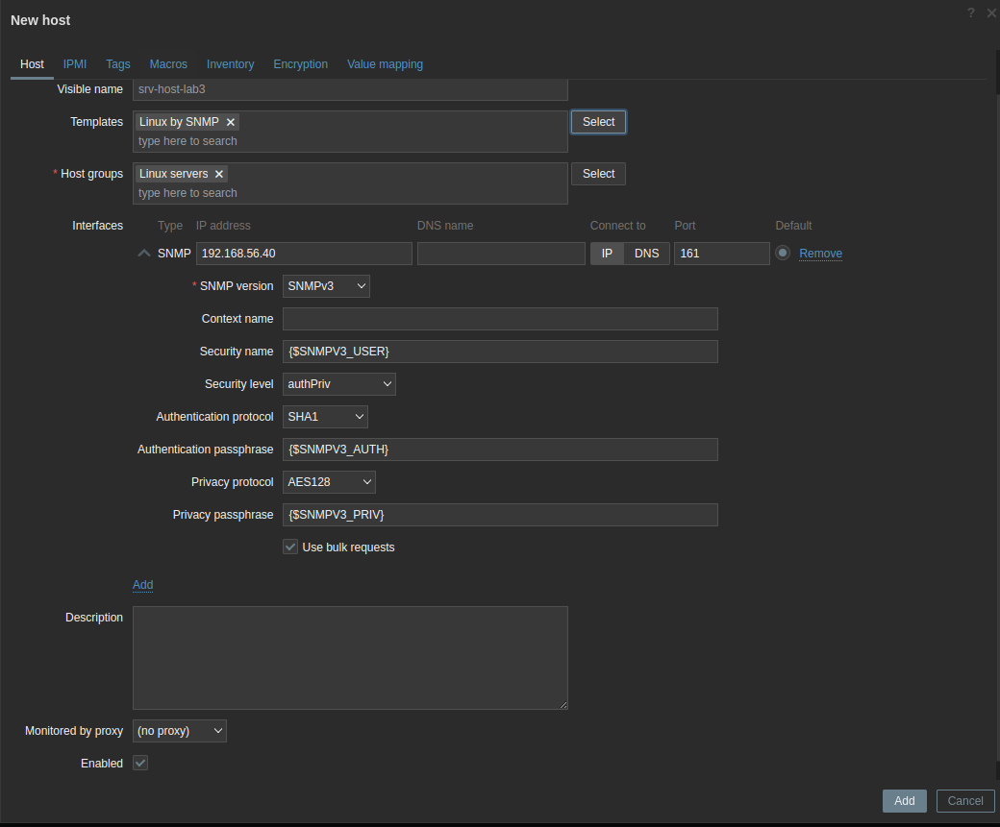
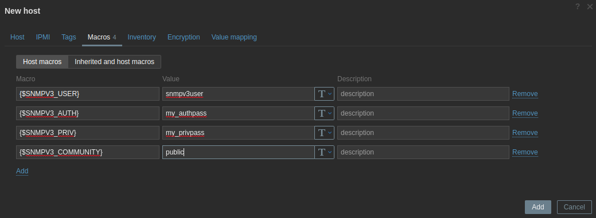
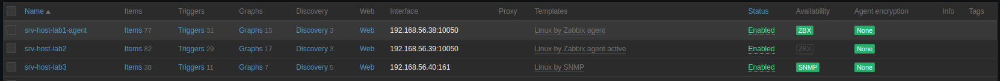

# Utilisation du monitoring SNMP

Le monitoring via l'interrogation SNMP est simple et très puissante. Nous allons commencer par configurer SNMPv3 sur notre hôte Linux à monitorer **srv-host-lab3**.

- Commençons par exécuter les commandes suivantes pour installer SNMP sur notre hôte. 

```
apt update
apt install snmp snmpd libsnmp-dev
```

- Maintenant, créons le nouvel utilisateur SNMPv3 que nous utiliserons pour monitorer notre hôte. 

```
systemctl enable snmpd
systemctl stop snmpd
```

```
net-snmp-create-v3-user -ro -a my_authpass -x my_privpass -A SHA -X AES snmpv3user
```

```
systemctl start snmpd
```

Cela créera un utilisateur SNMPv3 avec le nom d'utilisateur **snmpv3user** , le mot de passe d'authentification **my_authpass** et le mot de passe privilégié **my_privpass**.

- Assurons-nous de modifier le fichier de configuration SNMP pour nous permettre de lire tous les objets SNMP :

```
vim /etc/snmp/snmpd.conf
```

- Ajoutons la ligne **view systemview** et la ligne **agentaddress** avec l'interface (adresse IP) via laquel l'agent doit écouter le trafic SNMP:

```
view systemview included .1
agentaddress  127.0.0.1,[::1],192.168.56.40
```

- Maintenant redemarrons le service snmpd

```
systemctl restart snmpd
```

- Allons dans la page **Configuration > Hosts** dans notre interface Zabbix et cliquons sur **Create host** dans le coin supérieur droit.



Il est important d'ajouter ce qui suit : <br>
--- **Host name** : pour identifier cet hôte : **srv-host-lab3** <br>
--- **Groups** : pour regrouper logiquement les hôtes : **Linux servers** <br>
--- Il est également important d'ajouter un modèle à cet hôte : le modèle **Linux By SNMP** est sélectionné sous le modèle principal **template/Operating system** <br>
--- **Interfaces** : pour surveiller cet hôte sur une interface spécifique. Assurons-nous d'ajouter l'adresse IP correcte à la configuration de l'interface de l'agent SNMP **srv-host-lab3**, port : **161**.

- Nous utilisons ici des macros dans notre configuration pour le nom d'utilisateur et le mot de passe. Nous pouvons utiliser ces macros pour ajouter un groupe d'hôtes avec les mêmes informations d'identification. <br>
Accédons à l'onglet **Macros** et remplissons les macros comme ceci :



Maintenant, après avoir appliqué ces modifications en cliquant sur Mettre à jour, nous devrions pouvoir monitorer notre serveur Linux via SNMPv3. Allons à **Monitoring > Hosts** et consultons la page **Latest data** pour notre nouvel hôte.

<br>

Si tout se passe bien nous aurons l'icône SNMP en vert.



Lorsque nous créons un hôte comme nous l'avons fait à l'étape précédente, Zabbix interroge l'hôte à l'aide de SNMP. L'interrogation SNMP comme celle-ci fonctionne avec les **OID SNMP**. Par exemple, lorsque nous interrogeons l'élément appelé **Mémoire libre**, nous demandons à l'agent SNMP exécuté sur notre hôte Linux de nous fournir la valeur de **1.3.6.1.4.1.2021.4.6.0**. Cette valeur nous est ensuite renvoyée sur le serveur Zabbix.

<br>

SNMPv3 ajoute l'authentification et le cryptage à ce processus, en s'assurant que lorsque notre serveur Zabbix demande des informations, cette demande est d'abord cryptée et les données sont également renvoyées cryptées. <br>
Nous avons également inclus la possibilité d'utiliser les requêtes en masse lors de la configuration de notre hôte. Les requêtes en bloc demandent plusieurs OID dans le même flux, ce qui en fait la méthode préférée pour effectuer des requêtes SNMP car elle est plus efficace. Désactivons-le uniquement pour les hôtes qui ne prennent pas en charge les requêtes groupées.