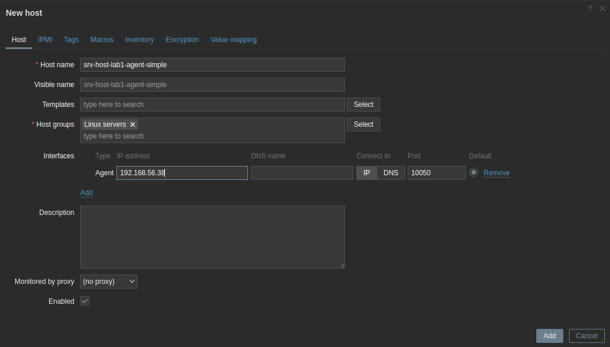
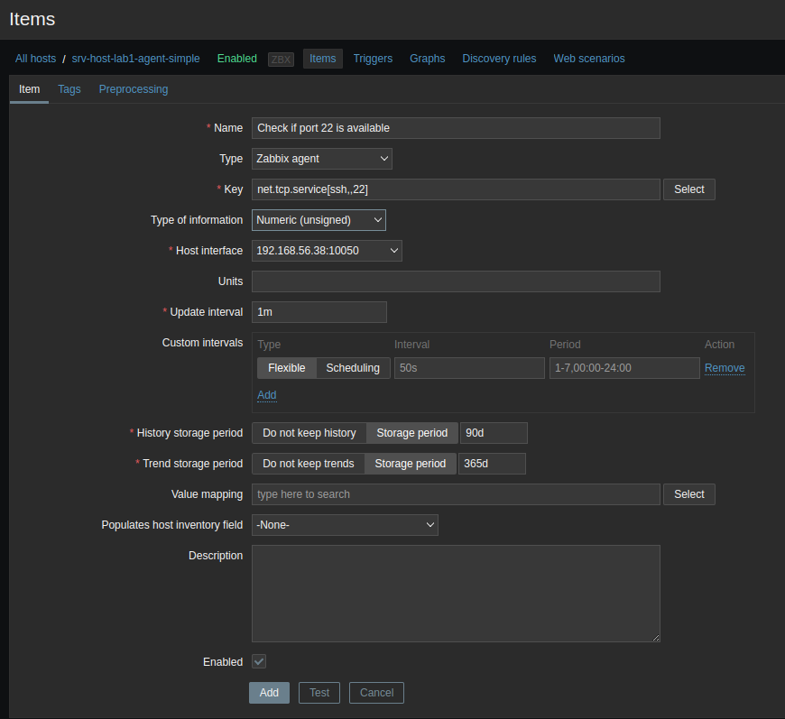
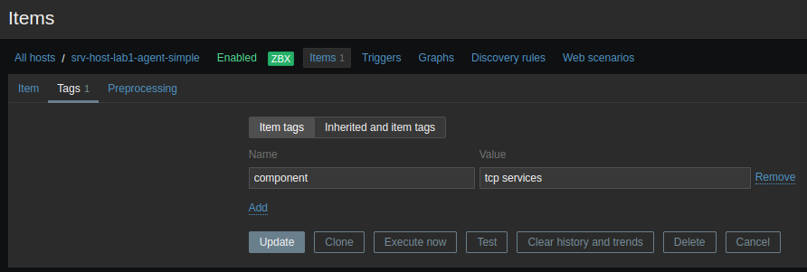
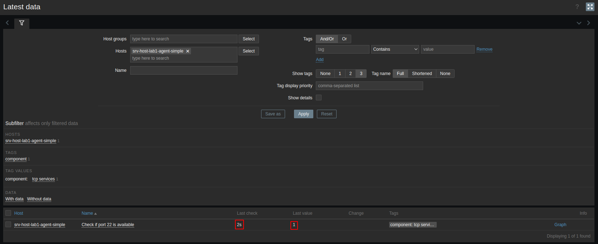
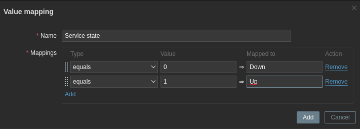
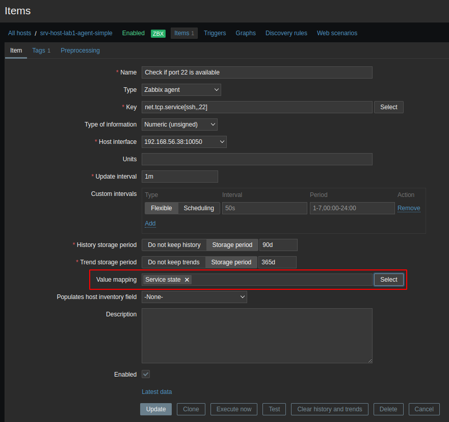
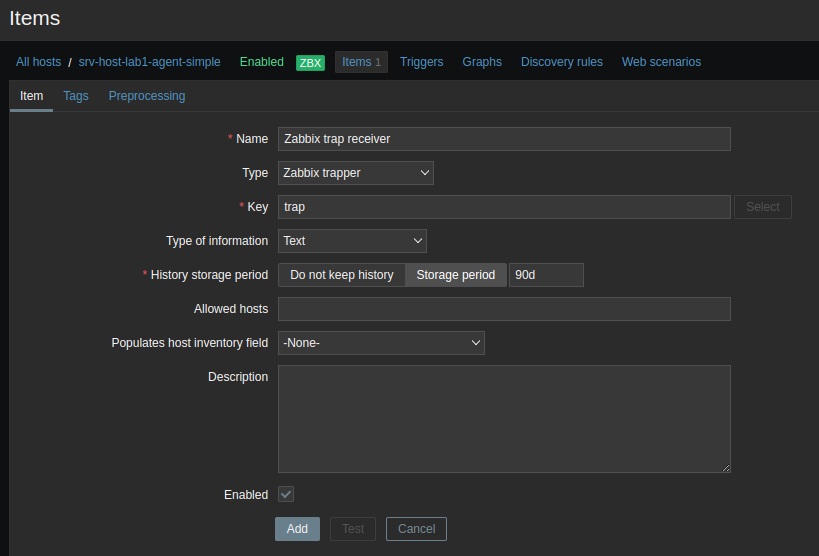
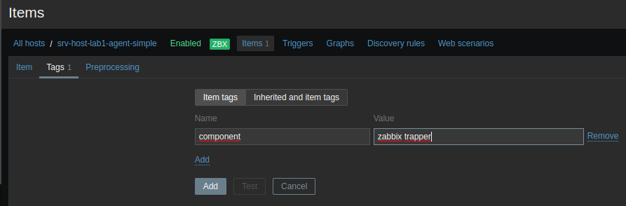
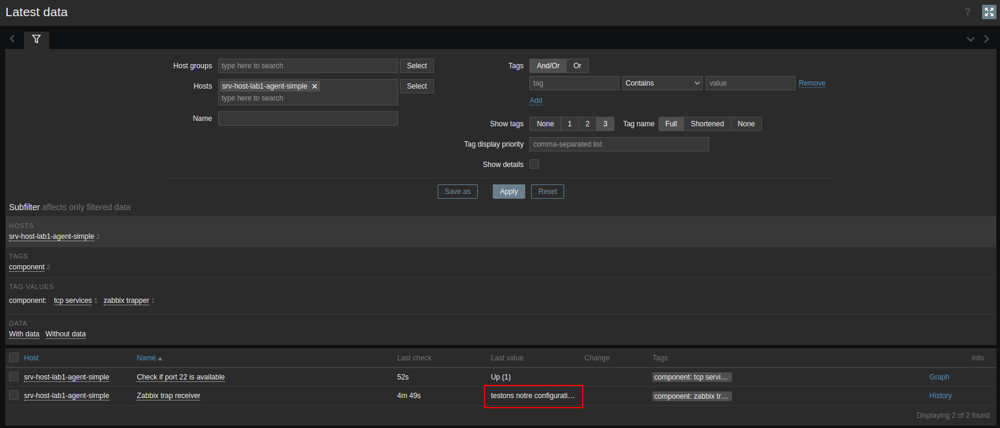

# Création des vérifications simples Zabbix et trappage avec Zabbix

## Création des vérifications simples

Les vérifications simples de Zabbix sont essentiellement une liste de vérifications intégrées conçues pour surveiller certaines valeurs. Une liste et une description sont disponibles dans la documentation Zabbix pour toutes les vérifications simples disponibles ici : **https://www.zabbix.com/documentation/current/manual/config/items/itemtypes/simple_checks** . <br>
Toutes ces vérifications sont effectuées par le serveur Zabbix pour collecter des données à partir d'un hôte monitoré. Par exemple, lorsque nous effectuons la simple vérification Zabbix pour vérifier si un port est ouvert, notre serveur Zabbix demande s'il peut atteindre ce port et le transforme en un statut que nous pouvons ensuite voir dans notre interface Zabbix. Cela signifie que si le pare-feu de notre hôte monitoré bloque le port 22 du serveur Zabbix, nous obtiendrons une valeur de service indisponible. Cependant, cela ne signifie pas nécessairement que SSH ne s'exécute pas sur le serveur ; cela signifie simplement que SSH est en panne, vu du côté du serveur ou du proxy Zabbix.
<br>
Nous allons créer une vérification simple pour monitorer si un service est en cours d'exécution et accepte les connexions TCP sur un certain port. Nous prendrons le cas de notre serveur **srv-host-lab1-agent-simple** en vérifiant si le port 22 du service ssh est disponible.
<br>
Pour ce faire, nous devrons créer un nouvel hôte dans l'interface Zabbix. 

- Allons dans **Configuration > Hosts** dans notre interface Zabbix et cliquons sur **Create host** dans le coin supérieur droit.

Dans l'interface qui s'affiche, nous configurons comme suit:



Nous cliquons sur le bouton **Add**.

- Allons maintenant dans **Configuration > Hosts**, cliquons sur l'hôte nouvellement créé et accédons à la colonne **Items**. Nous voulons créer un nouvel élément ici en cliquant sur le bouton **Create item**. <br>
Nous allons créer un nouvel élément avec les valeurs suivantes, et après cela, nous cliquerons sur le bouton **Add** en bas de la page :



Assurons-nous également d'ajouter un tag à l'élément, car nous en avons besoin à plusieurs endroits pour filtrer et trouver notre élément lorsque nous travaillons avec Zabbix. Cliquons sur l'élément **Check if port 22 is available**, accédons à l'onglet **Tags** et configurons-le comme ceci :



Nous cliquons sur le bouton **Update** pour mettre à jour notre élément. <br>
Nous devrions maintenant être en mesure de voir si notre serveur accepte les connexions SSH sur le port 22 sur notre écran **Latest data**. Accédons à **Monitoring > Hosts** et vérifions l'écran **Latest data** pour notre nouvelle valeur :



Actuellement nous n'avons pas encore de configuration de mappage de valeur. La dernière valeur affiche simplement un 1 ou un 0. Pour changer cela, revenons à **Configuration > Hosts** et modifions l'hôte **srv-host-lab1-agent-simple**. Cliquons sur l'onglet **Value mapping** et cliquons sur le petit bouton **Add** pour ajouter un mappage de valeur comme suit :



Cliquons sur le bouton bleu **Add** et cliquons sur le bouton bleu **Update**. Ensuite, revenons à **Configuration > Hosts**, recherchons la ligne de notre hôte **srv-host-lab1-agent-simple** et cliquons sur la colonne **Items** pour cet hôte. Modifions l'élément **Check if port 22 is available** et ajoutons le mappage de valeur comme suit :



Nous cliquons sur le bouton **Update** pour mettre à jour notre élément. Pour vérifier cette configuration, nous pouvons à nouveau accéder à **Monitoring > Hosts** et vérifier l'écran **Latest data** de notre hôte **srv-host-lab1-agent-simple**.

## Création d'un trappeur

Lorsque nous travaillons avec **Zabbix sender**, nous faisons exactement le contraire de la plupart des vérifications. Nous construisons un élément sur notre serveur Zabbix, qui nous permet de capturer des éléments de trappage. Cela nous permet de créer des vérifications personnalisées pour envoyer des données à notre serveur Zabbix à partir d'un hôte monitoré. <br>
Supposons, par exemple, que nous souhaitons créer un script Python personnalisé qui, à la fin de l'exécution du script, envoie la sortie au serveur Zabbix. Nous pourrions demander à Python d'envoyer ces données à l'aide de l'utilitaire **Zabbix sender**, puis nous aurons ces données disponibles pour traitement sur le serveur Zabbix. Par exemple, il est utilisé par certaines entreprises qui écrivent leur propre logiciel pour intégrer complètement leur logiciel dans Zabbix.
<br>
Nous allons créer un élément **Zabbix trap receiver** sur notre hôte **srv-host-lab1-agent-simple**. <br>
Allons dans **Configuration | Hôtes** et recherchons l'hôte **srv-host-lab1-agent-simple**, puis accédons à la colonne **Items**. Nous voulons créer un nouvel élément ici à nouveau en cliquant sur le bouton **Create item**.



Assurons-nous également d'accéder à l'onglet **Tags** et d'ajouter une tag que nous utiliserons plus tard pour le filtrage :



Nous cliquons sur le bouton **Add** pour ajouter notre élément. <br>

Si nous allons à la CLI de notre serveur monitoré **srv-host-lab1** (**192.168.56.38**), nous pouvons maintenant exécuter ce qui suit pour installer l'expéditeur Zabbix :

```
sudo dnf -y install zabbix-sender
```

Après l'installation, nous pouvons utiliser l'expéditeur Zabbix pour envoyer des informations à notre serveur zabbix :

```
zabbix_sender -z 192.168.56.37 -s "srv-host-lab1-agent-simple" -k trap -o "testons notre configuration de trappage"
```

Ici nous utilisons l'IP **192.168.56.37** du serveur **srv-lab1**. Comme nous sommes en mode haute disponibilité, si cela ne marche pas avec ce serveur ci-dessus alors nous pouvons tester avec l'IP **192.168.56.34** du serveur **srv-lab2**. Nous devrions maintenant être en mesure de voir si notre hôte monitoré a envoyé le trap Zabbix et si le serveur Zabbix a reçu ce trap pour traitement.

