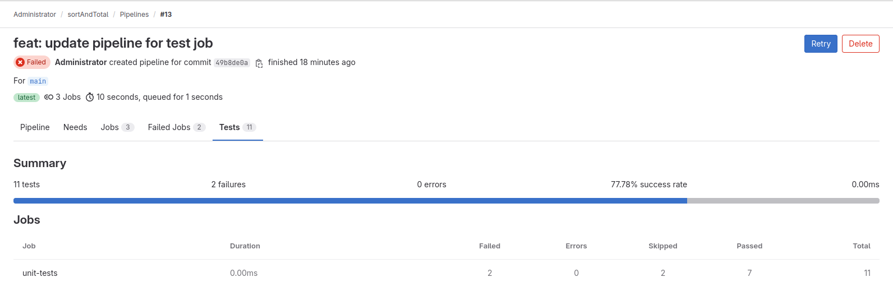

# Exécuter des tests fonctionnels automatisés dans un pipeline CI/CD

L'une des tâches les plus courantes dans un pipeline CI/CD consiste à exécuter des tests fonctionnels automatisés pour nous assurer que notre code fait ce qu'il est censé faire. Notre projet **sortAndTotal** contient notre fichier de test **main_test.go** qui permettra d'éxécuter une collection de test afin de valider les fonctionnalités du projet.

### Ajout d'une tâche pour les tests

Pour exécuter les tests automatisés dans notre pipeline, ajoutons une tâche qui les déclenche comme nous le ferions à partir de la ligne de commande.

```
cd $HOME/sortAndTotal
```

```
vi .gitlab-ci.yml
```

```
variables:
  OUTPUT_NAME: __bin__/$CI_PROJECT_NAME

default:
  tags:
    - dev
    - linux

stages:
  - test
  - build

include:
- template: Jobs/Code-Quality.gitlab-ci.yml

unit-tests:
  stage: test
  script:
    - gotestsum --junitfile report.xml --format testname
  artifacts:
    when: always
    reports:
      junit: report.xml

compilation:
  stage: build
  script:
    - mkdir -p $OUTPUT_NAME
    - go build -o $OUTPUT_NAME ./...
  artifacts:
    paths:
      - $OUTPUT_NAME
```

```
git add .gitlab-ci.yml
```

```
git commit -m "feat: update pipeline for test job"
```

```
git push --set-upstream origin main
```

La configuration de tâche pour les tests ajoutée définit une tâche appelé **unit-tests** qui appartient à l'étape **test** :

- **unit-tests**: c'est le nom de la tâche.

- **stage: test**: cette instruction définit l'étape à laquelle cette tâche appartient.

- **script**: c'est la section où nous spécifions les commandes à exécuter dans la tâche. Dans cet exemple, la commande "**gotestsum --junitfile report.xml --format testname**" est exécutée. Cette commande exécute les tests unitaires et génère un fichier de rapport au format **JUnit** appelé **report.xml**.

- **artifacts**: cette section spécifie les artefacts à conserver après l'exécution de la tâche. Dans ce cas, l'option **reports** est utilisée pour spécifier le type d'artefact (**junit**) et le chemin vers le fichier de rapport généré (**report.xml**). L'option **when: always** garantit que les artefacts sont collectés même en cas d'échec de la tâche.

### Affichage des résultats des tests fonctionnels automatisés

Un nouvel onglet intitulé **Tests** apparaîtra sur la page de détails du pipeline. Cliquer sur cet onglet nous montre un aperçu du nombre de tests automatisés réussis et combien ont échoué. 

<p align="center">

</p>

Ce tableau montre une ligne par tâche qui déclenche des tests automatisés. Cliquer sur n'importe quelle ligne décompose davantage les résultats, afin que nous puissions voir exactement quels tests ont réussi ou échoué.

Le bouton **View détails** à côté de chaque test nous montre plus d'informations sur ce test, y compris la ligne de code qui a généré l'assertion ayant échoué et l'historique de la fréquence d'échec de ce test dans le passé. Ces informations nous aident à déboguer notre code produit ou notre test, si c'est là que réside le problème.