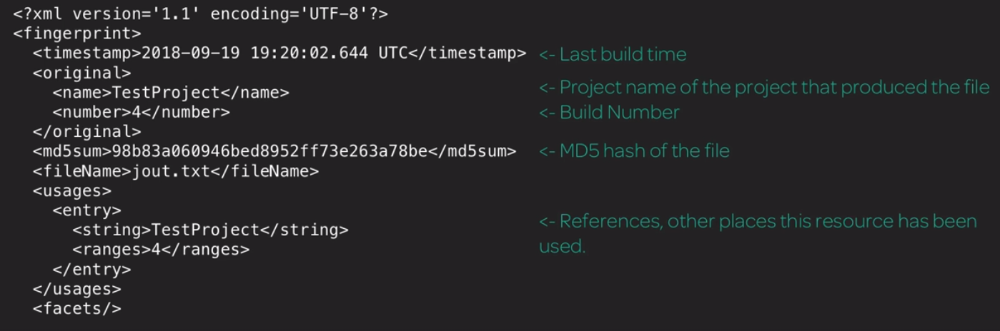

# Artefacts et empreintes

### Artefact

Il s'agit d'un fichier immuable qui est généré lors d'un build ou d'un pipeline. Ceux-ci sont utilisés pour fournir le projet compilé aux utilisateurs finaux, faciliter le processus de test, créer des classes et empêcher la reconstruction du bon code connu.

Les artefacts sont stockés dans un référentiel, les empreintes sont utilisées pour déterminer quel build a produit cet artefact.

Sur le maître jenkins, l'emplacement par défaut du référentiel d'archives est :

```
jenkins root/jobs/buildname/builds/lastSuccessfullBuild/archive
```

Des politiques de rétention peuvent être configurées pour empêcher la saturation des référentiels.

### Empreintes

C'est un hachage unique qui est utilisé pour suivre les artefacts ou d'autres entités sur plusieurs pipelines ou projets.

Il est stocké dans le répertoire personnel de jenkins précisément dans le répertoire des empreintes. Dans le répertoire des empreintes digitales, les fichiers sont stockés dans une hiérarchie basée sur les premiers caractères de la somme de contrôle.

```
/var/lib/jenkins/fingerprints/98/b8
```

La génération d'empreintes doit être activée sur l'écran de configuration du projet. L'on peut spécifier les artefacts à archiver et les artefacts à identifier.

Exemple de contenu d'empreinte

