# Jobs

### Création d'un dossier 

Pour créer un dossier, sur l'espace d'accueil, nous cliquons sur "nouveau Item".

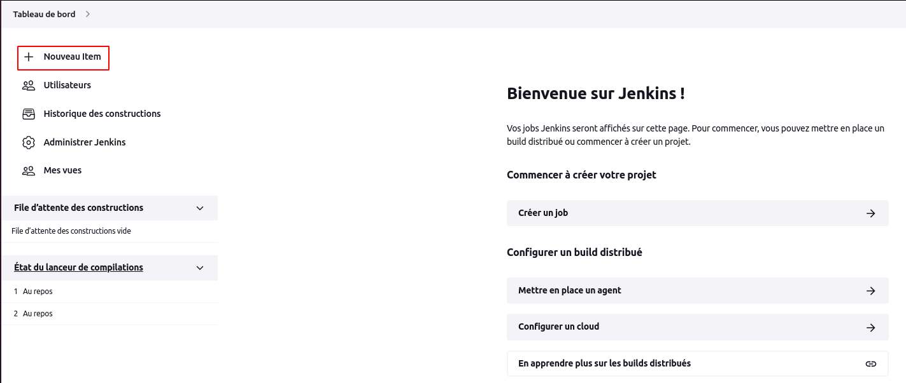

Une fenêtre s'ouvre où nous allons saisir le nom de notre dossier **mondossier**, puis choisir l'option **Dossier** .

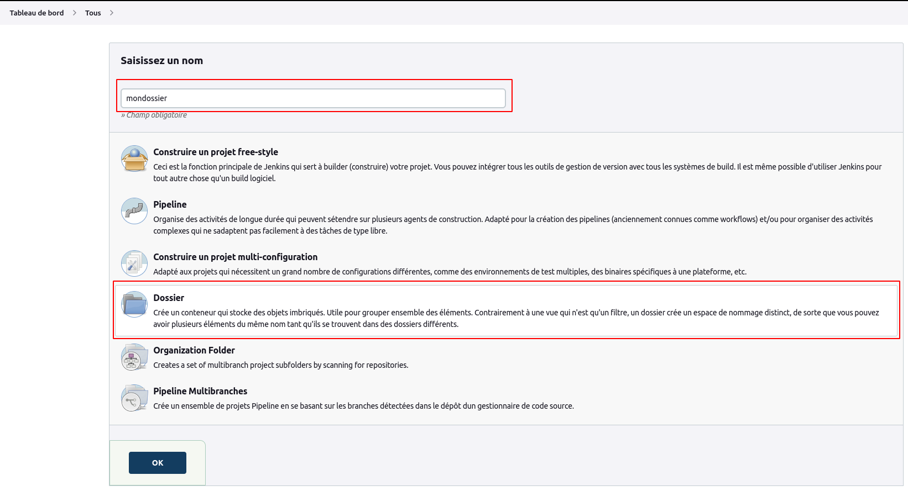

Une fenêtre s'ouvre où nous allons insérer le nom d'affichage du dossier **mondossier**, puis sa description **Mon dossier de travail** et enfin ajouter un indicateur de santé permettant de contrôler si les éléments des sous-dossiers seront considérés comme contribuant à la santé de ce dossier.


### Création d'un job

Nous pouvons créer simple un job depuis la racine de jenkins. Pour cela nous cliquons sur **Tableau de bord**, puis sur **nouveau item**. Une page s'ouvre où nous allons renseigner le nom du job **monjob**, puis choisir l'option **construire un projet free-style** .


Une fenêtre s'ouvre où nous allons saisir une description par exemple **mon job de travail** .

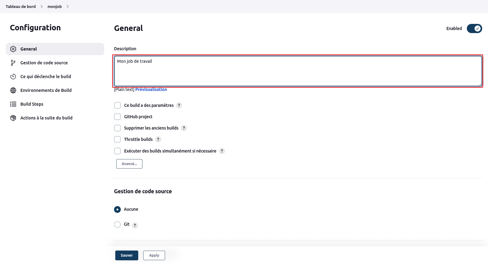

Nous déplaçons ce job vers le dossier créé précédemment. Pour cela sur la page de détails du job, nous cliquons sur le menu **Déplacer**.

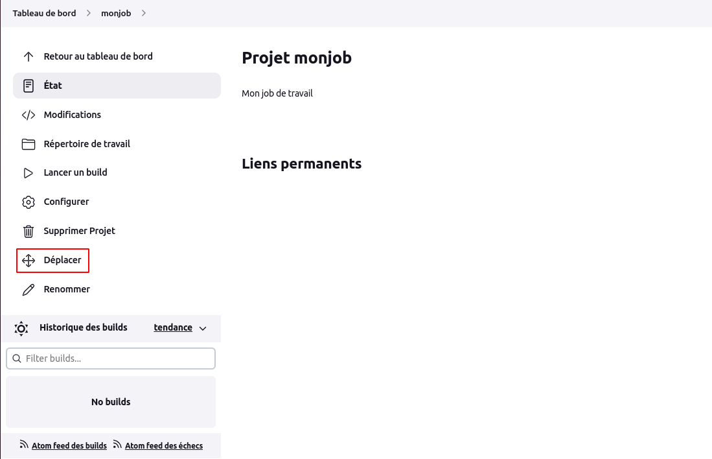

Une fénêtre s'ouvre où nous allons choisir notre dossier **mondossier**, puis validons.

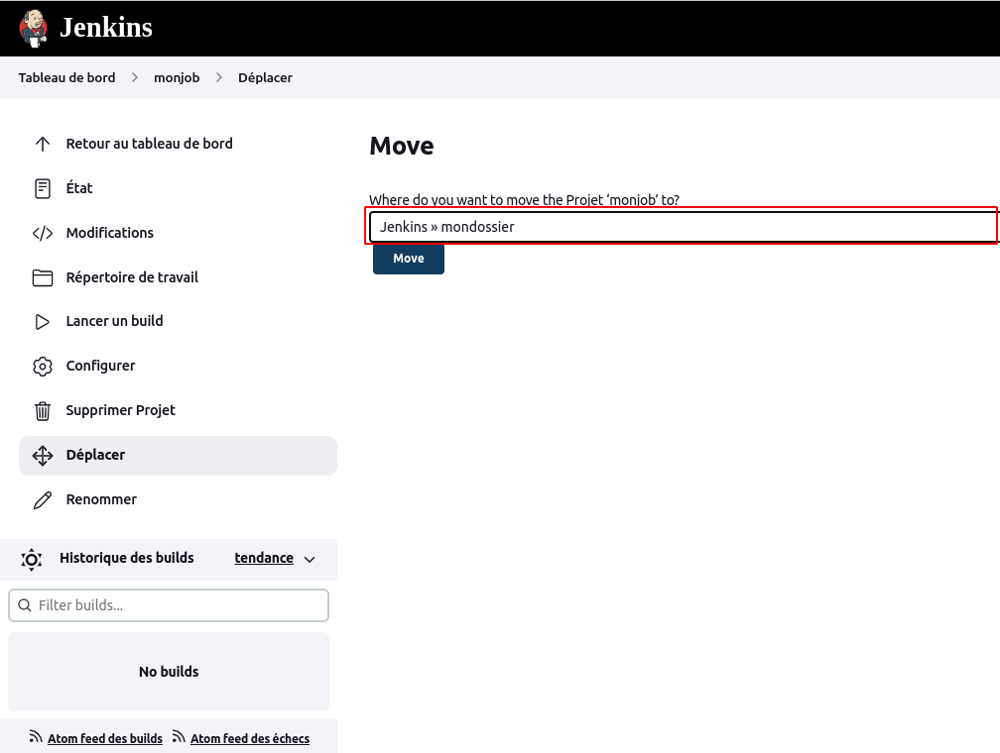

Ainsi en ouvrant notre dossier **mondossier**, nous verrons notre job dans la liste.

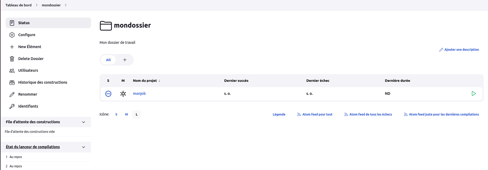

### Création d'un sous dossier

Nous pouvons créer un sous dossier **phpdossier** du dossier **mondossier** de la même manière que nous avons fait pour le dossier **mondossier** à condition de se situer d'abord sur l'interface détails de notre dossier **mondossier** via la navigation sur **Tableau de bord** > **mondossier** .

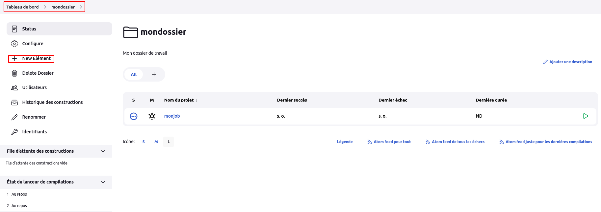

Après création du sous dossier, nous afficherons ce qui sur l'interface de notre dossier **mondossier** .

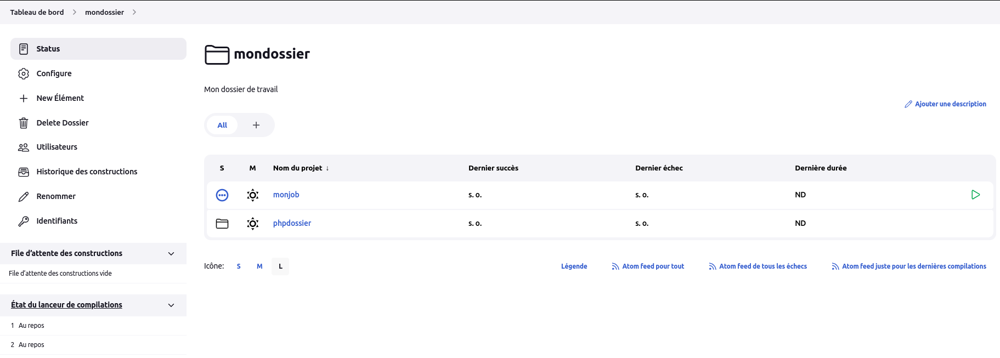

### Création d'un job **shell command** dans notre sous dossier **phpdossier**

Dans notre sous dossier **phpdossier**, nous pouvons créer un job **testShellJob** de la même manière que nous avons fait depuis notre dossier racine.

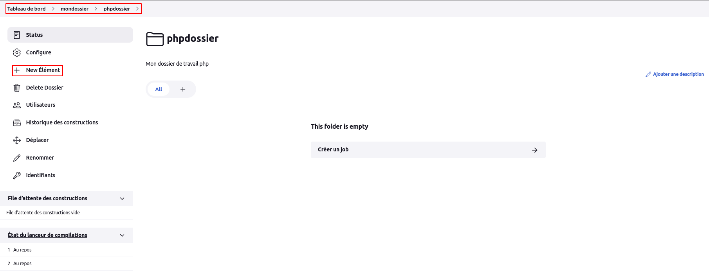

ou alors directement 


Une fenêtre s'ouvra où nous allons mentionner la description, puis ajouter une étape de build en choisissant l'option **Exécuter un script shell**. Commande à utiliser : **uname -a** .

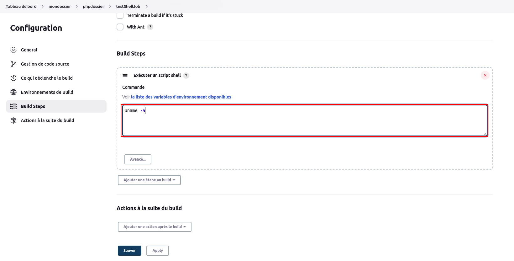

Nous pouvons lancer le build du job en cliquant sur le menu **lancer un build**, puis quelques secondes après, un résultat s'affiche sur le volet **Historique des builds** .

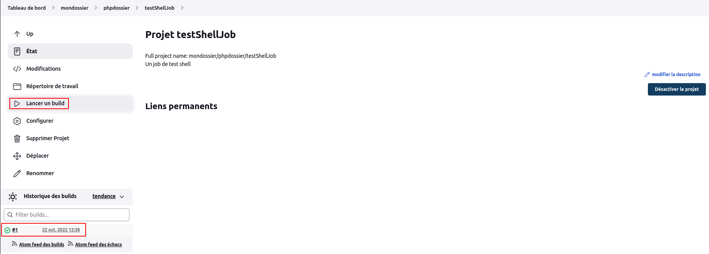

Nous pouvons le résultat d'un buil spécifique en cliquant sur l'item choisi de l'**Historique des builds**, puis en cliquant sur **sortie de la console**.

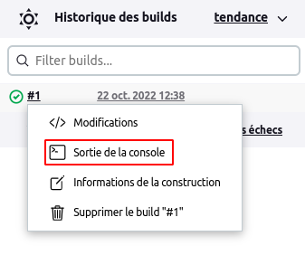


### Edition d'un job (testShellJob)

Nous pouvons modifier notre job **testShellJob** en configurant la possibilité d'affichage les dates dans notre sortie console et de rediriger notre commande shell dans un **fichier test.txt**. <br>
Pour cela nous nous redirigeons sur la page détails de notre job, puis nous cliquons sur **Configure** .

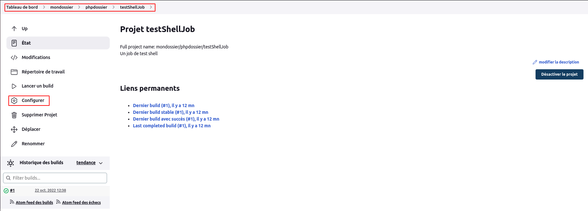


Si nous lançons un build et que nous consultons la **sortie console**, nous verrons les dates.

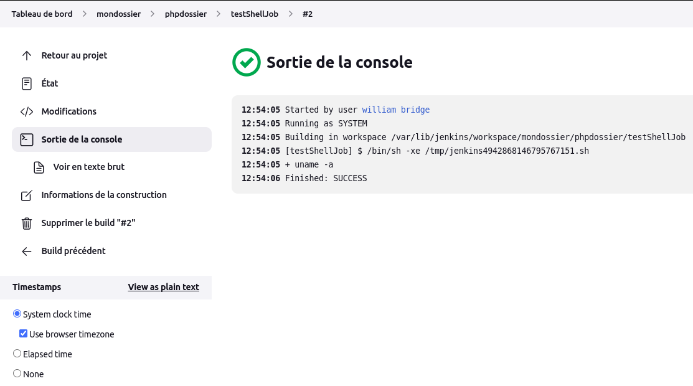

Si nous consultons le répertoire de travail de notre job **testShellJob**, nous trouverons notre fichier **test.txt**.

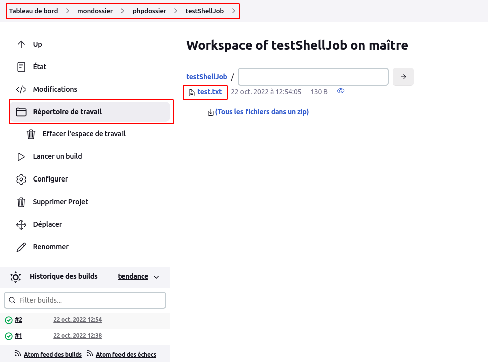

Nous pouvons éditer notre job **testShellJob** en configurant l'option permettant de supprimer le répertoire de travail de notre job avant son build, aussi en configurant un autre script shell exécutant la command **hostname**.

**NB**: Dans cette modification, deux commandes seront éxécutées :

```
uname -a
hostname
```


Si nous exécutons encore le build de notre job **testShellJob**, nous ne verrons plus de fichier **test.txt** dans son répertoire de travail et nous verrons nos deux commandes exécutées.

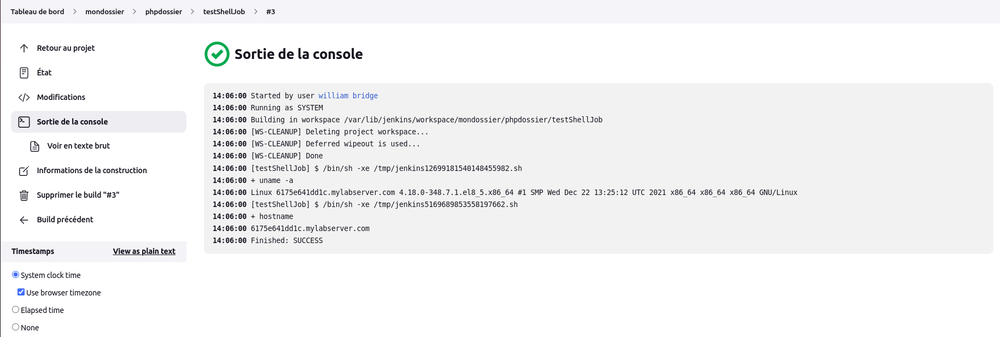

Nous pouvons aussi éditer notre job **testShellJob** en configurant les paramètres à utiliser par ce job. Pour cela en mode édition, (menu **Configure** de la page détails du job), nous cochons l'option **Ce build a des paramètres**, puis nous ajoutons la sous-option **Paramètre String**. En guise d'exemple nous définissons un paramètre **version** avec pour valeur **latest** et une description.

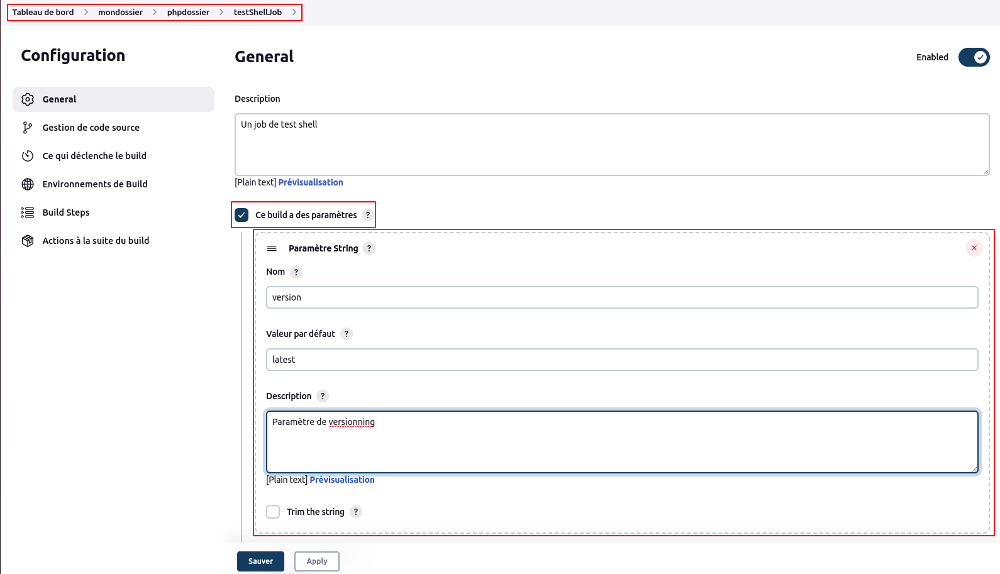

Nous pouvons ainsi utiliser ce paramètre via notre script shell : **$nomParametre**

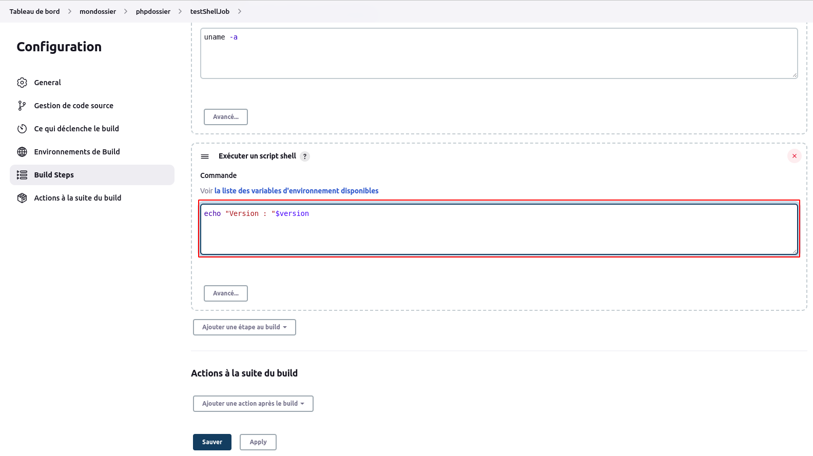

En lançant le build, jenkins nous demande d'éditer à nouveau le paramètre défini.

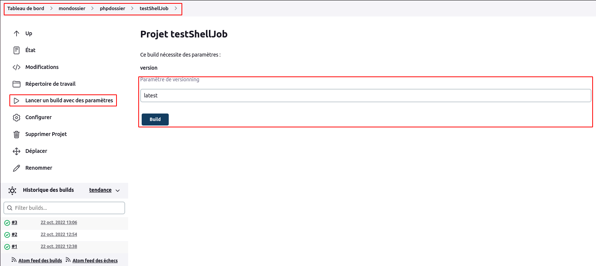