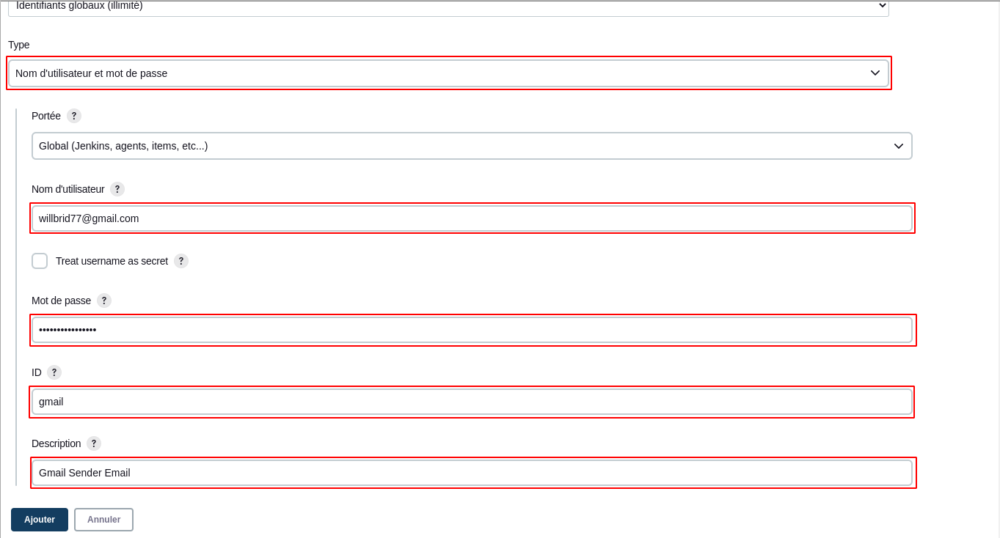

# Notifications et Alertes

Nous allons configurer Jenkins pour permettre une notification par mail via le provider **gmail**.

- Tester une notification sur une adresse gmail : willbrid77@gmail.com

Nous naviguons sur la page de configuration système : **Tableau de bord > administrer Jenkins > Configure System** au niveau de la section **Notification par email** , puis nous précisons les différentes options suivantes : <br>

```
# Serveur SMTP : smtp.gmail.com
# Suffixe par défaut des emails des utilisateurs : @gmail.com
# Port SMTP : 465
```

Nous cochons la case **Use SMTP Notification**, puis nous renseignons nos paramètres **Nom d'utilisateur** et **Mot de passe**.

```
Login : willbrid77@gmail.com
Pass: mot_de_passe_dapplication_gmail
```

Nous cochons la case **Utiliser ssl** pour la connectivité via ssl.


Maintenant nous cochons la case **Tester la configuration en envoyant un e-mail de test** et nous renseignons un email (dans notre cas : **ngaswilly77@gmail.com**). Nous cliquons sur le bouton **Tester la configuration**. Si tout se passe bien alors nous verrons un message de succès.


NB: Nous n'enregistrons pas ces paramètres : nous voulions juste tester l'envoie de mail.
<br>
- Envoier un mail de notification à la fin de l'exécution d'un job

Nous allons configurer la section **Extended E-mail Notification**.

```
# Serveur SMTP : smtp.gmail.com
# Port SMTP : 465

```

Nous cliquons sur ajouter pour configurer notre crédential gmail.

```
Login : willbrid77@gmail.com
Pass: mot_de_passe_dapplication_gmail
```



Nous cochons la case **Use ssl** pour la connectivité via ssl. <br>
Nous configurons le préfixe e-mail et le type de contenu d'e-mail à envoyer

```
# Default user e-mail suffix : @gmail.com
# Default Content Type : HTML
```

Nous enregistrons nos configurations. <br>
Nous créeons un job par exemple **scriptjob** du référentiel **https://github.com/willbrid/script_shell_for_testing_jenkins.git** (section **Gestion de code source**) en configurant ses paramètres **NUMBERONE** et **NUMBERTWO** et en configuration les deux commandes shell à exécuter par le job :

```
chmod +x ./testscript.sh
./testscript.sh
```

Au niveau de la section **Actions à la suite du build**, nous sélectionnons **Editable Email Notification**, puis nous renseignons notre email au niveau de du champ **Project Recipient List**.


En dessous de la section **Attach Build Log**, nous cliquons sur **advance settings**. Puis au niveau de la section **Triggers**, nous ajoutons un déclencheur d'envoie de mail avec l'option **always**.


Nous enregistrons et nous lançons un build de notre job. Si tout se passe bien, nous allons voir un mail de notification dans notre boîte email.

