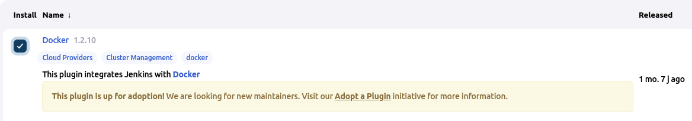
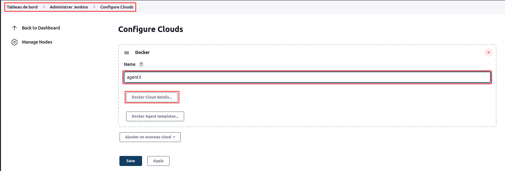
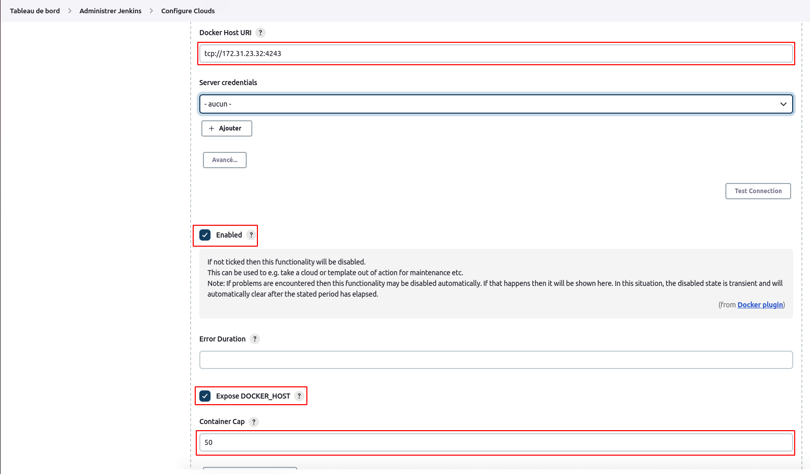
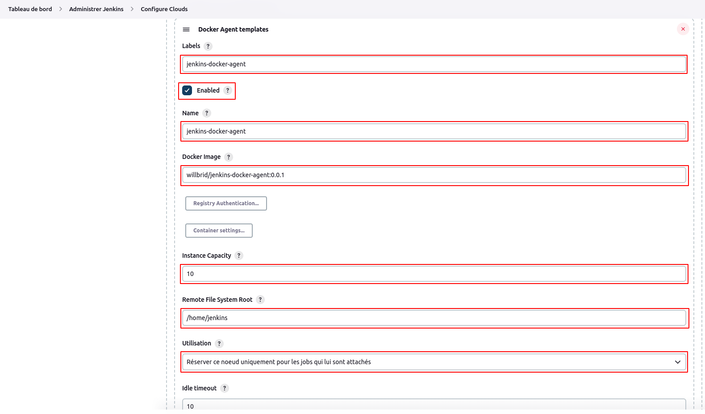
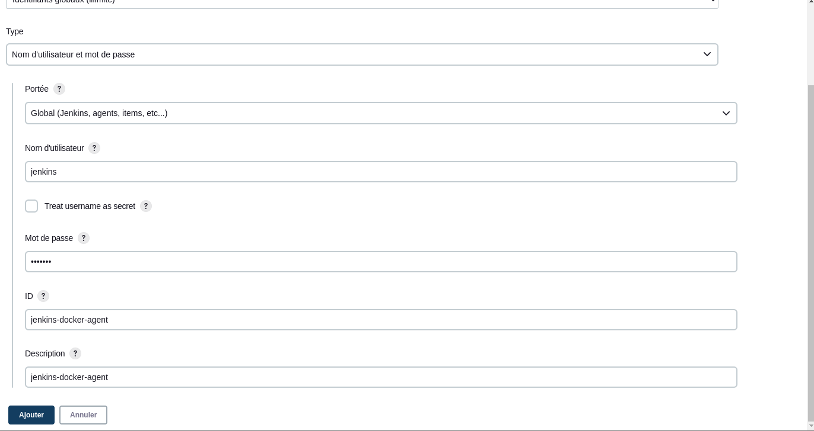
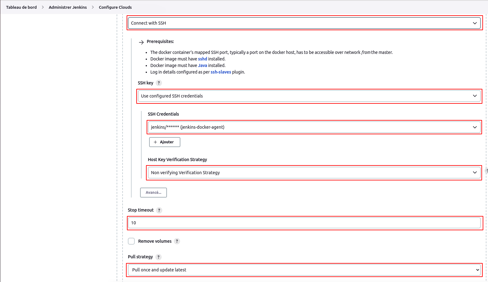
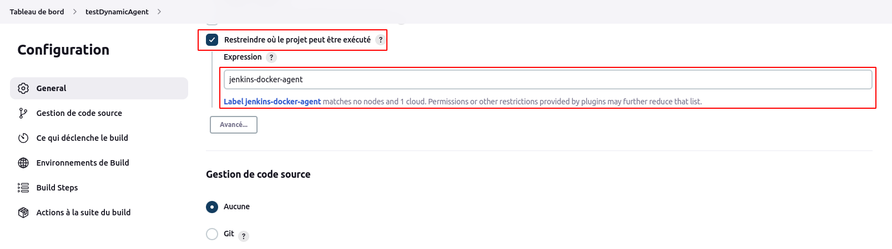
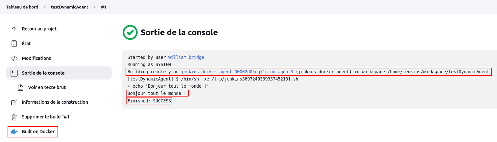

# Builds distribués [Partie2]

Dans cette partie, nous allons configurer les agents dynamiques via docker. L'idée est que lors du build, Jenkins va déployer un conteneur agent et établit une connexion SSH afin d'exécuter les instructions du build.

Comme préréquis, il faudrait installer docker sur notre machine **agent1** (https://github.com/willbrid/docker-light).
.
- Definition de notre conteneur agent

Nous allons utiliser notre image **willbrid/jenkins-docker-agent:0.0.1** provenant du dockerhub.

Le login de connection ssh au conteneur qui sera généré par l'image ci-dessus est **jenkins** et son mot de passe **jenkins**.

- Installation du plugin **docker plugin**

Pour installer ce plugin, il faudrait se référencer au tutoriel sur les plugins.



- Connectons-nous au serveur **agent1** et modifions le fichier service docker /lib/systemd/system/docker.service en remplaçant la ligne commençant par **ExecStart** comme suit

```
ExecStart=/usr/bin/dockerd -H fd:// -H tcp://0.0.0.0:4243
```

Rechargeons, redémarrons le service Docker et rassurons nous qu'il est bien démarré

```
sudo systemctl daemon-reload
sudo systemctl restart docker
sudo systemctl status docker
```

Autorisons le port 4243 pour l'accès à l'API distante Docker et les ports 32768 à 60999 qui sont utilisés par Docker pour attribuer un port hôte permettant à Jenkins de se connecter au conteneur. 
En effet Docker mappe tous ces ports (32768 à 60999) sur un port hôte dans une plage de ports éphémères donnée. Nous pouvons trouver la configuration de ces ports (généralement 32768 à 60999) dans **/proc/sys/net/ipv4/ip_local_port_range**

```
sudo firewall-cmd --permanent --add-port=4243/tcp
sudo firewall-cmd --permanent --add-port=32768-60999/tcp
sudo firewall-cmd --reload
```

Pour tester notre configuration d'api docker, nous pouvons exécuter la commande ci-dessous sur la master jenkins

```
curl http://IP_MACHINE_AGENT1:4243/version
```

- Création de l'agent (agent3) et configuration

Naviguons sur **Tableau de bord > Administrer Jenkins > Gérer les nœuds**, puis cliquons sur **Configure clouds**. Ajoutons un **nouveau noeud cloud docker** et donnons-lui un nom (agent3), puis cliquons sur **docker cloud details**.



Ensuite nous renseignons l'adresse **tcp://IP_MACHINE_AGENT1:4243**, nous activons cette fonctionnalité, nous exposons l'url host docker comme variable d'environnement **DOCKER_HOST** dans le conteneur et enfin nous définissons le nombre maximal de conteneur a créé lors du build.



Nous ajoutons le template d'agent docker en renseignant la configuration suivante : 
<br>
--- Labels : Identification de l'hôte Docker. Il sera utilisé dans la configuration du Job. Ici, nous utilisons **jenkins-docker-agent**
<br>
--- Name: nom du modèle Docker. Ici, nous utilisons le même nom que l'étiquette, c'est-à-dire **jenkins-docker-agent**
<br>
--- Docker Image : willbrid/jenkins-docker-agent:0.0.1
<br>
--- Remote Jenkins home : /home/jenkins



--- Informations d'identification : cliquons sur **ajouter** et entrons le nom d'utilisateur **jenkins** et le mot de passe **jenkins** SSH des conteneurs qui seront créés à partir de notre image **willbrid/jenkins-docker-agent:0.0.1**.



Pour la configuration SSH, nous aurons au final la capture suivante :



Comme sur l'image ci-dessus, n'oublions pas de sélectionner la stratégie (**pull strategy**) de téléchargement de notre image à **pull once and update latest**.

- Test de notre agent **agent3**

Nous créeons un job **testDynamicAgent** exécutant un script shell

```
echo "Bonjour tout le monde !"
```

Puis nous cochons la case **Restreindre où le projet peut être exécuté** et nous renseignons le label **jenkins-docker-agent** de notre agent **agent3**.



Si nous lançons le build, alors jenkins va télécharger notre image **willbrid/jenkins-docker-agent:0.0.1**, puis démarrer un conteneur permettant de faire le build de notre job.

