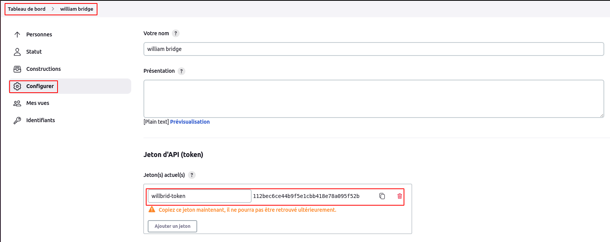

# Rest API

Jenkins fournit une API d'accès distant à ses fonctionnalités.
<br>
L'API d'accès à distance est proposée dans un style de type **REST**. Autrement dit, il n'y a pas de point d'entrée unique pour toutes les fonctionnalités, et à la place, elles sont disponibles sous l'URL **".../api/"** où **"..."** correspond aux données sur lesquelles elle agit.
<br>
L'API distante peut être utilisée pour faire des choses comme :
- récupérer des informations de Jenkins pour une consommation programmatique.
- déclencher un nouveau build
- créer/copier des jobs

### Récupération du jeton crumb

Naviguons sur **Tableau de bord > Administrer Jenkins > Configurer la sécurité globale**, puis sous la section **CSRF Protection** assurons que l'option **Crumb Issuer** est par défaut configuré.
<br>
En effet, la protection CSRF utilise un jeton (appelé **crumb** dans Jenkins) qui est créé par Jenkins et envoyé à l'utilisateur. Toute soumission de formulaire ou action similaire entraînant des modifications, comme le déclenchement de builds ou la modification de la configuration, nécessite que le jeton soit fourni. Le jeton contient des informations identifiant l'utilisateur pour lequel il a été créé, de sorte que les soumissions avec le jeton d'un autre utilisateur seraient rejetées.


Nous exécutons la commande ci-dessous pour récupérer et assigner notre jeton dans une variable **CRUMB**

```
CRUMB=$(wget -q --auth-no-challenge --user willbrid --password xxxxxxx --output-document - 'http://IP_MASTER:8080/crumbIssuer/api/xml?xpath=concat(//crumbRequestField,":",//crumb)')
```

Les options **--user** et **--password** permettent de préciser le login et le mot de passe de connexion à l'interface de jenkins.

```
echo $CRUMB
```

### Ajout d'un token d'api pour notre utilisateur 

Naviguons sur **Tableau de bord > Utilisateurs**, une interface s'ouvre avec la liste des utilisateurs. Sélectionnons notre utilisateurs et cliquons sur le menu **Configurer**. 
<br>
Au niveau de la section **Jeton d'API (token)**, ajoutons un token en mettant un nom par defaut **willbrid-token**, puis en cliquant sur le bouton **Générer**. Nous copions le token généré et sauvegardons la configuration.



### Déclenchement un build d'un job

Nous pouvons déclencher un build de notre job **testDynamicAgent** directement accessible depuis le menu **Tableau de bord** en utilisant la commande

```
curl -I -X POST http://willbrid:TOKEN_GENERE@IP_MASTER:8080/job/testDynamicAgent/build -H "$CRUMB"
```

- TOKEN_GENERE : token généré précédemment
- IP_MASTER : adresse IP la master de jenkins
- CRUMB : variable créée contenant notre jeton crumb
- **/job/testDynamicAgent/** : path complet du job. Ce path peut être récupéré depuis l'url de la page détail du job.


Si tout se passe bien, nous verrons le build de notre job qui se déclenche.

### Récupération des informations d'un job

Pour récupérer les informations sur un job, par exemple notre job **scmjob** (job se trouvant dans le dossier **sourced**) sous le path : **/job/sourced/job/scmjob/**, nous exécutons la commande

```
curl -X GET http://willbrid:TOKEN_GENERE@IP_MASTER:8080/job/sourced/job/scmjob/config.xml -H "$CRUMB" -o jobconfig.xml
```

Cette commande sauvegardera les configurations de notre job dans le fichier **jobconfig.xml**.

### Créer un job à partir des configurations d'un autre job

Précédemment nous avons sauvegardé les configurations de notre job **scmjob** dans le fichier **jobconfig.xml**. Nous utiliserons ce fichier pour créer un nouveau job **scmjob2** sous le path **/job/scripted/** du dossier **scripted**.

```
curl -s -X POST 'http://willbrid:TOKEN_GENERE@IP_MASTER:8080/job/scripted/createItem?name=scmjob2' --data-binary @jobconfig.xml -H "$CRUMB" -H "Content-Type: text/xml"
```

Si tout se passe bien, nous verrons notre job **scmjob2** dans le dossier **scripted**.

