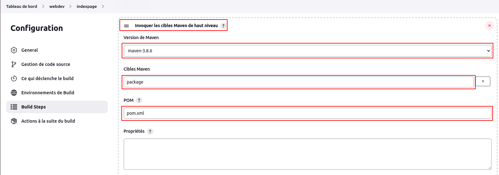
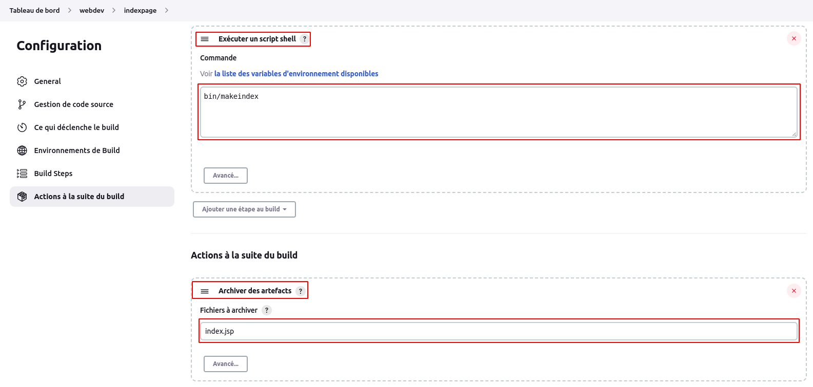
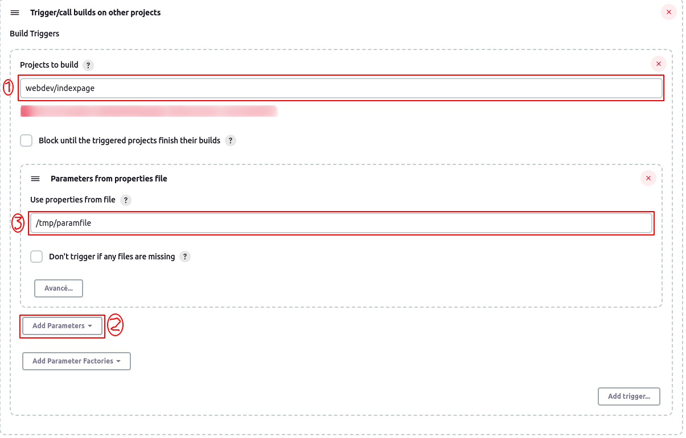
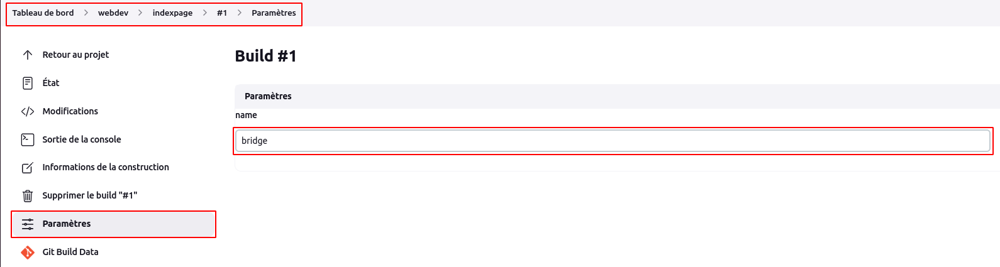
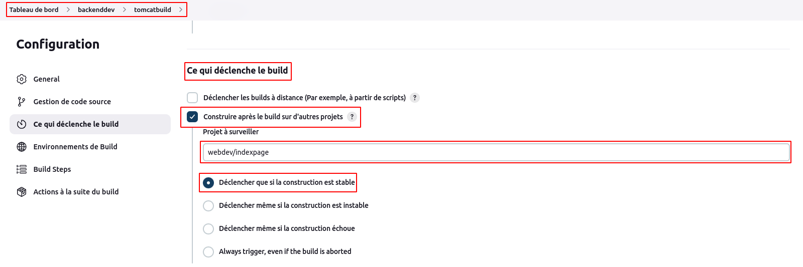
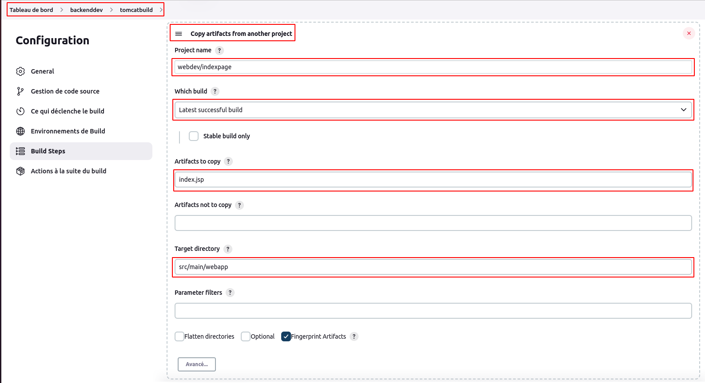
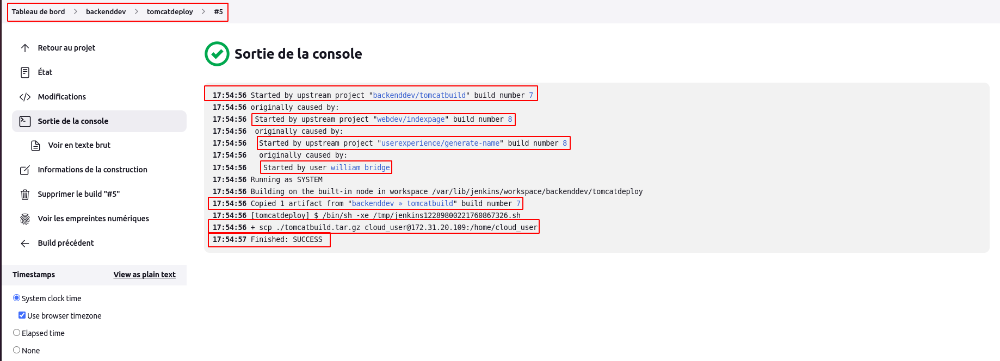

# Amont, Aval et Déclenchement

Avant de se pencher sur le sujet proprement dit, nous allons nous rassurer que les plugins **Parameterized Trigger** (Ce plugin nous permet de déclencher de nouveaux build lorsque notre buil est terminé, avec différentes façons de spécifier les paramètres du nouveau build) et **Copy Artifacts** (ce plugin permet d'ajouter une étape de build pour copier les artefacts d'un autre projet) sont bien installés. Dans le cas contraire il faudrait les installer.
<br>
Créeons à présent 3 dossiers : **backenddev**, **userexperience** et **webdev**.

- Dossier **webdev**

Dans ce dossier **webdev**, nous créeons un job shell script **indexpage**. <br>
Au niveau de la section **General**, nous cochons l'option **Ce build a des paramètres** et nous ajoutons le paramètre **name** dont la valeur proviendra d'un autre job.
<br>
Au niveau de la section **Gestion de code source**, nous cochons l'option **Git**, puis nous précisons le référentiel : **https://github.com/willbrid/content-cje-prebuild.git**.
<br>
Au niveau de la section **Build Steps**, nous choisissons l'option **Invoquer les cibles Maven de haut niveau**, puis les paramètres **Version de Maven** : selection de la version installée, **Cibles Maven** : **package** et **POM** : **pom.xml**.
<br>
Sous cette même section, nous ajoutons l'option **Exécuter un script shell** et nous définissons le script 

```
bin/makeindex
```

Au niveau de la section **Actions à la suite du build**, nous ajoutons l'option **Archiver des artefacts**, puis nous donnons le nom du fichier à archiver **index.jsp**.





- Dossier **userexperience**

Dans ce dossier **userexperience**, nous allons configurons un job **generate-name** en **amont** de notre job **webdev/indexpage** qui sera déclenché une fois que l'exécution de notre job **indexpage** sera terminé avec succès. Pour cela, nous créeons un job shell script **generate-name** avec pour contenu

```
NAMES=(william bridge rodrigue)
NAMEPARAM="name=${NAMES[1]}"
echo $NAMEPARAM > /tmp/paramfile
cat /tmp/paramfile
```

Puis ajoutons une autre étape de build **Trigger/call builds on other projects**, ensuite précisons le nom du projet de build provenant du dossier **webdev** : **webdev/indexpage** et enfin ajoutons l'option **Parameters from properties file** afin de définir le fichier de paramètres généré à l'étape de script shell ci-dessus: **/tmp/paramfile** .



Nous validons nos configurations de notre job **generate-name**.
<br>
Si nous lançons le build notre job **generate-name**, une fois terminée, nous verrons notre job **webdev/indexpage** se déclencher. 
<br>
Nous pouvons vérifier effectivement que notre paramètre de build configuré sur notre job **webdev/indexpage** contient bien le nom provenant de notre job en amont **userexperience/generate-name**. Il suffira de cliquer sur le résultat de notre build du job **webdev/indexpage**, puis de consulter le menu **paramètres**.



- Dossier **backenddev**

Dans ce dossier **backenddev**, nous allons configurer un job script shell **tomcatbuild**. <br>

Au niveau de la section **Ce qui déclenche le build**, nous cochons la case **Construire après le build sur d'autres projets**, puis nous définissons le job **webdev/indexpage**. Donc notre job **backenddev/tomcatbuild** sera déclenché après l'exécution avec succès du build de notre **webdev/indexpage**.
<br>
Au niveau de la section **Gestion de code source**, nous cochons l'option **Git**, puis nous précisons le référentiel : **https://github.com/willbrid/content-jenkinscert.git**.
<br>
Au niveau de la section **Build Steps**, nous choisissons l'option **Invoquer les cibles Maven de haut niveau**, puis les paramètres **Version de Maven** : selection de la version installée, **Cibles Maven** : **package** et **POM** : **pom.xml**.
<br>
Sous cette même section, nous ajoutons l'option **Exécuter un script shell** et nous définissons le script :

```
tar -czf tomcatbuild.tar.gz src/main/webapp/* target/*
```

Sous cette même section, nous ajoutons l'option **Copy artifacts from another project** et nous définissons les options : <br>
--- **Project name** : **webdev/indexpage** <br>
--- **Which build** : **Latest successful build** <br>
--- **Artifacts to copy** : **index.jsp** <br>
--- **Target directory** : **src/main/webapp** <br>

Au niveau de la section **Actions à la suite du build**, nous ajoutons l'option **Archiver des artefacts**, puis nous donnons le nom du fichier à archiver **tomcatbuild.tar.gz**.





Dans notre même dossier **backenddev**, nous allons configurer un job script shell **tomcatdeploy**. <br>

Au niveau de la section **Ce qui déclenche le build**, nous cochons la case **Construire après le build sur d'autres projets**, puis nous définissons le job **backenddev/tomcatbuild**. Donc notre job **backenddev/tomcatdeploy** sera déclenché après l'exécution avec succès du build de notre **backenddev/tomcatbuild**.
<br>
Au niveau de notre section **Build Steps**, nous ajoutons l'option **Copy artifacts from another project** et nous définissons les options : <br>
--- **Project name** : **backenddev/tomcatbuild** <br>
--- **Which build** : **Latest successful build** <br>
--- **Artifacts to copy** : **tomcatbuild.tar.gz** <br>
--- **Target directory** : **./** <br>

Au niveau de cette même section **Build Steps**, nous ajoutons l'option **Exécuter un script shell** et nous définissons le script :

```
scp ./tomcatbuild.tar.gz username@IP_PROD:/home/username
```

où **username**, **IP_PROD** sont respectivement le nom d'utilisateur et l'adresse de notre serveur vers lequel nous souhaiterons copier notre artéfact. Une fois terminée, nous validons nos configurations.
<br>
Il faudrait aussi configurer une authenfication par clé ssh sur le serveur **IP_PROD** afin que la command **scp** puisse être exécuté sans mot de passe.
<br>
Sur notre serveur de déploiement d'adresse **IP_PROD**, nous générons la paire de clé ssh sans mot de passe :

```
ssh-keygen
```

Nous vérifions le répertoire .ssh

```
ls .ssh/
```

Nous générons le fichier **authorized_keys** à partir de notre clé publique
```
mv ~/.ssh/id_rsa.pub ~/.ssh/authorized_keys
```

Nous éditons le fichier **sshd_config** afin de configurer une authentification ssh par clé.
```
vi /etc/ssh/sshd_config
```

```
...
PasswordAuthentication no
...
ChallengeResponseAuthentication no
...
```

```
sudo systemctl restart sshd
```

Maintenant sur chacun de nos noeuds jenkins (master ou worker), nous copions la clé privé **id_rsa** vers le répertoire **/var/lib/jenkins/.ssh/** :

```
sudo scp username@IP_PROD:/home/username/.ssh/id_rsa /var/lib/jenkins/.ssh/
sudo chown jenkins:jenkins /var/lib/jenkins/.ssh/id_rsa
sudo chown 700 /var/lib/jenkins/.ssh/id_rsa
```

Enfin nous nous connectons pour la première fois sur notre serveur de déploiement depuis chacun de nos noeuds jenkins afin que le fichier **known_hosts** soit généré ou soit à jour. Puis sur chacun de nos noeuds jenkins, nous copions ce fichier dans le répertoire **/var/lib/jenkins/.ssh/**

```
sudo cp ~/.ssh/known_hosts /var/lib/jenkins/.ssh/
sudo chown jenkins:jenkins /var/lib/jenkins/.ssh/known_hosts
```
<br>

A présent, nous lançons le build de notre job **userexperience/generate-name**. Le build avec succès de ce job déclenchera le build de notre job **webdev/indexpage**. Ensuite comme le job **backenddev/tomcatbuild** est en écoute du build du job **webdev/indexpage**, il sera déclenché une fois que celui-ci sera exécuté avec succès. Et enfin le job **backenddev/tomcatdeploy** se chargera de déployer notre application sur notre serveur de déploiement après l'exécution du job **backenddev/tomcatbuild**.
<br>
