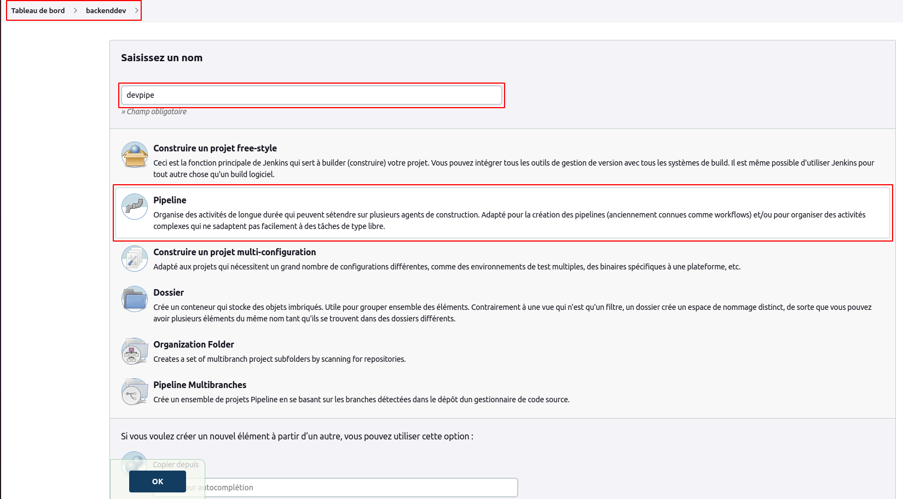
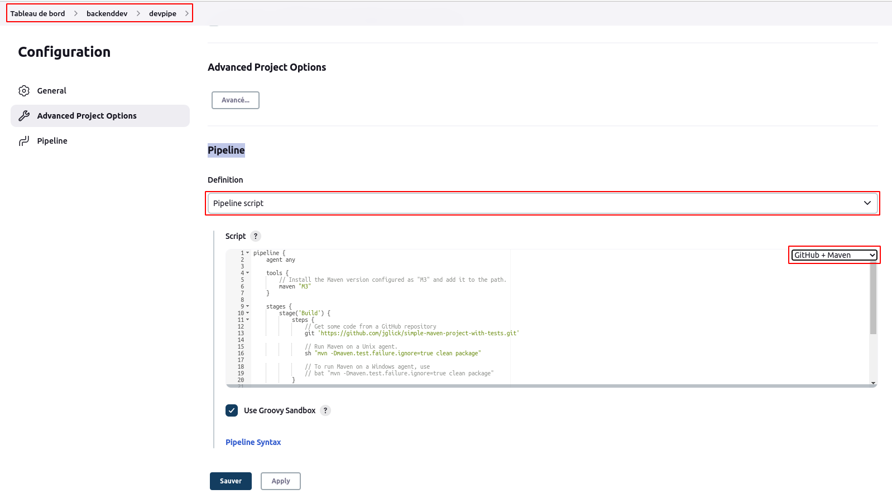
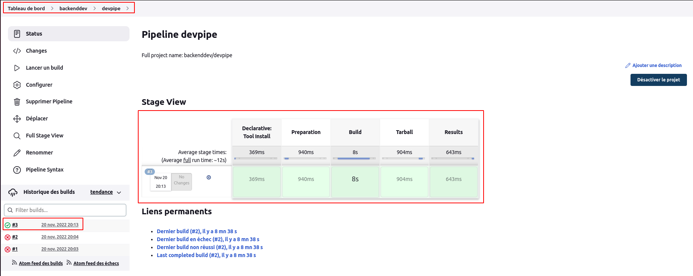

# Pipeline

Dans cet article, nous allons configurer un pipeline sur jenkins. Nous partirons sur la base du job **backenddev/tomcatbuild** pour construire notre pipeline.
<br>
Dans le dossier **backenddev**, ajoutons un pipeline **devpipe**.



Au niveau de la section **Build Triggers**, nous cochons l'option **Construire après le build sur d'autres projets**, puis nous renseignons le projet à surveiller **webdev/indexpage**
<br>
Au niveau de la section **Pipeline**, nous sélectionnons l'option **Pipeline script** et l'option de script **Github + Maven**.



Pour facilement construire notre script de pipeline, nous pouvons utiliser l'outil **Pipeline Syntax** disponible au niveau de cette section **Pipeline** en dessous du champ de **Script**.
<br>
Au niveau de notre champ de **Script**, nous allons renseigner le script ci-dessous :

```
pipeline {
    agent any

    tools {
        maven 'maven-3.8.6'
    }

    stages {
        stage('Preparation') {
            steps {
                copyArtifacts filter: 'index.jsp', fingerprintArtifacts: true, projectName: 'webdev/indexpage', selector: lastSuccessful(), target: 'src/main/webapp'
            
                git 'https://github.com/willbrid/content-jenkinscert.git'   
            }
        }
        stage('Build') {
            steps {
                sh "mvn -Dmaven.test.failure.ignore=true clean package"
            }
        }
        stage('Tarball') {
             steps {
                sh "tar -czf tomcatbuild.tar.gz src/main/webapp/* target/*"
            }
        }
        stage('Results') {
            steps {
                junit '**/target/surefire-reports/TEST-*.xml'
                archiveArtifacts 'tomcatbuild.tar.gz'
                fingerprint 'tomcatbuild.tar.gz'
            }
        }
    
    }
}

```

Nous validons nos configurations de notre pipeline **backenddev/devpipe**. <br>
Nous lançons un build de notre pipeline **backenddev/devpipe**. Puis si tout se passe bien, nous aurons en sortie la capture ci-après :

